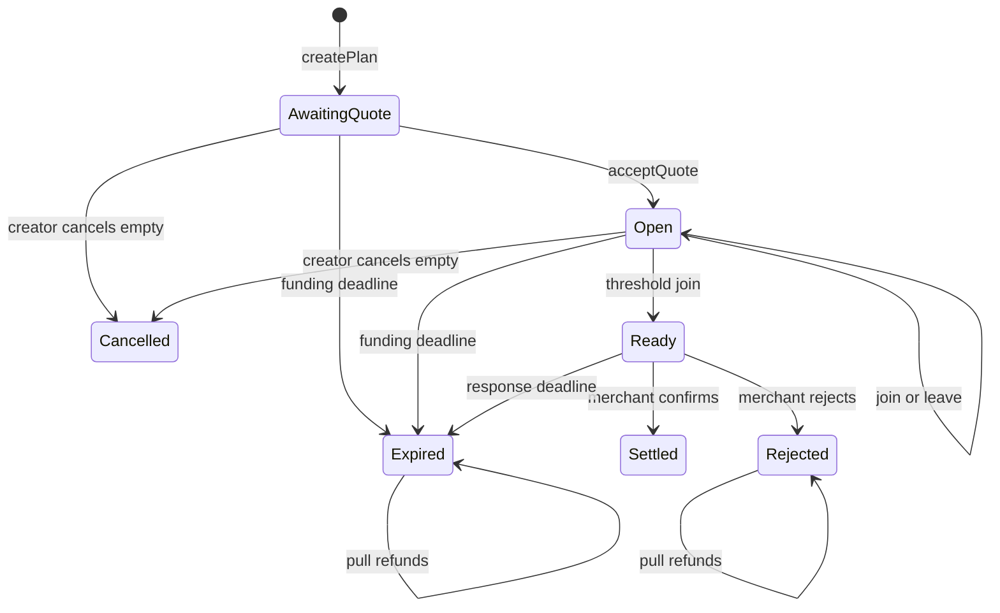
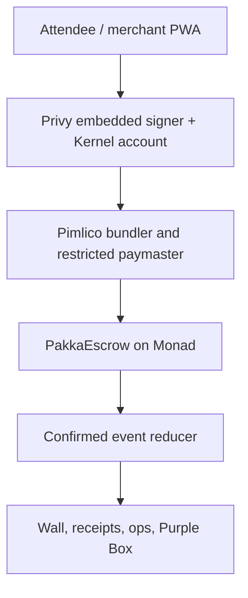

# PAKKA — Implementation Plan

**Prepared:** 14 August 2026
**Blitz day:** 16 August 2026
**Team:** 3 members
**Upstream brief:** [`PRODUCT_SPEC.md`](./PRODUCT_SPEC.md)
**Executed by:** [`PAKKA_BLITZ_PROMPT_PACK.md`](./PAKKA_BLITZ_PROMPT_PACK.md)

---

## 0. Document control

### 0.1 What this document is

This is the **frozen technical decision record**. Every ambiguity in the product spec is resolved here, once,
so that three parallel agents and three humans cannot resolve it three different ways.

It is a *reference*, not a worklist. Nothing here is executed directly — the
[prompt pack](./PAKKA_BLITZ_PROMPT_PACK.md) turns these decisions into ordered, gated work, and every prompt
cites the section numbers below. **Section numbers in this file are load-bearing. Do not renumber them.**

### 0.2 Authority order

When two sources conflict, resolve in this order — highest wins:

| Rank | Source | Authority over |
| --- | --- | --- |
| 1 | Deployed contract state and confirmed logs | money, membership, lifecycle, settlement — always |
| 2 | This implementation plan | design decisions, invariants, bounds, policy |
| 3 | [`PRODUCT_SPEC.md`](./PRODUCT_SPEC.md) | product intent, scope, narrative |
| 4 | [`PAKKA_BLITZ_PROMPT_PACK.md`](./PAKKA_BLITZ_PROMPT_PACK.md) | sequencing, ownership, evidence format |
| 5 | Code comments, realtime payloads, local UI state | nothing financial, ever |

A prompt may never contradict this plan. If one appears to, stop and raise it — do not silently pick a side.
Changing anything in [§2](#2-canonical-product-and-money-rules) or [§4](#4-contract-implementation-decisions)
after Prompt 02 requires a recorded human review note.

### 0.3 Supersessions over the product spec

These are deliberate changes to the 10 August brief. The brief was not edited; this table is the diff.

| Topic | Product spec said | This plan requires | Why |
| --- | --- | --- | --- |
| Global solvency | per-plan `totalLocked` only | adds `liabilityByToken` ([§4.2](#42-required-storage)) | makes cross-plan solvency testable; one plan cannot mask another's accounting error |
| Ownership | `Ownable` implied | `Ownable2Step` ([§4.1](#41-contracts)) | no accidental irrecoverable owner handoff |
| Pause | "blocks financial mutations" | exit-preserving pause ([§4.7](#47-pause-policy)) | a pause must not become a hostage switch over refunds |
| Expiry from `AwaitingQuote` | not stated | funding deadline expires an unaccepted plan ([§2.4](#24-state-machine)) | a never-accepted plan must reach a terminal state |
| Allowlist / admin surface | "an allowlist" | `setTokenAllowed`, `pause`, `unpause`, owner-only, no rescue path ([§4.3](#43-required-external-functions), [§4.6](#46-accounting-rules)) | closes the admin-withdrawal question explicitly |
| Confirmed state | "confirmed receipt" | receipt **plus** `FINALITY_CONFIRMATIONS` ([§3.3](#33-finality-and-retry-policy)) | Monad receipts can precede finality |
| Mainnet token | tiny stablecoin | native USDC only, resolved and verified on the day ([§4.8](#48-mainnet-token-policy)) | no pasted addresses |
| Package manager | "one TypeScript package manager" | npm workspaces, one root lockfile ([§6.1](#61-repository-layout)) | matches the official Monad template |

### 0.4 Related documents

| Document | Role | Produced by |
| --- | --- | --- |
| [`README.md`](./README.md) | entry point and reading order | — |
| [`PRODUCT_SPEC.md`](./PRODUCT_SPEC.md) | product intent and narrative | — |
| [`PAKKA_BLITZ_PROMPT_PACK.md`](./PAKKA_BLITZ_PROMPT_PACK.md) | ordered executable prompts 00–18 | — |
| [`SESSION_PREAMBLE.md`](./SESSION_PREAMBLE.md) | short standing rules pasted into every agent session | — |
| [`LIVE_LINKS.md`](./LIVE_LINKS.md) | observed URLs and tx hashes | Prompts 15, 18 |
| [`MAINNET_APPROVAL.md`](./MAINNET_APPROVAL.md) | two-human mainnet sign-off | Prompt 18 preflight |
| `THREAT_MODEL.md` | actors, threats, invariants, test IDs | Prompt 02 |
| `DEMO_RUNBOOK.md` | operator choreography and commands | Prompt 17 |
| `INCIDENT_FALLBACKS.md` | per-incident response cards | Prompt 17 |
| [`../artifacts/gates/README.md`](../artifacts/gates/README.md) | gate evidence format and index | — |

### 0.5 Requirement keywords

| Word | Meaning |
| --- | --- |
| `MUST` | required for the demo; do not waive silently |
| `SHOULD` | implement unless a recorded blocker exists |
| `MAY` | optional and first to cut ([§9.2](#92-feature-cut-order)) |
| `Gate` | a binary condition with recorded evidence |
| `Confirmed` | receipt succeeded **and** the configured finality threshold was reached |
| `Source of truth` | contract state and confirmed logs — never Supabase, never local UI state |

---

## 1. Outcome and definition of done

PAKKA is a group checkout on Monad. An organizer creates a fixed-price plan for one merchant. The merchant
accepts the immutable quote before funding opens. People then commit one equal contribution each. Reaching the
threshold changes the plan to `Ready` but moves no money. The merchant must freshly confirm availability after
that point; only this confirmation settles the whole pool atomically. If funding fails, the merchant rejects, or
the response window expires, each active participant can claim exactly one refund.

The demo sentence is:

> `PAKKA?` → people join → `GROUP READY` → merchant confirms → `PAKKA!`

The finished demo must let a stranger scan one QR, join without crypto vocabulary, appear on a live wall only
after chain confirmation, and open a valid explorer transaction. It must also show a settlement path and a
refund path.

### 1.1 Definition of done

- A stranger completes first-time onboarding and a sponsored testnet join in under 25 seconds.
- The last join makes the plan `Ready` and does **not** pay the merchant.
- Only the named merchant can settle, and only during the response window.
- Rejection and both expiry paths enable exact pull refunds.
- Every solid wall state is reconstructed from contract reads, receipts, and logs.
- The deployed source is verified and all live links are collected in [`LIVE_LINKS.md`](./LIVE_LINKS.md).
- Testnet credits and real mainnet value are never combined or visually confused.
- The experience remains usable with reduced motion, a slow phone, an RPC failover, or a failed physical box.

Each clause is discharged by a specific gate — see the traceability matrix in [§8.3](#83-traceability-matrix).

---

## 2. Canonical product and money rules

### 2.1 In scope

- One organizer, one named merchant, one allowlisted ERC-20, one equal contribution per address.
- Merchant quote acceptance before joins.
- Funding deadline and immutable post-ready merchant response window.
- Sponsored testnet join batch using open-mint `DemoINR` credits.
- Tiny, optional, pre-funded mainnet USDC proof.
- Attendee, merchant, wall, receipt, and restricted ops surfaces.
- Explorer links, verified source, deterministic state reconstruction, refund evidence.

### 2.2 Explicitly out of scope

- UPI, INR settlement, bank accounts, on/off-ramping, Cashfree, merchant KYC.
- Variable contributions, arbitrary fundraising, a marketplace, multiple merchants per plan.
- Delivery disputes, arbitration, lending, yield, NFTs, governance, cross-chain routing, AI features.
- Upgradeable contracts, protocol fees, admin withdrawal of escrowed funds.

### 2.3 Demo modes

| Mode | Purpose | Asset | Required label |
| --- | --- | --- | --- |
| Crowd | Room-scale interaction | Open-mint six-decimal testnet `DemoINR` | `DEMO CREDITS — NO CASH VALUE` |
| Mainnet proof | Economic settlement proof | Tiny native Monad USDC from 3–5 pre-funded accounts | `REAL MAINNET SETTLEMENT` |

Never add the two totals. Never describe testnet credits as money, INR, stablecoins, or payments.

### 2.4 State machine



`Settled`, `Cancelled`, `Expired`, and `Rejected` are terminal. `Expired` and `Rejected` continue to accept
`claimRefund` without leaving the state. No terminal state is reversible by anyone, including the owner.

### 2.5 Deterministic deadline semantics

Two derived deadlines exist. Define them once and use these exact names everywhere — Solidity, TypeScript,
tests, copy, and timers:

```
fundingDeadline  — set at createPlan, immutable
decisionDeadline — readyAt + merchantResponseWindow, fixed the instant the plan becomes Ready
```

- `acceptQuote`, `join`, and `leave` are allowed only when `block.timestamp < fundingDeadline`.
- Funding expiry is allowed when `block.timestamp >= fundingDeadline`.
- Merchant confirmation is allowed only when `block.timestamp < decisionDeadline`.
- Merchant-decision expiry is allowed when `block.timestamp >= decisionDeadline`.
- Merchant rejection may occur at any time while state is `Ready`; after the deadline, either rejection or
  expiry produces the same refund rights.
- The UI timer is informative; the contract timestamp is authoritative.

Note the asymmetry: `<` for the permissive action, `>=` for the expiry. Every boundary test asserts both sides
of the same instant.

### 2.6 Transition table

| Function | Caller | Required state | Money effect | Result |
| --- | --- | --- | --- | --- |
| `createPlan` | anyone | n/a | none | `AwaitingQuote` |
| `acceptQuote` | named merchant | `AwaitingQuote` | none | `Open` |
| `join` | participant | `Open` | exact contribution enters escrow | `Open` or `Ready` |
| `leave` | active participant | `Open` | exact contribution exits escrow | `Open` |
| `confirmReadyAndSettle` | named merchant | `Ready` | complete pool to merchant | `Settled` |
| `rejectReadyPlan` | named merchant | `Ready` | no transfer | `Rejected` |
| `expire` | anyone | applicable timed state | no transfer | `Expired` |
| `claimRefund` | active participant | `Expired` or `Rejected` | one exact contribution exits escrow | terminal state unchanged |
| `cancelEmptyPlan` | creator | `AwaitingQuote` or `Open`, zero active members | none | `Cancelled` |
| `setTokenAllowed` | owner | n/a | none | allowlist updated |
| `pause` / `unpause` | owner | n/a | none | see [§4.7](#47-pause-policy) |

### 2.7 Consumer vocabulary rules

Forbidden on any consumer-facing surface: **wallet, gas, approve, ERC-20, user operation, contract call,
paymaster, testnet**. Technical detail lives behind a `Verified on Monad` affordance. The single exception is
the mandatory `DEMO CREDITS — NO CASH VALUE` disclosure from [§2.3](#23-demo-modes).

`/ops` is not a consumer surface and may use precise technical language.

---

## 3. Architecture and authority boundaries



### 3.1 Authority rules

- `PakkaEscrow` is the only authority for lifecycle, membership, liabilities, settlement, and refunds.
- Confirmed logs are the history; `getPlan` is the current summary. Reducer output is reconciled against
  `getPlan` on every snapshot ([§6.1](#61-repository-layout), `packages/chain`).
- Realtime infrastructure may fan out transaction hashes and "refresh now" hints. It must not invent counts,
  balances, state, or settlement.
- Pending client state may animate amber. It may never increment the confirmed participant count.
- The box endpoint independently checks the configured chain, contract, plan, receipt success, and confirmed
  `Settled` state. A client message alone cannot unlock it.
- Chain ID, contract bytecode, token address, and deployment start block are validated at startup. Mismatch
  means fail closed with an ops error, not a best guess.

### 3.2 Monad integration facts — reverify on D-day

As of 14 August 2026, official documentation lists Monad testnet chain ID `10143`, mainnet chain ID `143`,
Pimlico support for both, and `viem >= 2.40.0`. Monad documents 300 ms blocks and finality after two blocks.

**Receipts can appear before finality**, so PAKKA presents in two stages:

| Stage | Trigger | Visual |
| --- | --- | --- |
| pending | transaction submitted | amber, uncounted |
| receipt seen | receipt returned, status success | amber, uncounted |
| confirmed | `FINALITY_CONFIRMATIONS` reached | solid violet / gold, counted |

For a physical action ([§3.1](#31-authority-rules), Purple Box) or a mainnet proof, prefer the conservative
finalized threshold. The official deployment summary explains proposed, finalized, and verified stages:
[Monad deployment summary](https://docs.monad.xyz/developer-essentials/summary).

Primary references:

- [Monad mainnet network information](https://docs.monad.xyz/developer-essentials/network-information)
- [Monad testnet network information and faucet](https://docs.monad.xyz/developer-essentials/testnet)
- [Official Next.js PWA sponsored-transactions template](https://docs.monad.xyz/templates/next-serwist-privy-smart-wallet)
- [Template repository](https://github.com/monad-developers/next-serwist-privy-smart-wallet)
- [Pimlico supported chains](https://docs.pimlico.io/guides/supported-chains)
- [Privy smart-wallet overview](https://docs.privy.io/wallets/using-wallets/evm-smart-wallets/overview)

Explorer bases observed on 14 August 2026. Generate links from validated chain config, never from hardcoded
strings, and re-check them before the event:

| Chain | MonadVision | Monadscan |
| --- | --- | --- |
| Testnet `10143` | [testnet.monadvision.com](https://testnet.monadvision.com/) | [testnet.monadscan.com](https://testnet.monadscan.com/) |
| Mainnet `143` | [monadvision.com](https://monadvision.com/) | [monadscan.com](https://monadscan.com/) |

See the [official explorer directory](https://docs.monad.xyz/tooling-and-infra/block-explorers) for current
status and verifier endpoints.

### 3.3 Finality and retry policy

- Persist the submitted transaction or user-operation identifier locally immediately.
- Poll for a receipt with bounded exponential backoff and a visible retry state.
- After a successful receipt, wait for `FINALITY_CONFIRMATIONS` from validated chain config before marking solid.
- Treat reverted receipts as red rewind; never count them.
- On timeout, keep the hash, switch read RPC, and continue receipt lookup. **Do not blindly resubmit a join** —
  a duplicate could race.
- Before a retry, read `hasJoined(planId, account)` and current plan state. Retry only if the intended effect is
  absent and the state still permits it.
- Order replayed logs by `(blockNumber, transactionIndex, logIndex)` and deduplicate by
  `(chainId, transactionHash, logIndex)`.

Tracked operation states, which the UI must distinguish: `submitted`, `receipt-seen`, `finalized`, `reverted`,
`timed-out`, `superseded`.

#### 3.3.1 Finality rule — frozen

Monad's block lifecycle is **Proposed at `N` → Voted at `N+1` → Finalized at `N+2`**. Counting a transaction as
final at `N+1` marks it confirmed while it is only speculatively final. Do not do that.

**Primary rule — use the `finalized` block tag.** This is the authoritative source and requires no arithmetic:

```ts
const finalized = await client.getBlock({ blockTag: 'finalized' })
const confirmed = receipt.status === 'success' && receipt.blockNumber <= finalized.number
```

**Fallback only when the tag is unavailable** (a provider that does not serve it). Depth is inclusive, so a
receipt in the latest block has exactly `1` confirmation:

```
confirmations = latestBlockNumber - receipt.blockNumber + 1
confirmed     = receipt.status == success && confirmations >= FINALITY_CONFIRMATIONS
```

| Constant | Value | Applies to |
| --- | --- | --- |
| `FINALITY_CONFIRMATIONS` | `3` | wall nodes, attendee `You're in`, receipt route, ops |
| `CONSERVATIVE_FINALITY_CONFIRMATIONS` | `6` | Purple Box unlock, any mainnet proof, physical action |

`3` is the inclusive-depth equivalent of "finalized at `N+2`" — **not** `2`. The conservative value is finality
**plus a safety buffer of three blocks**; it is not Monad's Verified stage and must not be described as such. For
a physical action or a mainnet proof, require the `finalized` tag **and** the conservative depth.

Both constants live in validated chain config in `packages/chain`, never as scattered literals. **Reverify the
Monad finality lifecycle on D-day** ([§3.2](#32-monad-integration-facts--reverify-on-d-day)) against the
[deployment summary](https://docs.monad.xyz/developer-essentials/summary) and
[JSON-RPC overview](https://docs.monad.xyz/reference/json-rpc/overview); if the documented lifecycle changes,
change these values and rerun the boundary tests.

Required boundary tests: a receipt one block short of the threshold renders pending; at the threshold it renders
confirmed; a receipt newer than the `finalized` tag renders pending; and a reverted receipt never renders
confirmed at any depth.

---

## 4. Contract implementation decisions

Frozen by Prompt 02. Any later change requires a human review note.

### 4.1 Contracts

Implement:

- `PakkaEscrow.sol`: non-upgradeable escrow and lifecycle.
- `DemoINR.sol`: six-decimal open-mint testnet token with permanent `NO CASH VALUE — TESTNET ONLY` source
  comments and metadata.
- malicious/mock tokens only under tests.

Use Solidity `^0.8.24`, OpenZeppelin Contracts 5.x, `SafeERC20`, `ReentrancyGuard`, `Pausable`, and
`Ownable2Step`. Pin exact dependency revisions in git.

Construction and initial state — frozen:

- the constructor takes `address initialOwner`, reverts on zero, and passes it to `Ownable`; there is no
  `msg.sender`-implicit owner and no post-deploy initializer;
- the contract deploys **unpaused**;
- the allowlist deploys **empty** — the deploy script calls `setTokenAllowed` explicitly, so a plan can never be
  created against an unreviewed token;
- `nextPlanId` starts at `1`. Plan ID `0` is permanently invalid, which makes `PlanState.None` and "unset plan
  ID" distinguishable in storage, in the reducer, and in URLs.

### 4.2 Required storage

```solidity
enum PlanState {
    None,
    AwaitingQuote,
    Open,
    Ready,
    Settled,
    Expired,
    Rejected,
    Cancelled
}

enum ExpiryPhase {
    Funding,
    MerchantDecision
}

struct Plan {
    address creator;
    address merchant;
    address token;
    uint96 contribution;
    uint32 minimumParticipants;
    uint32 participantCount;
    uint64 fundingDeadline;
    uint64 readyAt;
    uint32 merchantResponseWindow;
    uint128 totalLocked;
    bytes32 metadataHash;
    PlanState state;
}

uint256 public nextPlanId;
mapping(uint256 => Plan) public plans;
mapping(uint256 => mapping(address => bool)) public hasJoined;
mapping(uint256 => mapping(address => bool)) public refundClaimed;
mapping(address => bool) public allowedToken;
mapping(address => uint256) public liabilityByToken;
```

`liabilityByToken` is mandatory. It makes cross-plan solvency testable and prevents one plan's funds from
masking another plan's accounting error.

### 4.3 Required external functions

```solidity
createPlan(address merchant, address token, uint96 contribution,
  uint32 minimumParticipants, uint64 fundingDeadline,
  uint32 merchantResponseWindow, bytes32 metadataHash)
  returns (uint256 planId)

acceptQuote(uint256 planId)
join(uint256 planId)
leave(uint256 planId)
expire(uint256 planId)
confirmReadyAndSettle(uint256 planId)
rejectReadyPlan(uint256 planId)
claimRefund(uint256 planId)
cancelEmptyPlan(uint256 planId)
getPlan(uint256 planId) view returns (Plan memory)
setTokenAllowed(address token, bool allowed)
pause()
unpause()
```

There is no other external mutating function. In particular there is no rescue, sweep, withdraw, migrate, or
upgrade entry point.

### 4.4 Required events

These are the declarations as they must appear in Solidity, including the indexed layout. `planId` and the actor
address are indexed so the reducer can filter per plan and per participant; numeric payload values are not
indexed merely for appearance.

```solidity
event PlanCreated(
    uint256 indexed planId,
    address indexed creator,
    address indexed merchant,
    address token,
    uint256 contribution,
    uint256 minimumParticipants,
    uint256 fundingDeadline,
    uint256 merchantResponseWindow,
    bytes32 metadataHash
);
event MerchantQuoteAccepted(uint256 indexed planId, address indexed merchant);
event ParticipantJoined(
    uint256 indexed planId, address indexed participant, uint256 participantCount, uint256 totalLocked
);
event ParticipantLeft(
    uint256 indexed planId, address indexed participant, uint256 participantCount, uint256 totalLocked
);
event PlanReady(uint256 indexed planId, uint256 readyAt, uint256 merchantDecisionDeadline);
event MerchantConfirmed(uint256 indexed planId, address indexed merchant, uint256 confirmedAt);
event PlanSettled(
    uint256 indexed planId, address indexed merchant, uint256 totalAmount, uint256 participantCount
);
event MerchantRejected(uint256 indexed planId, address indexed merchant);
event PlanExpired(uint256 indexed planId, ExpiryPhase phase);
event RefundClaimed(uint256 indexed planId, address indexed participant, uint256 amount);
event PlanCancelled(uint256 indexed planId);
event TokenAllowlistUpdated(address indexed token, bool allowed);
```

**This set is a hard contract with the reducer.** The event schema is frozen at Gate G02 precisely so that
Prompt 07 can build fixtures in parallel with Prompt 03 writing Solidity. Prompt 02 may correct an error here,
but only by publishing the change to lane C in the same commit.

The **financial** lifecycle — every state transition, membership change, liability change, and refund — must be
reconstructable from these logs alone, with no off-chain data. Presentation data (title, image, merchant display
name, participant aliases) is deliberately *not* in the logs; it lives in the canonical metadata document
committed to by `metadataHash` ([§6.3](#63-metadata-and-minimal-off-chain-data)) and in
`participant_profiles`. A reducer with no database must still produce correct counts, states, and amounts — it
will simply render addresses rather than aliases.

### 4.5 Input bounds

**Frozen values.** These are exact, not "documented later" — a bound without a number cannot be tested, and
Prompt 04 asserts every one of them. Changing any value after Gate G02 requires a human review note
([§0.2](#02-authority-order)).

```solidity
uint32 internal constant MIN_PARTICIPANTS      = 2;
uint32 internal constant MAX_PARTICIPANTS      = 100;          // matches reactor segments, §5.6
uint96 internal constant MAX_CONTRIBUTION      = 1_000_000_000; // 1,000 units at 6 decimals
uint64 internal constant MIN_FUNDING_HORIZON   = 60;            // 1 minute
uint64 internal constant MAX_FUNDING_HORIZON   = 7 days;
uint32 internal constant MIN_RESPONSE_WINDOW   = 60;            // 1 minute
uint32 internal constant MAX_RESPONSE_WINDOW   = 24 hours;
```

Validation rules on `createPlan`:

| Rule | Revert condition |
| --- | --- |
| merchant and token nonzero | either is `address(0)` |
| creator | cannot be zero by construction (`msg.sender`) |
| contribution | `== 0` or `> MAX_CONTRIBUTION` |
| participants | `< MIN_PARTICIPANTS` or `> MAX_PARTICIPANTS` |
| funding deadline | `< block.timestamp + MIN_FUNDING_HORIZON` or `> block.timestamp + MAX_FUNDING_HORIZON` |
| response window | `< MIN_RESPONSE_WINDOW` or `> MAX_RESPONSE_WINDOW` |
| aggregate fits | `uint256(contribution) * minimumParticipants > type(uint128).max` |
| token allowlisted | `!allowedToken[token]` |
| metadata committed | `metadataHash == bytes32(0)` — **a metadata-free plan is not supported** |

Both decisions worth calling out explicitly, because they remove a branch each: `metadataHash` is **mandatory**
(the merchant screen must always have something to verify against), and the merchant **may** equal the creator
(useful for scripted smoke lifecycles) but **may not** equal a participant's obligation — nothing prevents a
merchant from also joining, and that is acceptable since their contribution is escrowed identically.

Bounds are inclusive at both ends: a funding deadline exactly `now + MIN_FUNDING_HORIZON` and a response window
of exactly `MIN_RESPONSE_WINDOW` are both valid. Prompt 04 asserts each boundary on both sides.

**`MAX_CONTRIBUTION` is a per-plan input validation bound, not a global exposure limit.** Be clear-eyed about
what it does and does not do:

- `MAX_CONTRIBUTION * MAX_PARTICIPANTS = 1e11` fits `uint128` comfortably, and the contribution fits `uint96`.
  That is the arithmetic-safety purpose, and it is achieved.
- At six decimals it permits **1,000 USDC per participant and 100,000 USDC in a single plan**. That is not a
  small exposure for unaudited software, and an earlier draft of this section wrongly called it one.
- **The number of plans is unbounded**, so no per-plan constant caps total contract liability at all.

Total exposure is therefore controlled operationally, not by this constant. For Blitz, pick one and record it in
[`MAINNET_APPROVAL.md`](./MAINNET_APPROVAL.md):

| Option | Mechanism | Cost |
| --- | --- | --- |
| **Skip mainnet** (default) | no real value at risk | none — mainnet is `MAY` throughout |
| **Tiny operational limit** (recommended if proving mainnet) | the mainnet plan-creation script hard-codes 3 participants × 1 USDC = **3 USDC maximum**, and the approval record states that figure | none; script-level only |
| Global liability cap | an immutable per-token cap checked in `join` | safest, but adds contract scope and tests after the G02 freeze |

Do not choose the third option late. If it is not in the G02 freeze, it is out of scope for this event.

Demo defaults used by the seed script — not contract constants, and freely adjustable:

| Parameter | Crowd plan (testnet) | Mainnet proof |
| --- | --- | --- |
| contribution | `1_000_000` (1 demo credit) | `1_000_000` (1 USDC) — hard-coded, not configurable |
| minimumParticipants | `20` | `3` — maximum exposure **3 USDC** |
| funding horizon | 2 hours | 30 minutes |
| response window | 15 minutes | 15 minutes |

### 4.6 Accounting rules

- On `join`, mark effects under `nonReentrant`, pull exactly one contribution, and verify the contract balance
  delta equals the requested amount. A fee-on-transfer or rebasing token is unsupported and must revert or
  never be allowlisted.
- Increment both `plan.totalLocked` and `liabilityByToken[token]` exactly once.
- The threshold join sets `Ready` and `readyAt`; it never transfers to the merchant.
- On `leave`, `claimRefund`, or settlement, reduce plan and global liability **before** the external token
  transfer. A later revert rolls back all effects.
- `participantCount` is the current active count in `Open`, then a frozen terminal participation snapshot after
  `Ready`.
- Refund progress is represented by `totalLocked`, `liabilityByToken`, membership flags, and events — not by
  decrementing the frozen terminal count.
- `totalLocked == participantCount * contribution` while a plan is `Open` or `Ready`.
- There is no participant array and no unbounded settlement or refund loop.
- There is no owner/admin method that can withdraw or rescue allowlisted tokens while
  `liabilityByToken[token] > 0`.
- A participant who has left cannot claim a terminal refund unless they rejoined and locked a fresh
  contribution.
- The contract must end with zero plan liability after all refunds or a successful settlement.

### 4.7 Pause policy

An emergency pause must stop new risk without creating a hostage switch:

| Function | Paused |
| --- | --- |
| `createPlan`, `acceptQuote`, `join`, `confirmReadyAndSettle` | blocked |
| `leave`, `expire`, `rejectReadyPlan`, `claimRefund` | still available when logically valid |

Record and test this exact policy. If the team instead pauses every mutation, document that refunds can be
temporarily frozen and obtain explicit human sign-off. **The recommended policy is exit-preserving.**

### 4.8 Mainnet token policy

Use native USDC only if the D-day verification procedure succeeds. As of this document's preparation, Circle and
Monad's token list agree on a six-decimal Monad mainnet USDC address, but **do not paste that snapshot into
deploy code as eternal truth.** Resolve and verify it immediately before deployment using both:

- [Circle's USDC contract-address reference](https://developers.circle.com/stablecoins/usdc-contract-addresses)
- [Monad's canonical token-list repository](https://github.com/monad-crypto/token-list)

Then verify on chain:

- chain ID is `143`;
- address has bytecode;
- `symbol()`, `name()`, and `decimals()` match expectations;
- explorer labels/source match Circle;
- the selected address is written once to the chain deployment manifest;
- the human approver signs [`MAINNET_APPROVAL.md`](./MAINNET_APPROVAL.md) before `setTokenAllowed` or plan
  creation.

If any check differs, skip the mainnet proof. Testnet remains the primary demo.

---

## 5. Experience and visual system

### 5.1 Creative direction: "the promise reactor"

The product should feel like a room charging one shared commitment — not like a banking dashboard.

- Base: near-black plum canvas with a subtle grain and coordinate grid.
- Primary: electric violet for verified commitments.
- Pending: warm amber pulse.
- Settlement: restrained metallic gold bloom.
- Failure/refund: cool grey release; red only for true reverts/errors.
- Typography: oversized condensed or grotesk display face paired with a highly legible UI sans. Self-host or use
  `next/font` with deterministic fallbacks.
- Geometry: one radial reactor with one segment per required person; thin orbital labels; crisp cards; no
  generic crypto gradients, coin icons, glassmorphism soup, or token-price widgets.

Borrow principles, not assets or layouts:

- [Rig](https://rig.ai/): sharp hierarchy, terminal precision, deliberate sequencing.
- [Anime.js](https://animejs.com/): timeline orchestration, SVG drawing, stagger, responsive scopes.
- [Claude Clan](https://claude-clan.vercel.app/): playful world-building and characterful transitions.
- [Tinkerers](https://tinkerers.space/): candid technical copy, numbered process, tactile utility.
- [Awwwards](https://www.awwwards.com/): high craft, but never at the expense of task completion.

### 5.2 Page map

| Route | Job | Primary action | Built by |
| --- | --- | --- | --- |
| `/` | One-sentence story and current plan | `Join the live plan` | Prompt 10 |
| `/p/[slug]` | Attendee plan and status | `I'm PAKKA — join` | Prompt 10 |
| `/merchant/[planId]` | Quote acceptance or ready decision | one state-appropriate merchant action | Prompt 11 |
| `/wall` | Full-screen confirmed room visualization | none | Prompt 12 |
| `/receipt/[planId]` | Verifiable outcome | explorer links | Prompt 11 |
| `/ops` | Restricted health/fallback view | operator-only controls | Prompt 11 |
| `/api/box/[planId]` | Signed hardware unlock decision | none | Prompt 12 |

### 5.3 State-to-motion contract

| State | Motion | Copy | Authority |
| --- | --- | --- | --- |
| Empty | slow, low-amplitude orbit | `N spots to make it pakka` | plan read |
| Signing/submitted | one amber segment breathes | `Reserving your spot…` | local pending op |
| Confirmed join | amber compresses into solid violet | `You're in` | finalized receipt/log |
| Ready | final gap closes; purple ring locks | `GROUP READY — awaiting merchant` | confirmed `PlanReady` |
| Settled | one gold wave, seal stamp, optional confetti particles | `PAKKA!` | confirmed `PlanSettled` |
| Rejected/expired | segments release outward and desaturate | `Released — claim your credit` | confirmed terminal log |
| Reverted | pending segment rewinds once | human error/retry copy | failed receipt |

**Never loop celebratory animation. Never show `PAKKA!` on threshold alone.** The gold seal is a one-shot keyed
to a confirmed `PlanSettled`, and a React re-render must not replay it.

### 5.4 Motion implementation rules

- Use Anime.js v4 modules only where timelines, SVG drawing, stagger, or responsive scopes add meaning. Prefer
  CSS for simple hover/focus transitions.
- Animate only `transform`, `opacity`, SVG stroke properties, and custom properties that do not trigger layout.
- Provide `prefers-reduced-motion` behavior: remove parallax, particles, shakes, long staggers, and route
  sweeps; keep instant state clarity.
- Pause ambient work when the tab is hidden or the element is offscreen.
- Lazy-load celebration and wall-only motion.
- No WebGL or heavy 3D in the critical path. It is optional only after every release gate passes
  ([§7.2](#72-gono-go-decisions)).
- One animation timeline owns each lifecycle transition.

### 5.5 Responsive and accessibility requirements

- Design at `360×640`, `390×844`, `768×1024`, `1440×900`, and `1920×1080`. These are also the visual-baseline
  viewports for Prompts 09 and 14.
- Minimum interactive target: 44×44 CSS pixels.
- Preserve plan amount, merchant, deadline, state, and primary action above the fold on attendee phones.
- Wall text must be readable from the back of a room; no critical text below 24 px at 1080p.
- Use semantic buttons, visible focus, keyboard navigation, labelled timers, and polite/assertive live regions
  appropriately.
- Do not encode state with color alone. Include shape, icon, and text.
- Maintain WCAG AA contrast and test with axe plus manual keyboard and reduced-motion passes.
- Do not show email addresses or raw wallet addresses on the wall. Use generated aliases and optional
  identicons.

### 5.6 Component contracts

Built in Prompt 09, consumed by Prompts 10–12:

`Button`, `ActionCard`, `StatusPill`, `Countdown`, `ExplorerLink`, `PlanFacts`, `Toast`/`LiveRegion`,
`Skeleton`, `NetworkHealth`, and `CommitmentReactor`.

`CommitmentReactor` is the load-bearing one:

- supports 2–100 segments, matching the participant bound in [§4.5](#45-input-bounds);
- receives **typed confirmed state plus a separate pending overlay** — it must not infer state from a numeric
  percentage alone;
- exposes explicit `empty`, `pending`, `confirmed`, `ready`, `settled`, `released`, `reverted` states;
- must never label `Ready` as `PAKKA`/`Settled`.

A development-only state gallery renders every component and lifecycle state without chain access. It is the
fixture surface for visual baselines and axe scans.

### 5.7 Performance budgets

- Plan page LCP under 2.5 seconds on the event phone and hotspot.
- Returning participant from page open to submitted intent under 7 seconds in a rehearsed normal path.
- Confirmed wall transition within 2 seconds of the configured finalized threshold under normal venue
  conditions.
- No long animation task over 50 ms during the join flow.
- Zero horizontal scroll at target viewports.
- Zero avoidable layout shift around wallet/login modals and the reactor.
- Lighthouse targets on the production build: Performance ≥ 85, Accessibility ≥ 95, Best Practices ≥ 90.

Record exceptions; do not game the audit and do not silently lower a budget to make a gate pass.

---

## 6. Repository and configuration contract

### 6.1 Repository layout

```text
pakka-blitz/
  apps/
    web/
      app/
      components/
      e2e/
      public/
  packages/
    contracts/
      src/
      script/
      test/
    chain/
      src/abi/
      src/config/
      src/events/
    ui/
      src/components/
      src/motion/
      src/tokens/
    config/
  scripts/
    deploy-testnet.ts
    deploy-mainnet.ts
    verify-contracts.ts
    seed-crowd-plan.ts
    create-mainnet-plan.ts
    smoke-test.ts
    verify-live-links.ts
  deployments/
    <chainId>.json
  docs/
    README.md
    PRODUCT_SPEC.md
    IMPLEMENTATION_PLAN.md
    PAKKA_BLITZ_PROMPT_PACK.md
    THREAT_MODEL.md
    LIVE_LINKS.md
    DEMO_RUNBOOK.md
    INCIDENT_FALLBACKS.md
    MAINNET_APPROVAL.md
    archive/
  artifacts/gates/
  .env.example
  package-lock.json
  README.md
```

Use npm workspaces and one root `package-lock.json` because the official PWA template ships with npm. Do not
churn package managers two days before the event.

Two generation rules that prevent the most likely integration failure:

1. **The ABI is generated from Foundry build artifacts** into `packages/chain/src/abi`. Never hand-maintain a
   second copy. Ownership is split so no two prompts race on the same file: **Gate G03 generates** the ABI as
   part of the contract build; **Gate G06 publishes and checksums** it into the manifest. The generator is a
   single script both invoke — Prompt 06 does not re-implement it.
2. **Addresses, deployment block, and explorer URL builders are generated from `deployments/<chainId>.json`.**
   Client configuration is *emitted* from that manifest ([§6.2](#62-environment-contract)), never manually
   copied between components.

`packages/chain` is the only web-facing chain integration layer. `apps/web` must not import viem clients,
addresses, or ABIs from anywhere else.

#### 6.1.1 What "deterministic deployment" means here

It does **not** mean `CREATE2` with a fixed salt — vanity or cross-chain-identical addresses buy nothing for this
demo and add a factory to review. It means **repeat-safe**:

- the script reads `deployments/<chainId>.json` first; if a manifest exists with live bytecode at the recorded
  address, it **refuses to redeploy** and exits non-zero unless `--force-redeploy` is passed;
- `--force-redeploy` writes a new manifest and archives the previous one under
  `deployments/history/<chainId>-<timestamp>.json`, so an address is never silently replaced;
- the manifest is written atomically (temp file, then rename) so an interrupted deploy cannot leave a
  half-written source of truth;
- every write path revalidates `eth_chainId` immediately before broadcasting.

Rerunning the script on an already-deployed chain is therefore a safe no-op that prints the existing addresses.

### 6.2 Environment contract

Classify every variable. Validate all of them at process startup with a schema in `packages/config`.

| Variable | Exposure | Purpose |
| --- | --- | --- |
| `NEXT_PUBLIC_CHAIN_MODE` | client | explicit `testnet` or `mainnet` mode |
| `NEXT_PUBLIC_MONAD_CHAIN_ID` | client | expected chain |
| `NEXT_PUBLIC_ESCROW_ADDRESS` | client | generated deployment address |
| `NEXT_PUBLIC_DEMO_TOKEN_ADDRESS` | client/testnet | generated demo token address |
| `NEXT_PUBLIC_DEPLOYMENT_BLOCK` | client | bounded log replay start |
| `NEXT_PUBLIC_PRIVY_APP_ID` | client | Privy app identity |
| `NEXT_PUBLIC_PIMLICO_BUNDLER_URL` | client | restricted event key/URL if template requires it |
| `NEXT_PUBLIC_SITE_URL` | client | canonical share URL |
| `MONAD_RPC_URL` | server/CLI | primary deployment/read RPC |
| `MONAD_BACKUP_RPC_URL` | server/CLI | independent backup provider |
| `DEPLOYER_PRIVATE_KEY` | secret/CLI only | deployer; never exposed to Next.js |
| `ETHERSCAN_API_KEY` | secret/CLI only | Monadscan verification |
| `BOX_HMAC_SECRET` | secret/server only | signed hardware polling response |
| optional realtime variables | scoped by provider | hints only, never authority |

Rules:

- No private key, server secret, or unrestricted provider key may begin with `NEXT_PUBLIC_`.
- Commit `.env.example` with safe placeholders, never `.env*` values. `npm run verify:no-secrets`
  ([§8.1](#81-mandatory-command-gate)) enforces this.
- Restrict Pimlico credentials by origin and feature; use a sponsorship policy limited to the intended chain,
  target contracts, selectors, gas, per-user rate, and total budget. Pimlico recommends restrictions,
  sponsorship policies, or a proxy:
  [Protect API keys](https://docs.pimlico.io/guides/how-to/security/protect-api-keys).
- Separate testnet and mainnet Privy/Pimlico policies if the provider supports it.

#### 6.2.1 Chain-derived variables are generated, never typed

Four variables above duplicate values that already exist in `deployments/<chainId>.json`:
`NEXT_PUBLIC_MONAD_CHAIN_ID`, `NEXT_PUBLIC_ESCROW_ADDRESS`, `NEXT_PUBLIC_DEMO_TOKEN_ADDRESS`, and
`NEXT_PUBLIC_DEPLOYMENT_BLOCK`. Next.js must inline them at build time, so the duplication cannot be removed —
but it **must not be performed by a human**, because a hand-copied address that is wrong by one character is the
single most expensive mistake available on the day.

Therefore:

- a generator (`npm run config:emit`) reads the manifest and writes these four values; the deploy script and CI
  both run it, and it is the only supported way to set them;
- the manifest carries a `checksum` field over its own canonical content;
- that checksum is emitted as a fifth build-time value and **revalidated at startup** against the manifest the
  app was built from — a mismatch fails closed with an ops error, exactly like a chain-ID mismatch
  ([§3.1](#31-authority-rules));
- `/ops` displays the checksum so an operator can confirm at a glance that the deployed app and the intended
  manifest agree ([§5.2](#52-page-map));
- the remaining `NEXT_PUBLIC_*` variables (Privy app ID, bundler URL, site URL) are genuine human-set
  configuration and stay hand-managed.

The rule stated in [§6.1](#61-repository-layout) — the manifest is the single source of addresses — is satisfied
by generation plus checksum validation, not by pretending the environment variables do not exist.

### 6.3 Metadata and minimal off-chain data

The contract stores `metadataHash`, not presentation strings. Define a versioned, canonical JSON shape:

```json
{
  "schemaVersion": 1,
  "chainId": 10143,
  "escrow": "GENERATED_DEPLOYMENT_ADDRESS",
  "slug": "room-plan",
  "title": "Five-a-side under the purple lights",
  "merchantName": "Demo merchant",
  "imageUrl": "/plans/room-plan.webp",
  "displayUnit": "demo credit",
  "disclosure": "DEMO CREDITS — NO CASH VALUE"
}
```

#### Canonicalization — frozen

"One canonical serializer" is not a sufficient specification: two reasonable implementations disagree on key
order, whitespace, unicode escaping, and address casing, and the merchant screen would then reject valid
metadata. The exact rules are:

- **[RFC 8785 JSON Canonicalization Scheme (JCS)](https://www.rfc-editor.org/rfc/rfc8785)** — keys sorted by
  UTF-16 code unit, no insignificant whitespace, ECMAScript `JSON.stringify` string escaping (so printable
  non-ASCII characters such as the em dash in the disclosure stay literal UTF-8, **not** `\u` escaped).
- Implementation: the `canonicalize` npm package, pinned, used by both `scripts/` and `apps/web`. One module in
  `packages/chain` exports it; nothing else may serialize metadata.
- **All addresses lowercase**, no EIP-55 checksum casing — casing changes the bytes and therefore the hash.
- Integers only for `schemaVersion` and `chainId`; no floats anywhere in the document.
- Hash = `keccak256(utf8Bytes(jcs(document)))`, no length prefix, no `\n` terminator.

Save the exact bytes next to the generated plan record, and make the merchant screen verify the fetched bytes
against the on-chain hash before quote acceptance. Do not silently display unverified metadata.

#### Test vector

Prompt 02 must include this as a passing test in both Solidity and TypeScript. It was computed with
`cast keccak` over the exact bytes below; regenerate rather than retype if you change the fixture.

```
canonical bytes (294 bytes, UTF-8, no trailing newline):
{"chainId":10143,"disclosure":"DEMO CREDITS — NO CASH VALUE","displayUnit":"demo credit","escrow":"0x00000000000000000000000000000000000000a1","imageUrl":"/plans/room-plan.webp","merchantName":"Demo merchant","schemaVersion":1,"slug":"room-plan","title":"Five-a-side under the purple lights"}

keccak256 = 0x3c62747e27075c8eec2e930f7b47197c5b71349eacf89c959f4646bde6ebe9e3
```

Note the key order differs from the illustrative document above — JCS sorts it. If your serializer preserves
insertion order, it is wrong.

On the em dash: the canonical bytes **must contain `e2 80 94`**, i.e. a literal `—` in the output. That is
correct and expected. If instead you see the six ASCII characters `\u2014`, your serializer is escaping
non-ASCII and every hash will mismatch.

**The hashed document must contain only values known before `createPlan`.** Do not insert `planId` afterward and
invalidate the hash. Store the returned plan ID in the separate `plans_ui` record that points to the immutable
canonical document.

If a database/realtime provider is used, its schema is limited to experience data:

```text
plans_ui
  slug, chain_id, escrow_address, contract_plan_id, canonical_metadata_json

participant_profiles
  wallet_address, display_alias, avatar_seed

pending_operations
  client_operation_id, wallet_address, plan_id, status, tx_hash, created_at

verified_replays
  chain_id, escrow_address, plan_id, join_tx_hashes[], settlement_tx_hash
```

Rules:

- no mirrored balance, participant count, lifecycle state, or settlement flag is authoritative;
- email/social-login identifiers remain with Privy and never appear in this store or on the wall;
- pending-operation records expire and are reconciled against chain state;
- verified replay records contain public chain references and always render with the replay watermark;
- **the app must still reconstruct correct financial state if this database is empty or unavailable.**

---

## 7. Delivery plan

### 7.1 D−2 prerequisites

Human accounts and physical items, completed before coding polish:

- [ ] Git repository created; all three members have access; default branch protected from force pushes.
- [ ] Privy app created; email and Google configured; embedded EVM wallet auto-creation enabled; allowed origins
      include localhost and the preview/production domains.
- [ ] Pimlico account and Monad testnet endpoint created; sponsor policy and budget cap configured.
- [ ] Vercel project created and domains known.
- [ ] Two independent Monad RPC providers tested from the venue region.
- [ ] Monad testnet deployer funded from the [official faucet](https://faucet.monad.xyz).
- [ ] The current Monad Foundry build/fork recommended by official docs is installed and its version recorded.
- [ ] Monadscan/Etherscan verification key available if using that verifier; Sourcify path also rehearsed.
- [ ] Three test phones: at least one iPhone/Safari and one Android/Chrome; chargers and power bank.
- [ ] Merchant phone/account and 3–5 mainnet proof accounts created and clearly labelled.
- [ ] Mainnet accounts pre-warmed and funded only with the tiny approved amount; no valuable personal wallet is
      used.
- [ ] ESP32, servo, box, USB cable, spare power, hotspot, printed QR, tape, and manual release tested.
- [ ] Screen recording of a fully verified fallback lifecycle captured and labelled `VERIFIED REPLAY`.

### 7.2 Go/no-go decisions

| Feature | Go only if | Otherwise |
| --- | --- | --- |
| Physical box | 10 consecutive confirmed unlock cycles | digital box animation |
| Realtime relay | reconnect and replay never alter chain-derived count | direct chain polling with cache |
| Mainnet proof | full tiny-value lifecycle rehearsed twice; token and sponsor reverified | omit mainnet and state why |
| Push notifications | complete backend and permission UX already works | remove from build |
| Heavy 3D/WebGL | all functional/reliability gates pass with performance budget | do not add |

### 7.3 Team ownership and file boundaries

| Member | Branch prefix | Owns | Must not casually edit |
| --- | --- | --- | --- |
| A — Chain/reliability | `chain/` | `packages/contracts`, deployment scripts, chain manifests, verification, RPC failover | page styling and wall animation |
| B — Consumer/UI | `web/` | auth UX, attendee, merchant, receipt, shared app shell | Solidity and deployment manifests |
| C — Live/demo | `live/` | reducer, wall, ops health, box endpoint/firmware, demo docs | contract invariants and auth internals |

Shared `packages/chain` changes require one reviewer from A and the consumer owner using the change.

Prompt-to-lane assignment is in
[`PAKKA_BLITZ_PROMPT_PACK.md` §4](./PAKKA_BLITZ_PROMPT_PACK.md#4-prompt-index-and-dependency-graph).

### 7.4 14 August — foundation day

| Window | Member A | Member B | Member C | Integration gate |
| --- | --- | --- | --- | --- |
| 0–2 h | Prompt 00–02; threat model | Prompt 00–01; template smoke | Prompt 00; wall state storyboard | repo builds from clean clone |
| 2–6 h | Prompt 03–04; contract/tests | Prompt 08 setup spike, no polish | Prompt 07 reducer fixtures | contract gate green; event schema frozen |
| 6–9 h | Prompt 05–06 testnet deploy rehearsal | Prompt 09–10 core flow | Prompt 12 wall shell | one real sponsored join reaches reducer |
| End of day | publish contract interface + manifest schema | publish join UX | publish wall replay | integration branch green |

### 7.5 15 August — reliability and freeze day

| Window | Member A | Member B | Member C | Integration gate |
| --- | --- | --- | --- | --- |
| 0–3 h | verification + lifecycle scripts | merchant/receipt/ops views | wall + box endpoint | full create→settle and create→refund |
| 3–6 h | fuzz/static review | motion/accessibility | reconnect/reconstruction | 10 clean scripted cycles |
| 6–9 h | mainnet dry-run, no broadcast | Playwright/device fixes | hardware and QR rehearsal | three phones, one stranger under 25 s |
| Final 2 h | freeze addresses/scripts | freeze critical UX | freeze demo scene | tag `pre-blitz-ready` |

No late-night architectural rewrite. Back up the repo, deployment evidence, QR asset, slide/pitch notes, and
verified replay.

### 7.6 D-day six-hour plan

| Time | Member A | Member B | Member C | Gate |
| --- | --- | --- | --- | --- |
| 0:00–0:30 | re-check official network info; deploy/verify testnet | bind generated manifest and production env | wall, projector, QR, hardware setup | explorer-verified deployment |
| 0:30–1:15 | scripted settle + refund lifecycles | live sponsored join | reducer and box confirmation | both monetary paths pass |
| 1:15–2:00 | disable primary RPC and prove recovery | three-device/clean-browser checks | refresh/reconnect/box checks | 10 consecutive cycles |
| 2:00–2:45 | optional mainnet approval preflight | only blocker polish | recruit first users and signage | stranger join <25 s |
| 2:45–4:45 | chain monitor, no speculative changes | attendee support | live activation and evidence | 20+ confirmed joins |
| 4:45–5:20 | optional tiny mainnet proof | UI freeze | capture all links and metrics | settlement confirmed or safely skipped |
| 5:20–6:00 | demo support | clean demo phone | pitch, wall, box, Q&A | two clean rehearsals |

### 7.7 Pre-Blitz boundary and honesty

Monad Blitz permits preparation, so roughly 75–80% is built beforehand. Preserve a clear boundary for peer-vote
optics:

- tag pre-event work as `pre-blitz-ready` (Prompt 17);
- deploy the final contracts during the event (Prompt 18);
- create the actual room plan during the event;
- collect all real room usage inside the six-hour build window;
- say plainly: *"The infrastructure was prepared; this network of commitments was created live in this room
  today."*

---

## 8. Review and release gates

### 8.1 Mandatory command gate

Adapt script names to the final package manifests, but keep one root command that covers all of this:

```bash
npm ci
npm run lint
npm run typecheck
npm run test
npm run contracts:fmt-check
npm run contracts:build
npm run contracts:test
npm run contracts:coverage
npm run build
npm run test:e2e
npm run verify:no-secrets
```

`npm run gate` aggregates the whole list. "The full gate" anywhere in the prompt pack means exactly this.

Additional contract review:

```bash
cd packages/contracts
forge fmt --check
forge build --sizes
forge test -vvv
forge test --gas-report
forge coverage
slither .
```

Single-test invocations during development:

```bash
forge test --match-test <TestName> -vvv
forge test --match-contract <SuiteName> -vvv
npm run test -- <path-or-pattern>
npm run test:e2e -- --grep "<scenario>"
```

Do not install a security tool during the final hour. Install and rehearse it on D−2; pin or record the version.

### 8.2 Coverage target

100% branch coverage on `join`, `leave`, readiness, settlement, expiry, rejection, and refund. Overall
percentage matters less than covering every monetary transition. Document intentionally unreachable lines; do
not add meaningless tests to inflate numbers.

### 8.3 Traceability matrix

Every row must be green before the pitch. `G__` values are gate IDs from
[`PAKKA_BLITZ_PROMPT_PACK.md` §4](./PAKKA_BLITZ_PROMPT_PACK.md#4-prompt-index-and-dependency-graph).

| Requirement | Plan ref | Contract evidence | Web evidence | Live evidence | Gates |
| --- | --- | --- | --- | --- | --- |
| quote before funding | [§2.6](#26-transition-table) | unauthorized/state tests | merchant route state | quote explorer tx | G04, G11, G18 |
| threshold transfers nothing | [§4.6](#46-accounting-rules) | merchant balance assertion | Ready copy/state | Ready tx + balance | G04, G10, G14 |
| merchant-only settlement | [§2.6](#26-transition-table) | access tests | address-gated action | settlement tx caller | G04, G11, G18 |
| exact refunds | [§4.6](#46-accounting-rules) | refund/invariant tests | eligible claim UX | refund tx + balances | G04, G10, G18 |
| no duplicate join/refund | [§3.3](#33-finality-and-retry-policy) | duplicate/replay tests | disabled/reconciled action | current membership read | G04, G08, G10 |
| exit-preserving pause | [§4.7](#47-pause-policy) | pause policy tests | — | — | G04, G05 |
| global solvency | [§4.2](#42-required-storage) | `liabilityByToken` invariants | — | ops reconciliation | G04, G05, G11 |
| confirmed-only wall | [§3.1](#31-authority-rules) | reducer tests | pending/confirmed visuals | node explorer links | G07, G12, G16 |
| deterministic reconstruction | [§3.3](#33-finality-and-retry-policy) | log fixtures | refresh preserves count | wall refresh on site | G07, G12, G14 |
| RPC recovery | [§3.3](#33-finality-and-retry-policy) | failover tests | health banner | live failover rehearsal | G07, G13, G18 |
| box unlocks only on settlement | [§3.1](#31-authority-rules) | — | signed endpoint tests | 10-cycle soak | G12, G16 |
| testnet/mainnet separation | [§2.3](#23-demo-modes) | deploy guards | labels/theme copy | separate totals/links | G06, G14, G16 |
| stranger onboarding < 25 s | [§1.1](#11-definition-of-done) | — | timed flow | live stranger timing | G08, G10, G16 |
| accessibility and reduced motion | [§5.5](#55-responsive-and-accessibility-requirements) | — | axe + manual passes | reduced-motion device | G09, G13, G14 |

### 8.4 Human review scorecard

Each category is Pass/Fail, not a 1–10 vibe score.

| Category | Pass condition |
| --- | --- |
| Funds safety | no open Critical/High; liabilities and balances proven; no hidden withdrawal |
| Liveness | every eligible participant can leave/refund under specified conditions |
| Authorization | merchant/owner/user capabilities match [§2.6](#26-transition-table) |
| Chain correctness | chain/token/address/bytecode validated; explorer builders correct |
| Sponsor safety | target/selectors/origin/rate/budget restricted |
| State truth | reducer and `getPlan` reconcile; pending never counted |
| UX | stranger understands and joins under target time |
| Accessibility | axe clean for critical routes plus manual keyboard/reduced-motion pass |
| Performance | production budgets recorded and accepted |
| Resilience | backup RPC, refresh, stale SW, and box fallback rehearsed |
| Truthfulness | every demo claim maps to evidence; testnet/mainnet labels unambiguous |

### 8.5 Mainnet approval

The two-human checklist lives in [`MAINNET_APPROVAL.md`](./MAINNET_APPROVAL.md). Any unchecked item means no
mainnet proof. Mainnet is `MAY` throughout; skipping it safely is a recorded success, not a failure.

### 8.6 Release profiles — Core and Stretch

Executing all nineteen prompts to their literal maximum — every visual baseline, device pass, hardware soak,
provider integration, and review perspective — does not fit a three-person, two-day window. Pretending otherwise
produces the worst outcome: a team that runs out of time inside a gate and ships something unverified.

So the gates are split into two profiles. **A gate passes at Core.** Stretch items are recorded as `NOT RUN —
stretch` in the gate report, which is an honest pass, not a silent omission.

| Core — must pass before the room is invited | Stretch — only after Core is green |
| --- | --- |
| Full contract lifecycle and monetary tests (G04) | Physical box automation (G12) |
| Static analysis clean or findings owned (G05) | Realtime relay (G12) |
| Testnet deployment + source verification (G06) | Full offline PWA behaviour (G13) |
| Deterministic reducer on fixtures (G07) | Rich `/ops` dashboard beyond health basics (G11) |
| One real sponsored join (G08) | Mainnet proof (G18) |
| Attendee and merchant flows (G10, G11) | Ambient motion, celebration particles (G09) |
| Confirmed-only wall (G12) | Visual baselines at all five viewports (G09, G14) |
| Refund path proven end to end (G04, G10, G18) | Three-device matrix (G13) |
| Explorer-backed receipt evidence (G11) | Lighthouse ≥ targets on every route (G13) |
| One stranger on a real phone (G16) | Push notifications, install prompts |
| One settlement + one refund rehearsal (G15) | |
| Live links and a recorded fallback (G15, G17) | |

**Gates must accept the cut variants.** This is the rule that keeps [§9.2](#92-feature-cut-order) and the gate
definitions from contradicting each other:

- **G12** passes with the *digital* box if the physical box is cut — the 10-cycle soak then runs against the
  simulator, and the gate report says so.
- **G12** passes with *direct confirmed polling* if the realtime relay is cut — the reducer is the authority
  either way, so nothing financial changes.
- **G13** passes with a minimal offline shell (static assets only, financial routes explicitly online-required).
- **G09/G14** pass with baselines at `390×844` and `1920×1080` only — the phone the room will actually use and
  the wall projection.
- **G18** passes with mainnet recorded `SKIPPED SAFELY`.

No cut is silent. Every one is named in the gate report, and anything cut that a pitch claim depends on means
the claim comes out of the pitch too ([§10.3](#103-evidence-discipline)).

---

## 9. Incident playbook and cut ladder

Prompt 17 expands this into operator cards in `INCIDENT_FALLBACKS.md`, with detection, first 60-second action,
owner, safe fallback, prohibited action, and audience wording for each row.

### 9.1 Fast incident table

| Incident | Detect | First action | Safe fallback | Never do |
| --- | --- | --- | --- | --- |
| Primary RPC fails | health age/error | switch to validated backup | slower polling | use unknown RPC/chain |
| Sponsor denied | policy/error code | inspect budget and selector | operator-assisted pre-funded test account if rehearsed | expose/loosen key publicly |
| Privy unavailable | login readiness | pause new onboarding | use verified replay for story, disclose outage | collect private keys |
| Join pending | no finalized receipt | preserve hash and poll backup | explain pending; use another participant only after reconciliation | blindly resubmit |
| Wall drifts | reducer ≠ `getPlan` | freeze celebration and full replay | show plan read + explorer | edit count manually |
| Box fails | no heartbeat/servo | use manual release after confirmed settlement | digital box animation | unlock before settlement |
| Service worker stale | SHA mismatch | hard refresh/update worker | clean browser/device | present wrong address |
| Vercel fails | health outage | rollback known-good deployment | local production build on hotspot if rehearsed | deploy untested branch |
| Mainnet preflight differs | address/chain/policy mismatch | abort mainnet | testnet proof only | "try anyway" |
| Contract defect suspected | invariant/state anomaly | pause new exposure; preserve exits; stop demo writes | verified prior replay with disclosure | conceal or patch deployed bytecode claim |

### 9.2 Feature cut order

If behind, cut in this order:

1. ambient/decorative motion;
2. physical-box automation — keep digital fallback;
3. realtime relay — keep direct confirmed polling;
4. extra plans and profile/avatar customization;
5. push notifications/PWA install prompts;
6. mainnet proof;
7. landing-page flourish — route QR directly to the plan.

**Never cut** merchant post-threshold confirmation, correct settlement/refunds, confirmed-only counting,
stranger onboarding, explorer verification, or testnet/mainnet honesty.

---

## 10. Demo choreography and judge-proof evidence

### 10.1 Two-minute flow

1. Begin on the incomplete live ring.
2. Say: **"Every group plan dies the same way: one person pays first, everyone else says pakka."**
3. A judge scans and sees merchant, amount, deadline, and group progress before login.
4. They tap `I'm PAKKA`. Their spot pulses amber while submitted, then locks violet only after confirmation.
   Open their explorer link.
5. The final participant joins. The ring closes violet and stops at `GROUP READY — awaiting merchant`. Show that
   the merchant balance did not change.
6. The merchant taps `Confirm availability & settle` in front of the room.
7. After confirmation, the ring turns gold, the box opens, and screens say `PAKKA!`.
8. Open the `PlanReady` and settlement transactions separately.
9. Show a second rejected/expired plan and one exact refund transaction.
10. End: **"The group proved demand. The merchant confirmed supply. No organizer held the pool."**

If asked about prework, say plainly: **"The infrastructure was prepared; this network of commitments was created
live in this room today."**

### 10.2 Honest Q&A

- **Are the crowd credits money?** No. They are open-mint testnet demo credits with no cash value. Any mainnet
  USDC proof is separate, tiny, and clearly labelled.
- **Why does the merchant act twice?** First to accept fixed terms before people commit; second to confirm
  current availability after the group is actually ready. The last participant cannot accidentally pay the
  merchant.
- **What if the merchant is unavailable?** They reject or the short window expires. Funds do not settle;
  participants pull exact refunds.
- **What if the slot was double-booked meanwhile?** Same path — rejection or expiry. This closes availability
  risk, not post-payment fulfillment disputes.
- **Can the contract force delivery?** No. It closes group-funding and stale-availability risk, not real-world
  fulfillment or dispute risk.
- **Why Monad?** Fast, low-cost, independently verifiable lifecycle changes make the room-scale interaction
  legible; cite only current official performance claims.
- **Why not UPI here?** UPI cannot be held by a Solidity contract. This build proves the crypto-native
  primitive; production needs a regulated fiat adapter.
- **Is it production ready?** No. It is unaudited hackathon software. Production needs audits, regulated
  merchant/fiat integration, operational controls, dispute policy, privacy review, and monitoring.

### 10.3 Evidence discipline

Every displayed metric derives from confirmed chain state. Never prefill a hash in
[`LIVE_LINKS.md`](./LIVE_LINKS.md). `VERIFIED REPLAY` fallbacks are visibly watermarked and built from a real
prior confirmed transaction set. Never manufacture a missing milestone.

---

## 11. Source and implementation links

### Monad

- [Developer essentials](https://docs.monad.xyz/developer-essentials)
- [Mainnet network information](https://docs.monad.xyz/developer-essentials/network-information)
- [Testnet network information](https://docs.monad.xyz/developer-essentials/testnet)
- [Deployment summary and finality notes](https://docs.monad.xyz/developer-essentials/summary)
- [High-performance app best practices](https://docs.monad.xyz/developer-essentials/best-practices)
- [Official block explorer directory](https://docs.monad.xyz/tooling-and-infra/block-explorers)
- [Foundry contract verification](https://docs.monad.xyz/guides/verify-smart-contract/foundry)
- [Official sponsored PWA template guide](https://docs.monad.xyz/templates/next-serwist-privy-smart-wallet)
- [Official sponsored PWA template repository](https://github.com/monad-developers/next-serwist-privy-smart-wallet)
- [Monad token list](https://github.com/monad-crypto/token-list)
- [Monad testnet faucet](https://faucet.monad.xyz)

### Wallet and sponsorship

- [Privy smart wallets](https://docs.privy.io/wallets/using-wallets/evm-smart-wallets/overview)
- [Privy smart-wallet usage](https://docs.privy.io/wallets/using-wallets/evm-smart-wallets/usage)
- [Privy batch transactions](https://docs.privy.io/recipes/batch-transactions)
- [Pimlico supported chains](https://docs.pimlico.io/guides/supported-chains)
- [Pimlico API-key protection](https://docs.pimlico.io/guides/how-to/security/protect-api-keys)

### Contracts, testing, and web QA

- [OpenZeppelin Contracts 5.x](https://docs.openzeppelin.com/contracts/5.x/)
- [Foundry documentation](https://getfoundry.sh/)
- [Playwright best practices](https://playwright.dev/docs/best-practices)
- [Playwright visual comparisons](https://playwright.dev/docs/test-snapshots)
- [Playwright accessibility testing](https://playwright.dev/docs/accessibility-testing)
- [Anime.js documentation](https://animejs.com/documentation/)
- [Vercel documentation](https://vercel.com/docs)
- [Serwist documentation](https://serwist.pages.dev/docs/)

### Mainnet USDC

- [Circle USDC contract addresses](https://developers.circle.com/stablecoins/usdc-contract-addresses)
- [Circle: USDC on Monad](https://www.circle.com/multi-chain-usdc/monad)

---

## 12. Final pre-flight card

Print this section or keep it on the ops phone.

### Before opening the QR

- [ ] full root gate green on release SHA;
- [ ] correct chain/address/build SHA visible in ops;
- [ ] contract source verified;
- [ ] merchant quote accepted;
- [ ] sponsor budget and policy healthy;
- [ ] primary and backup RPC green;
- [ ] test join, settle, reject/expire, and refund evidence captured;
- [ ] wall refresh reconstructs the same count;
- [ ] three phones and one clean browser pass;
- [ ] QR opens the correct production plan;
- [ ] box simulator/physical box and manual release pass;
- [ ] `DEMO CREDITS — NO CASH VALUE` visible;
- [ ] presenter has Ready, settlement, and refund links queued.

### Before the pitch

- [ ] confirmed room participant target met or stated honestly;
- [ ] one settled crowd plan;
- [ ] one verified refund path;
- [ ] mainnet proof completed or explicitly skipped safely;
- [ ] all displayed totals come from chain-derived confirmed state;
- [ ] two clean two-minute rehearsals;
- [ ] no code/config change after the last rehearsal;
- [ ] hotspot, chargers, backup device, and verified replay ready.

> Final safety line: unaudited hackathon software. Use testnet credits for the crowd and only a tiny mainnet
> amount the team can afford to lose.
