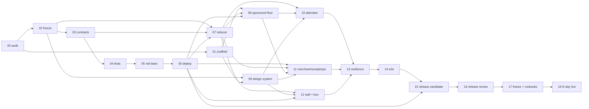

# PAKKA — Blitz Prompt Pack

**Prepared:** 14 August 2026
**Blitz day:** 16 August 2026
**Team:** 3 members
**Frozen decisions:** [`IMPLEMENTATION_PLAN.md`](./IMPLEMENTATION_PLAN.md) — cited below as **PLAN §x**
**Product intent:** [`PRODUCT_SPEC.md`](./PRODUCT_SPEC.md)
**Use with:** Claude Opus 5, Fable 5, or an equivalent repository-aware coding agent with terminal access

> This is an execution system, not a mood board. Run the prompts in order. A prompt is complete only when its
> exit gate passes and its evidence is recorded. Never let visual polish outrun money safety, chain truth, or a
> clean stranger onboarding flow.

---

## 1. How to use this pack

1. Confirm the three reference documents are present in `docs/`:
   [`PRODUCT_SPEC.md`](./PRODUCT_SPEC.md), [`IMPLEMENTATION_PLAN.md`](./IMPLEMENTATION_PLAN.md), and this file.
2. Start one long-lived coding-agent session per owner lane when possible:
   - **Member A** — contracts, deployment, chain reliability.
   - **Member B** — attendee and merchant web experience.
   - **Member C** — event reducer, live wall, demo hardware, pitch evidence.
3. Paste [`SESSION_PREAMBLE.md`](./SESSION_PREAMBLE.md) into **every** session — it is one screen of invariants,
   authority, evidence rules, and stop conditions. Run
   [**Prompt 00**](#prompt-00--one-time-repository-audit) **once per lane** at the start of the build; it is a
   repository audit, not a per-session ritual. Then run only the prompts assigned to that lane in
   [§4](#4-prompt-index-and-dependency-graph).
4. Use small branches and merge at the stated integration gates. Do not let three agents edit the same files
   concurrently — file boundaries are in PLAN §7.3.
5. Each prompt ends by writing a gate report under `artifacts/gates/` in the format in
   [§5](#5-gate-evidence-format). Never include secrets.
6. If a gate fails, stop that lane, fix the failure, rerun the gate, and only then continue.
7. Humans — not the coding model — approve deployments, secret changes, mainnet transactions, sponsor limits,
   visual baselines, and any ignored security finding.

### 1.1 Continuity rules

These four rules are what make eighteen prompts behave as one build rather than eighteen unrelated sessions.

- **Every prompt declares its inputs.** `Depends on` lists upstream gates that must already be green. Starting a
  prompt whose dependencies are red is the single most common way to waste an hour.
- **Every prompt declares its outputs.** `Hand-off` names the artifact downstream lanes will consume and which
  prompts consume it. If you change what you publish, tell the consuming lane in the same commit.
- **Every prompt cites the plan, never restates it.** `Spec refs` points at PLAN sections. If a prompt and the
  plan disagree, the plan wins (PLAN §0.2) — stop and raise it rather than choosing.
- **Two schema freezes are load-bearing.** Gate G02 freezes the Solidity interface and event payloads; Gate G06
  freezes the deployment manifest shape. Everything downstream is written against those freezes, which is what
  lets contracts, reducer, and UI proceed in parallel. Breaking a freeze after the fact requires notifying every
  consuming lane.

### 1.2 Prompt execution contract

Every prompt assumes the agent can inspect and edit the repository and run commands. If it cannot, use the
prompt to produce a **patch plan only** — and do not accept invented command output.

Requirement keywords (`MUST`, `SHOULD`, `MAY`, `Gate`, `Confirmed`, `Source of truth`) are defined once in
PLAN §0.5.

### 1.3 Global stop conditions

Stop and ask a human before:

- broadcasting any mainnet transaction;
- changing a deployed contract address in production configuration;
- selecting or allowlisting a mainnet token;
- raising a paymaster budget or loosening a sponsor policy;
- rotating or exposing credentials;
- suppressing a failing monetary test, static-analysis finding, type error, or chain mismatch;
- changing a contract invariant or the post-threshold merchant confirmation rule;
- deleting or rewriting user work unrelated to the current prompt.

---

## 2. The non-negotiables, in one screen

**The nine rules live in [`SESSION_PREAMBLE.md`](./SESSION_PREAMBLE.md), which is the canonical copy for agents.**
They are deliberately not duplicated here — four divergent copies of an invariant list is how an invariant
quietly stops being one. The preamble also carries the deadline table, the vocabulary ban, the evidence rules,
and the stop conditions, and it is one screen long.

If you have not pasted it into this session, do that before reading further. Every prompt below assumes it.

The rule most often violated by well-meaning code, stated once here because it is the whole product:
**reaching the threshold sets `Ready` and moves no money.** Only the named merchant, only while `Ready`, only
before `decisionDeadline`, can settle. Never render `PAKKA!` on `Ready`.

---

## 3. Reading order for a fresh session

A new agent joining mid-build should read in this order and stop when oriented:

| Order | Read | For |
| --- | --- | --- |
| 1 | [`SESSION_PREAMBLE.md`](./SESSION_PREAMBLE.md) | invariants, authority, evidence rules, stop conditions |
| 2 | `CLAUDE.md` | repo conventions |
| 3 | [§4](#4-prompt-index-and-dependency-graph) | where the build currently is |
| 4 | latest files in `artifacts/gates/` | what is actually green |
| 5 | the `Spec refs` of your next prompt | only the plan sections you need |

Do not read all of `IMPLEMENTATION_PLAN.md` before every prompt. Read the cited sections.

---

## 4. Prompt index and dependency graph



| # | Prompt | Owner | Branch | Depends on | Exit artifact | Gate condition |
| --- | --- | --- | --- | --- | --- | --- |
| 00 | [repository audit](#prompt-00--one-time-repository-audit) | A once, B/C countersign | current | — | `G00-orientation.md` | real gate status verified; missing prerequisites named with the prompt each blocks |
| 01 | [scaffold and pin](#prompt-01--scaffold-pin-and-reproducible-baseline) | B (rev A) | `web/scaffold` | G00 | `G01-baseline.md` | clean clone installs and builds; template provenance pinned; no secrets tracked |
| 02 | [threat model + interface freeze](#prompt-02--executable-threat-model-and-contract-interface-freeze) | A | `chain/spec` | G00 | `THREAT_MODEL.md`, `G02-contract-spec.md` | every monetary requirement maps to a transition and planned test; human A approves the freeze |
| 03 | [implement contracts](#prompt-03--implement-pakkaescrow-and-demoinr) | A | `chain/contracts` | G02 | `G03-contracts.md` | compiles, within size limits, no unplanned authority or transfer path |
| 04 | [contract tests](#prompt-04--unit-fuzz-invariant-and-malicious-token-tests) | A | `chain/tests` | G03 | `G04-contract-tests.md` | deterministic, fuzz, invariant, malicious-token tests pass; monetary branch coverage met |
| 05 | [red-team review](#prompt-05--independent-contract-red-team-review) | A + 2nd human | `chain/security-fixes` | G04 | `G05-security-review.md` | zero open Critical/High; no unowned Medium fund/liveness finding; human sign-off |
| 06 | [deploy + seed + smoke](#prompt-06--deterministic-deployment-verification-seeding-and-smoke-scripts) | A | `chain/deploy` | G05 | `G06-deployment.md` | one command deploys and records testnet; verification and both lifecycle smokes pass; mainnet guarded |
| 07 | [chain package + reducer](#prompt-07--typed-chain-package-and-deterministic-event-reducer) | C (rev A) | `live/chain-reducer` | **G07a:** G02, G03 · **G07b:** G07a, G06 | `G07-chain-reducer.md` | **a:** replay deterministic and reconciles with contract state on all fixtures · **b:** manifest-bound clients validate chain, bytecode, and checksum |
| 08 | [sponsored batches](#prompt-08--privy-kernel-pimlico-and-sponsored-batches) | B (rev A) | `web/wallet-flow` | G01, G07, G06 | `G08-sponsored-flow.md` | fresh account completes a real three-call sponsored testnet join; chain reads prove exact accounting |
| 09 | [design system](#prompt-09--design-tokens-reactor-and-motion-primitives) | B | `web/design-system` | G01, G02 (lifecycle type only) | `G09-design-system.md` | all lifecycle states visually distinct, accessible, responsive, deterministic under screenshots |
| 10 | [attendee experience](#prompt-10--attendee-landing-and-plan-experience) | B | `web/attendee` | G07, G08, G09 | `G10-attendee.md` | a non-crypto human completes the mocked flow unaided; real testnet path still passes |
| 11 | [merchant/receipt/ops](#prompt-11--merchant-receipt-and-restricted-ops-surfaces) | B (rev A/C) | `web/merchant-receipt-ops` | G06, G07, G08, G09 | `G11-operator-surfaces.md` | merchant authority correct, receipts independently verifiable, ops cannot mutate financial truth |
| 12 | [wall + Purple Box](#prompt-12--live-wall-realtime-hints-and-purple-box) | C | `live/wall-box` | G07, G09 | `G12-live-wall.md` | 10 consecutive lifecycle/reconnect cycles preserve state; box unlocks only after finalized settlement |
| 13 | [PWA resilience](#prompt-13--pwa-offline-shell-resilience-and-performance-polish) | B + C | `web/resilience` | G10, G11, G12 | `G13-resilience.md` | offline shell honest, no dangerous caching, failover works, budgets met or approved |
| 14 | [end-to-end suite](#prompt-14--end-to-end-lifecycle-and-visual-regression-suite) | B/C (A fixtures) | `test/e2e` | G13 | `G14-e2e.md` | all 15 scenarios pass; no critical visual/a11y regression; real testnet matches deterministic suite |
| 15 | [release candidate](#prompt-15--deployment-live-links-monitoring-and-rollback) | A + B/C | `release/deploy` | G06, G14 | `G15-release-candidate.md` | public RC, verified testnet contract, settlement/refund evidence, QR, rollback all work |
| 16 | [release review](#prompt-16--full-release-review-security-ux-and-truthfulness) | all three | review → fixes | G15 | `G16-release-review.md` | zero Critical/High; three human sign-offs; one clean full-gate rerun after the last change |
| 17 | [demo freeze](#prompt-17--demo-freeze-runbooks-and-evidence-pack) | C (rev A/B) | `release/demo-freeze` | G16 | `DEMO_RUNBOOK.md`, `INCIDENT_FALLBACKS.md`, `G17-freeze.md` | two clean rehearsals from the written runbook; tag exists; fallbacks ready offline |
| 18 | [D-day live](#prompt-18--d-day-deploy-seed-prove-and-capture) | A writes; B/C observe | event release branch | G17 | `G18-live.md`, [`LIVE_LINKS.md`](./LIVE_LINKS.md) | real room plan verified and healthy; every claim has a working URL or a labelled fallback |

### 4.1 Convergence, not a single critical path

This is a **convergence graph**: three lanes fan out from two freezes and reconverge at G13. Describing it as one
chain is misleading, because the release does not depend on the contract lane alone — G15 needs G14, which needs
the entire web and reducer path.

The **longest chain**, and therefore the true schedule risk, is:

```
00 → 02 → 03 → 04 → 05 → 06 → 07 → 08 → 10 → 13 → 14 → 15 → 16 → 17 → 18
```

Fifteen gates deep. Note what that means in practice: **the contract lane is not the bottleneck by itself** — a
day lost on G05 or G06 delays the sponsored join, which delays the attendee flow, which delays everything. Lane
A finishing early is what buys lanes B and C their room.

Structure of the graph:

| Stage | What happens |
| --- | --- |
| **Fan-out 1 — after G02** | The interface, event payloads, and the shared UI lifecycle type are frozen. Lane C builds the whole reducer core (G07a) from the frozen payloads and lane B builds the design system (09) against the frozen lifecycle type — both while lane A is still writing Solidity. This is the entire point of freezing early. |
| **Fan-out 2 — after G06** | The manifest exists. G07b binds clients to it, and 08, 11, 12, and 15 can all read real addresses. |
| **Convergence — G13** | 10, 11, and 12 must all be merged. This is the last barrier before testing. |
| **Serial tail — G14 → G18** | Test, release, review, freeze, run. No parallelism available here; protect the time. |

Two structural rules that hold throughout:

- **G07 is the integration seam.** Nothing in `apps/web` reaches the chain except through `packages/chain`.
- **Only G07a and G09 are genuinely chain-independent.** Every other web prompt needs a real address or a real
  signer. If the contract lane slips, those two are the only useful work available to lanes B and C — plan for
  that rather than discovering it.

### 4.2 Scope: run Core first

Do not attempt every prompt at its literal maximum. Each gate has a **Core** bar and a **Stretch** set, defined
in PLAN §8.6, and **a gate passes at Core**. Stretch items are recorded as `NOT RUN — stretch` in the gate
report — an honest pass, not a silent omission. The gates explicitly accept the cut variants (digital box,
direct polling instead of a realtime relay, two viewports instead of five, mainnet `SKIPPED SAFELY`), so the cut
ladder in PLAN §9.2 and the gate definitions cannot contradict each other.

---

## 5. Gate evidence format

Every prompt writes one file to `artifacts/gates/`. Format and index:
[`../artifacts/gates/README.md`](../artifacts/gates/README.md). Required contents:

```md
# Gxx — <title>

- Prompt: xx
- Owner: A | B | C
- Branch / commit SHA:
- Date (UTC):
- Depends on: <upstream gates, and whether each was green>
- Status: PASS | FAIL | BLOCKED

## Commands run
<command → exit status → key output, verbatim, secrets redacted>

## Changed files
## Evidence
<addresses, tx hashes, links — only if actually observed>
## Hand-off
<what downstream prompts can now rely on>
## Risks / TODO / accepted findings
<each with an owner>
```

Rules: never include secrets. Never invent command output, hashes, addresses, or links. `BLOCKED` is a legitimate
and useful status — a fabricated `PASS` is not.

---

## 6. The prompts

Paste [`SESSION_PREAMBLE.md`](./SESSION_PREAMBLE.md) at the beginning of every session, run Prompt 00 once per
lane, then run the numbered prompts in sequence for the relevant lane. The prompts deliberately instruct the
agent to inspect the repo before editing, execute tests, and report evidence. **Do not remove those constraints
to make the model "go faster."**

Every prompt inherits the preamble's rules; they are not repeated in each prompt body.

---

### Prompt 00 — one-time repository audit

**Owner:** **A, once globally**, reviewed by B and C
**Branch:** current
**Depends on:** —
**Spec refs:** PLAN §0.2 (authority order), §0.4 (document map), §7.1 (prerequisites)
**Exit artifact:** `artifacts/gates/G00-orientation.md`

> **Run this once for the whole team, not once per lane and not once per session.** Three lanes running it
> concurrently would race on the same artifact path and the last writer would win. A runs it, B and C read and
> countersign it. The per-session rules live in [`SESSION_PREAMBLE.md`](./SESSION_PREAMBLE.md), which is one
> screen long and is what each lane actually pastes.
>
> Re-run only when repository state changes materially — the toolchain changes, or a gate is invalidated. A
> re-run appends a dated *Rerun* section; it does not overwrite the original.

```text
Audit the PAKKA repository and produce a durable orientation artifact. Make NO product-code edits in this step.

Read, in this order, stopping when you can answer the questions below:
1. docs/README.md — the document map
2. docs/IMPLEMENTATION_PLAN.md sections 0 (document control), 2 (money rules), and 4 (contract decisions)
3. docs/PAKKA_BLITZ_PROMPT_PACK.md section 4 — the dependency graph and current gate status
4. CLAUDE.md, README.md, package manifests, Foundry config, .env.example, and any AGENTS.md
Read docs/PRODUCT_SPEC.md only if the plan leaves you unclear on product intent — the plan outranks it.

Then inspect and report:
- repository tree, current branch, git status, and whether the worktree is dirty;
- every file in artifacts/gates/ and the real status of each gate — trust the reports, not assumptions;
- installed tool versions: node, npm, git, forge, cast, anvil, slither, and the Monad-recommended Foundry
  build per current official docs;
- which prerequisites in plan section 7.1 are satisfied and which are missing, naming the prompt each missing
  item blocks;
- whether any environment variable required by the prompts your lane will run is absent;
- any place where the plan, the pack, and the code disagree.

Answer explicitly:
- Which gates are green, which are claimed but unverifiable, and which are not started?
- What is the next prompt for this lane, and are all of its `Depends on` gates actually green?
- Is it safe to continue, or is there a blocker a human must clear first?

Write artifacts/gates/G00-orientation.md containing the repo map, detected tool versions, dirty-worktree notes,
missing prerequisites with the prompt each one blocks, the verified gate-status table, and an explicit
safe-to-continue verdict. Do not begin the next prompt.
```

**Gate G00:** the real gate status is verified rather than assumed; missing prerequisites are named along with
the prompt each one blocks; a safe-to-continue verdict is recorded.
**Hand-off:** a verified gate-status snapshot and prerequisite gap list every other prompt can trust.

---

### Prompt 01 — scaffold, pin, and reproducible baseline

**Owner:** B, reviewed by A
**Branch:** `web/scaffold`
**Depends on:** G00
**Spec refs:** PLAN §6.1 (layout), §6.2 (environment contract), §8.1 (command gate)
**Exit artifact:** `artifacts/gates/G01-baseline.md`

```text
Create a reproducible PAKKA monorepo baseline without implementing product features yet.

Requirements:
1. Use npm workspaces and exactly one root package-lock.json.
2. Start from the official monad-developers/next-serwist-privy-smart-wallet template or, if the repo already
   contains it, audit the imported files. Record the exact upstream URL and commit SHA in README.md. Do not
   track a moving branch as provenance.
3. Preserve the template's verified smart-wallet path before upgrading dependencies. Run its original clean
   install/build and a local wallet smoke if credentials exist. If the upstream is too old or incompatible,
   document the smallest compatibility patch; do not perform a broad framework upgrade.
4. Create the repository structure in docs/IMPLEMENTATION_PLAN.md section 6.1, shared TypeScript configs, root
   scripts, .nvmrc or equivalent pinned Node version, .env.example matching the variable table in section 6.2,
   and a strict startup environment schema in packages/config.
5. Pin direct dependency versions. Ensure viem meets Monad's documented minimum (section 3.2) and record the
   installed Monad Foundry version. Add Renovate/Dependabot only if it does not delay the build.
6. Add scripts for lint, typecheck, unit test, build, e2e, contract build/test, ABI generation, and a single
   `npm run gate` aggregator covering exactly the command list in section 8.1.
7. Add CI that uses npm ci, Foundry, lint, typecheck, unit tests, contract tests, and production build. Do not
   require deployment secrets on pull requests.
8. Add secret-safe .gitignore entries and a `verify:no-secrets` check that fails if private-key-shaped values or
   committed .env files are detected.

Run a clean install and production build. Record exact versions, upstream commit, commands, results, and
unresolved blockers in G01-baseline.md. Do not implement PAKKA screens or contracts in this step.
```

**Gate G01:** a clean clone can install and build; template provenance is pinned; no secrets are tracked.
**Hand-off:** workspace layout, `npm run gate`, env schema, and the pinned template SHA — consumed by Prompts
08, 09, and every later gate run.

---

### Prompt 02 — executable threat model and contract interface freeze

**Owner:** A, **co-approved by C** (the reducer consumer) — the author alone cannot sign off a schema two other
lanes must build against
**Branch:** `chain/spec`
**Depends on:** G00
**Spec refs:** PLAN §2.4–§2.6 (state machine, deadlines, transitions), §4.1–§4.7 (all contract decisions),
§6.3 (canonical metadata)
**Exit artifact:** `docs/THREAT_MODEL.md`, `artifacts/gates/G02-contract-spec.md`

> **This is the first load-bearing freeze**, and it unblocks both other lanes. Lane C starts the reducer (G07a)
> against the event payloads frozen here and lane B starts the design system (09) against the UI lifecycle type
> frozen here — both in parallel with Prompt 03. Publish all three artifacts the moment the gate is green.

```text
Before writing Solidity, convert the product specification into an executable contract design and threat model.
The frozen decisions are in docs/IMPLEMENTATION_PLAN.md sections 2 and 4 — implement those, do not reinvent
them, and flag any place they are internally inconsistent instead of choosing silently.

Produce docs/THREAT_MODEL.md with:
- actors, trust boundaries, protected assets, authority boundaries, and explicit non-goals;
- the full state transition table, caller permissions, deadline semantics, and terminal-state behavior;
- invariants for per-plan liability, liabilityByToken, membership, frozen participantCount, single settlement,
  single refund, and zero liability after completion;
- threats: reentrancy, fee-on-transfer/rebasing/malicious tokens, duplicate join, stale quote, deadline races,
  pause abuse, owner abuse, wrong token/chain, overflow/cast errors, event inconsistency, griefing, denial of
  refund, and smart-account batch partial assumptions;
- mitigation and a test ID for every threat;
- a list of residual hackathon risks and production work not claimed.

Freeze the Solidity interface, structs, enums, custom errors, events with their final indexed-parameter layout
(plan section 4.4), the named constants and validation rules (plan section 4.5 — the values are already fixed,
transcribe them exactly and do not re-derive them), the construction and initial-state decisions (plan section
4.1), ownership model, allowlist policy, and the exit-preserving pause policy. Design liabilityByToken and exact
balance-delta checks. Ensure there is no participant array and no refund loop.

Also freeze two cross-lane artifacts, because downstream lanes are blocked without them:

1. A shared TypeScript **plan lifecycle type** in packages/chain — the discriminated union of confirmed
   lifecycle states (empty, pending, confirmed, ready, settled, released, reverted) plus the separate pending
   overlay shape. Prompt 07 returns it and Prompt 09 renders it, so freezing it here is what lets those two run
   in parallel without an adapter layer. It is a type-only artifact and depends on no Solidity.
2. The **canonical metadata serializer and its test vector** (plan section 6.3): RFC 8785 JCS, lowercase
   addresses, keccak256 over UTF-8 bytes. Add the plan's published 294-byte vector as a passing test in both
   Solidity and TypeScript. If your implementation does not reproduce the published digest, your serializer is
   wrong — do not adjust the expected value.

Create interface/fixture files needed by tests, but do not implement function bodies beyond compile-safe stubs
if necessary. Add a state-machine diagram and a traceability table mapping each source requirement to a
function, event, and test ID; keep those test IDs stable, because Prompt 04 and Prompt 05 cite them.

Run formatting and compilation. End by calling out any spec conflict rather than silently choosing. Write
G02-contract-spec.md, including the frozen event payload list verbatim so lane C can build against it, and stop.
```

**Gate G02:** every monetary requirement maps to a state transition and a planned test ID; the metadata test
vector reproduces the published digest; **A and C both sign** the interface freeze.
**Hand-off:** frozen interface + event payloads + stable test IDs → Prompts 03, 04, 05, 07 · UI lifecycle type →
Prompt 09 · canonical serializer → Prompts 06, 11.

---

### Prompt 03 — implement PakkaEscrow and DemoINR

**Owner:** A
**Branch:** `chain/contracts`
**Depends on:** G02
**Spec refs:** PLAN §4.1–§4.7, §2.5 (deadline semantics)
**Exit artifact:** `artifacts/gates/G03-contracts.md`

```text
Implement the frozen PAKKA contracts exactly as specified in docs/IMPLEMENTATION_PLAN.md sections 4.1–4.7 and
the Prompt 02 freeze. Do not add product features.

PakkaEscrow requirements:
- Solidity ^0.8.24 and pinned OpenZeppelin 5.x imports;
- SafeERC20, ReentrancyGuard, Pausable, Ownable2Step, custom errors;
- the storage, functions, events, constants, and deadline semantics frozen in Prompt 02;
- exact balance-delta validation on joins;
- checks/effects before transfers, protected by nonReentrant;
- per-plan totalLocked and global liabilityByToken updated together;
- threshold join emits ParticipantJoined and PlanReady, records readyAt, transfers nothing;
- atomic merchant confirmation sets terminal state and zeroes liability before one aggregate transfer;
- reject/expire do no refund loop; claimRefund is exact and one-time;
- leave clears active membership before returning funds and allows a later fresh rejoin;
- cancellation only by creator with zero active participants in the specified states;
- allowlist changes and pause controls only by owner;
- pause blocks new exposure and settlement but preserves valid exits/refunds;
- no rescue path for escrow liabilities, no upgradeability, no hidden fees.

DemoINR requirements:
- six decimals;
- open mint only for testnet demonstration;
- unmistakable NO CASH VALUE / TESTNET ONLY source comments, name/symbol metadata, and README warning;
- never referenced by the mainnet deployment script.

Use NatSpec on all external functions and security-sensitive state. Keep functions small and readable. Run
forge fmt --check, forge build --sizes, and the existing tests. This prompt OWNS ABI generation: write the
shared generator and emit packages/chain/src/abi from the Foundry artifacts, so lane C consumes generated output
rather than a hand-copied file. Prompt 06 will invoke this same generator to publish and checksum the ABI — it
must not write a second one. Write
G03-contracts.md with bytecode sizes, compiler settings, and results. Stop if the implementation deviates from
the frozen interface.
```

**Gate G03:** contracts compile, bytecode is within limits, and a line-by-line review finds no unplanned
authority or transfer path.
**Hand-off:** compiled artifacts and generated ABI → Prompts 04, 06, 07.

---

### Prompt 04 — unit, fuzz, invariant, and malicious-token tests

**Owner:** A
**Branch:** `chain/tests`
**Depends on:** G03
**Spec refs:** PLAN §4.5–§4.7, §8.1–§8.2 (commands and coverage target)
**Exit artifact:** `artifacts/gates/G04-contract-tests.md`

```text
Build a comprehensive Foundry test suite for PakkaEscrow. Tests must verify behavior, state, events, balances,
and global liability — not merely that calls do not revert. Use the stable test IDs from the Prompt 02
traceability table so coverage can be traced back to requirements.

Required deterministic tests:
- every valid and invalid create input, including each bound in plan section 4.5;
- only merchant quote acceptance, before the funding deadline;
- join before acceptance, duplicate join, wrong state, deadline boundary, paused state;
- exact single contribution accounting and emitted counts;
- leave, leave→rejoin, refund-after-leave rejection;
- threshold join reaches Ready without changing merchant balance;
- only merchant can confirm/reject; confirm before Ready and at/after deadline revert;
- exact aggregate settlement once; state and liabilities zero before transfer;
- funding expiry from AwaitingQuote and Open, and response expiry from Ready;
- rejection and both expiries enable only eligible one-time refunds;
- refund clears hasJoined and liability; terminal participantCount remains frozen;
- cancellation permissions and zero-member requirement;
- token allowlist and two-step ownership transfer;
- exit-preserving pause behavior exactly as tabulated in plan section 4.7;
- multiple plans sharing a token, and multiple tokens, cannot cross-subsidize liabilities;
- events contain reconstructable data — assert the payloads lane C's reducer depends on.

Every deadline test must assert both sides of the same instant: the permissive action succeeds at
timestamp - 1 and reverts at the deadline, and the expiry reverts at timestamp - 1 and succeeds at the deadline.

Adversarial tests:
- reentrant transferFrom/transfer callback token;
- fee-on-transfer token;
- token returning false or reverting;
- oversized values/casts and timestamp edges;
- repeated settle/refund/expire/reject calls;
- randomized interleavings across plans.

Add stateful invariant tests with a handler. At minimum assert:
1. sum of plan liabilities for each token equals liabilityByToken;
2. contract balance is never below liabilityByToken for supported standard tokens;
3. a participant has at most one active contribution per plan;
4. Settled/Cancelled plans cannot regain liability;
5. each contribution exits at most once;
6. merchant cannot receive before confirmed Ready settlement;
7. no terminal transition is reversible.

Run forge test -vvv, fuzz/invariants with a meaningful run count, forge coverage, and forge test --gas-report.
Target 100% branch coverage for join, leave, readiness, settlement, expiry, rejection, and refund. If a line is
intentionally unreachable, document why; do not add meaningless tests to inflate numbers. Write
G04-contract-tests.md with test count, seed/run settings, coverage summary, gas summary, and any residual gaps.
```

**Gate G04:** all deterministic, fuzz, invariant, and malicious-token tests pass; the monetary branch coverage
target is met.
**Hand-off:** the regression suite every later prompt reruns; event-payload assertions that pin the G02 freeze.

---

### Prompt 05 — independent contract red-team review

**Owner:** A requests; another human approves
**Branch:** review first, then `chain/security-fixes`
**Depends on:** G04
**Spec refs:** PLAN §4 (all), §8.4 (scorecard), `THREAT_MODEL.md`
**Exit artifact:** `artifacts/gates/G05-security-review.md`

```text
Act as an adversarial smart-contract reviewer. Do not edit code during the first pass.

Read docs/PRODUCT_SPEC.md, docs/IMPLEMENTATION_PLAN.md, docs/THREAT_MODEL.md, the contract, tests, deployment
scripts, and the git diff. Build an attack table with severity, likelihood, exact code location, exploit
sequence, affected invariant, proof/test, and remediation. Review at least:
- state-machine completeness and deadline equality;
- access control and two-step ownership transfer;
- quote freshness and merchant authority;
- CEI and every external token call;
- exact accounting, global solvency, shared-token multi-plan isolation;
- non-standard ERC-20 behavior;
- pause/refund liveness and admin censorship;
- replay/double-action possibilities;
- event correctness and off-chain reconstruction — a reducer built only from logs must not be able to disagree
  with getPlan;
- denial-of-service and gas bounds;
- unsafe casts, storage packing assumptions, and timestamp math;
- deployment/allowlist misconfiguration;
- test blind spots against the Prompt 02 traceability table.

Run available static analysis (Slither if installed), forge fmt --check, build, full tests, coverage, and gas
report. Classify tool false positives with evidence; never silence them without a note.

After presenting the first-pass report, fix Critical/High findings and clear Medium findings that affect
hackathon funds or liveness. Add regression tests first where practical. Rerun all checks. Do not broaden scope.
If a fix requires changing the frozen interface or events, stop and say so explicitly — lane C is already
building against them.

Write G05-security-review.md containing first-pass findings, fixes, regression tests, accepted residual findings
with owner, and final gate status.
```

**Gate G05:** zero open Critical/High findings; no unowned Medium fund-safety/liveness finding; human reviewer
signs off.
**Hand-off:** contracts are now deployment-eligible → Prompt 06.

---

### Prompt 06 — deterministic deployment, verification, seeding, and smoke scripts

**Owner:** A
**Branch:** `chain/deploy`
**Depends on:** G05
**Spec refs:** PLAN §4.8 (mainnet token), §6.1 (manifest generation), §6.3 (metadata hashing),
[`MAINNET_APPROVAL.md`](./MAINNET_APPROVAL.md)
**Exit artifact:** `artifacts/gates/G06-deployment.md`

> **This is the second load-bearing freeze.** `deployments/<chainId>.json` becomes the single source of
> addresses, deployment block, and explorer URL builders for Prompts 07, 08, 11, 12, and 15.

```text
Implement deterministic, idempotent deployment and lifecycle tooling for Monad testnet and guarded mainnet use.

"Deterministic" here means repeat-safe, as defined in plan section 6.1.1 — read an existing manifest and refuse
to redeploy over it, archive on --force-redeploy, write atomically. It does NOT mean CREATE2 with a fixed salt;
do not add a factory.

Create scripts that:
- validate environment and eth_chainId before any write;
- deploy DemoINR only on chain 10143;
- deploy PakkaEscrow with the intended owner;
- allowlist DemoINR on testnet;
- write deployments/<chainId>.json atomically with chain ID, RPC label (not the secret URL), contract
  addresses, deployment block, deploy tx hashes, compiler settings, git SHA, timestamp, and explorer URL
  builders;
- publish and checksum the ABI that Gate G03 already generated into packages/chain — invoke the same shared
  generator, do not write a second one, and record the ABI checksum in the manifest;
- write a `checksum` field over the manifest's own canonical content, and emit the four chain-derived
  NEXT_PUBLIC_* values plus that checksum via `npm run config:emit` (plan section 6.2.1). No human types an
  address into an environment file at any point;
- verify source through the official Monad Foundry verification path and then confirm verification by
  opening/reading the explorer result;
- canonicalize and hash versioned plan metadata per plan section 6.3, save the exact JSON bytes, verify the hash
  before merchant acceptance, seed a plan, and output share/merchant/wall URLs;
- run settle and reject/expire/refund smoke lifecycles and assert balances, state, and liabilityByToken after
  every transaction;
- rerun safely without silently deploying duplicates.

Publish and document the manifest schema explicitly in G06-deployment.md: Prompts 07, 08, 11, 12, and 15 all
read it, so any later field change must be announced.

Mainnet guardrails. Note carefully: this prompt BUILDS AND TESTS the guard — it does not satisfy it. Mainnet
must remain unbroadcast at Gate G06, and docs/MAINNET_APPROVAL.md is expected to be incomplete at this stage.
Only Prompt 18 requires a completed approval.

- require explicit `--network mainnet --confirm-chain-id 143` and an interactive human confirmation or a signed
  approval file;
- never deploy DemoINR;
- resolve USDC from current Circle and Monad sources, then verify bytecode/name/symbol/decimals;
- parse docs/MAINNET_APPROVAL.md and refuse to broadcast unless every checklist item is initialled by two
  distinct approvers and the decision line reads APPROVED;
- use tiny configurable amounts and print a human-readable maximum exposure before broadcasting;
- stop on any mismatch; no fallback token.

Prove the guard rather than asserting it. Required negative tests, all run against a dry-run or fork so nothing
is broadcast:
- an incomplete or unsigned MAINNET_APPROVAL.md aborts with a non-zero exit;
- a missing --confirm-chain-id, or one that disagrees with eth_chainId, aborts;
- a USDC address whose decimals or symbol mismatch aborts;
- the DemoINR deploy path is unreachable when --network mainnet is set — assert this at the code level, not by
  observation;
- a second run against an existing manifest refuses to redeploy and exits non-zero without --force-redeploy
  (plan section 6.1.1).

Use the official Foundry verification guide: https://docs.monad.xyz/guides/verify-smart-contract/foundry

Add npm wrappers and README commands. Dry-run locally/anvil first, then rehearse testnet only if credentials are
present. Capture actual links only when a transaction truly exists. Write G06-deployment.md with commands,
manifest schema, testnet rehearsal evidence, and mainnet-not-broadcast status.
```

**Gate G06:** one command deploys and records testnet contracts; verification and both lifecycle smoke paths
succeed; mainnet remains guarded.
**Hand-off:** `deployments/<chainId>.json` schema + testnet addresses + seeded plan → Prompts 07, 08, 11, 12, 15.

---

### Prompt 07 — typed chain package and deterministic event reducer

**Owner:** C, reviewed by A
**Branch:** `live/chain-reducer`
**Depends on:** **G07a** — G02 (event freeze) + G03 (ABI) · **G07b** — G07a + G06 (manifest)
**Spec refs:** PLAN §3.1 (authority), §3.3 + §3.3.1 (finality constants and counting rule), §4.4 (event
payloads), §6.1 (chain package rules), §6.2.1 (manifest checksum)
**Exit artifact:** `artifacts/gates/G07-chain-reducer.md`

> **Split into two gates so the manifest does not block the reducer.** G07a is the pure reducer, its types, and
> its fixtures — it needs only the G02 freeze and the G03 ABI, and lane C should finish it while lane A is still
> at Prompts 04–06. G07b binds real clients to `deployments/<chainId>.json` and can only close after G06. Claim
> them separately in the gate report; downstream prompts depend on G07b, but a green G07a is real progress worth
> recording.

```text
Implement packages/chain as the only web-facing integration layer for PAKKA contracts. Nothing in apps/web may
reach the chain except through this package.

Requirements:
- generated ABI import; typed addresses and explorer URL builders read from deployments/<chainId>.json using the
  schema published at Gate G06;
- validated Monad chain definitions and primary/backup public clients using viem >= the official minimum;
- startup checks for chain ID, nonzero bytecode, and expected contract/token addresses, failing closed;
- typed read/write helpers and transaction intent types;
- a pure event reducer that consumes ordered decoded logs and returns current participants, per-address active
  status, plan milestones, refund progress, and canonical explorer links;
- deterministic deduplication by (chainId, txHash, logIndex) and ordering by
  (blockNumber, transactionIndex, logIndex);
- replay starts at the deployment block and handles chunked getLogs provider limits;
- snapshots reconcile reducer output with getPlan; disagreement becomes a visible health error and triggers a
  bounded full replay;
- pending operations are a separate overlay and never mutate confirmed counts;
- receipt tracking distinguishes submitted, receipt-seen, finalized, reverted, timed-out, and superseded;
- retry intent checks current on-chain state before resubmission, per plan section 3.3;
- primary RPC failover preserves the same chain and verifies the returned chain ID.

Build the reducer against the event payloads frozen at Gate G02 so this work can proceed in parallel with the
Solidity implementation. If a payload you need is absent from the freeze, stop and raise it — do not infer a
field.

Create unit fixtures for join, leave, rejoin, ready, settle, reject, both expiries, partial refunds, duplicate
delivery, out-of-order input, refresh, provider chunking, and reorg-like pending replacement. Add property tests
if practical: replaying the same canonical log set in chunks must yield the same state.

Do not add Supabase authority or UI components. Run typecheck and reducer tests. Write G07-chain-reducer.md with
fixture coverage, failover behavior, the exported surface downstream lanes should use, and any provider
assumptions.
```

**Gate G07a:** reducer replay is deterministic across all lifecycle fixtures, and chunked replay of the same
canonical log set yields identical state.
**Gate G07b:** manifest-bound clients validate chain ID, contract bytecode, and manifest checksum, fail closed
on mismatch, and reducer output reconciles exactly with a live `getPlan`.
**Hand-off:** the typed chain surface, the lifecycle type implementation, and the reducer — the integration seam
for Prompts 08, 10, 11, 12.

---

### Prompt 08 — Privy, Kernel, Pimlico, and sponsored batches

**Owner:** B, reviewed by A
**Branch:** `web/wallet-flow`
**Depends on:** G01 (pinned template), G07 (typed chain), G06 (testnet addresses for the real join)
**Spec refs:** PLAN §2.7 (vocabulary), §3.3 (retry), §6.2 (sponsor restrictions)
**Exit artifact:** `artifacts/gates/G08-sponsored-flow.md`

```text
Integrate the pinned official Monad PWA template's Privy embedded-wallet and Pimlico Kernel smart-account flow
into PAKKA. Preserve the known-working account-abstraction path; do not rewrite it from memory.

Requirements:
- email and Google login; embedded EVM signer automatically created;
- distinguish the Privy signer address from the smart-account address everywhere in code and diagnostics;
- wait for wallet/account readiness before enabling join;
- chain must be the configured Monad network; fail closed on mismatch;
- encode calls with viem and the generated ABI, through packages/chain only;
- testnet join batch: DemoINR.mint(smartAccount, contribution), approve exact escrow amount,
  PakkaEscrow.join(planId);
- mainnet join batch: read balance and allowance; include approve only when needed, then join; no mint path can
  compile into mainnet mode;
- estimate/simulate where supported before sending;
- create one idempotency/client-operation ID and persist tx/user-op identifiers;
- show human copy for login, preparing, submitted, confirmed, already joined, plan closed, rejected, sponsor
  denied, and reverted states;
- never automatically submit twice after a timeout; reconcile against hasJoined and plan state on chain first,
  per plan section 3.3;
- restrict the sponsor policy to expected chain, targets/selectors, gas, origin, per-user rate, and total event
  budget;
- include an ops-only diagnostic that shows account addresses, chain, sponsor status, and hashes without
  exposing secrets;
- no consumer-facing words: wallet, gas, approve, ERC-20, user operation, contract call, paymaster, testnet
  (except the explicit no-cash-value demo label).

Write integration tests with provider clients mocked at boundaries, then perform a real testnet sponsored batch
if configured. Confirm token balance delta, hasJoined, participantCount, totalLocked, liabilityByToken, receipt,
and explorer link. Record timing from tap to confirmed state — the 25-second target in plan section 1.1 is
measured end to end at Prompt 10 and 16, so capture the wallet-flow portion now. Write G08-sponsored-flow.md.
```

**Gate G08:** a fresh test account completes a real three-call sponsored testnet join and chain reads prove exact
accounting.
**Hand-off:** the join service, operation-ID scheme, and measured timing baseline → Prompt 10.

---

### Prompt 09 — design tokens, reactor, and motion primitives

**Owner:** B
**Branch:** `web/design-system`
**Depends on:** G01; G02 for the shared UI lifecycle type only — no chain, RPC, or wallet dependency
**Spec refs:** PLAN §5.1–§5.7 (entire visual system), §2.7 (vocabulary), §8.6 (Core vs Stretch baselines)
**Exit artifact:** `artifacts/gates/G09-design-system.md`

```text
Build the PAKKA visual system and reusable motion primitives before composing full pages.

This prompt needs no deployed contract, no RPC, and no wallet — it may run in parallel with the entire contract
lane. Its one upstream input is a type: the shared plan lifecycle union frozen at Gate G02. Import that type and
render it. Do not wait for Prompt 07, and do not invent a parallel shape that will need reconciling later.

Translate docs/IMPLEMENTATION_PLAN.md section 5 into code:
- semantic color, type, spacing, radius, elevation, z-index, and motion tokens;
- near-black plum base, verified violet, pending amber, settlement gold, release grey, true-error red;
- responsive display typography and legible UI typography with deterministic loading;
- accessible Button, ActionCard, StatusPill, Countdown, ExplorerLink, PlanFacts, Toast/LiveRegion, Skeleton, and
  NetworkHealth components;
- an SVG CommitmentReactor that supports 2–100 segments and explicit empty/pending/confirmed/ready/settled/
  released/reverted states;
- Anime.js timelines isolated in hooks/utilities with cleanup, one-shot transition IDs, reduced-motion variants,
  and responsive scopes;
- a development-only state gallery showing every component and lifecycle state without requiring chain access.

The reactor must not infer state from a numeric percentage alone. It receives typed confirmed state plus a
separate pending overlay. It must never label Ready as PAKKA/Settled, and a React re-render must not replay the
settled celebration.

Components consume the Gate G02 lifecycle type directly. Prompt 07's reducer returns that same type, so Prompt
10 composes the two with no adapter layer. If you find yourself wanting a field the type does not have, raise it
against G02 rather than widening the props locally.

Add unit tests for state mapping and reduced-motion behavior. Use stable fixture data and disable
nondeterministic ambient effects for screenshots.

Core — required to pass this gate:
- Playwright visual baselines at 390x844 (the event phone) and 1920x1080 (the wall projection);
- axe clean on the state gallery;
- lint, typecheck, tests, production build.

Stretch — record as "NOT RUN — stretch" if time is short, do not fail the gate on these:
- baselines at 360x640, 768x1024, and 1440x900;
- celebration particles and ambient motion beyond the state transitions themselves.

Write G09-design-system.md with screenshots reviewed by a human, naming which viewports were captured.
```

**Gate G09 (Core):** all lifecycle states are visually distinct, accessible, and deterministic under screenshots
at the two Core viewports; the reactor never labels `Ready` as settled.
**Stretch:** the remaining three viewports, ambient motion, celebration particles.
**Hand-off:** component library, motion primitives, state gallery, visual baselines → Prompts 10, 11, 12, 14.

---

### Prompt 10 — attendee landing and plan experience

**Owner:** B
**Branch:** `web/attendee`
**Depends on:** G07, G08, G09
**Spec refs:** PLAN §5.2 (page map), §5.3 (state-to-motion), §2.5 (deadline copy), §2.7 (vocabulary), §1.1
**Exit artifact:** `artifacts/gates/G10-attendee.md`

```text
Implement the landing page and /p/[slug] attendee journey using the typed chain layer from Prompt 07, the
sponsored-flow service from Prompt 08, and the design system from Prompt 09. Compose them; do not reimplement
them.

Requirements:
- plan facts visible before login: title, merchant, equal amount, confirmed count/threshold, funding deadline,
  quote status, demo/mainnet label;
- one dominant state-appropriate action;
- first tap begins clear login only when needed, then resumes the same intent after account readiness;
- pending is amber and not counted; finalized join becomes solid violet with an explorer link;
- refresh/reopen detects already joined and never offers a duplicate join;
- Ready removes join/leave actions and says awaiting merchant;
- Settled says PAKKA only after confirmed settlement;
- Expired/Rejected offers claim refund only to an eligible active participant and tracks it through
  confirmation;
- Open active members may leave before the deadline with explicit consequence copy and confirmation;
- countdown equality matches the contract rules in plan section 2.5 exactly, including which side of the
  instant is permissive;
- no hidden login wall, crypto vocabulary, fake testimonials, fake metrics, or fabricated transaction links;
- SEO/share metadata and QR target use the canonical production URL;
- offline shell may load, but financial actions clearly require connectivity and fresh chain state.

Add component/unit tests for every state and Playwright flows using a deterministic chain adapter: new visitor,
login resume, pending, confirmed, duplicate prevention, leave/rejoin, Ready, Settled, rejection refund, expiry
refund, revert, RPC timeout, and reduced motion. Record a production-build mobile trace and fix layout shift or
unusable modal behavior. Measure and record full tap-to-confirmed timing against the 25-second target. Write
G10-attendee.md.
```

**Gate G10:** a human unfamiliar with crypto can explain the plan and complete the mocked flow without
assistance; the real testnet path still passes.
**Hand-off:** the attendee flow and its deterministic chain adapter → Prompts 13, 14.

---

### Prompt 11 — merchant, receipt, and restricted ops surfaces

**Owner:** B; ops diagnostics reviewed by A and C
**Branch:** `web/merchant-receipt-ops`
**Depends on:** G06 (manifest, verified-source links), G07 (reads and reducer), **G08** (the merchant route
performs real writes — `acceptQuote`, `confirmReadyAndSettle`, `rejectReadyPlan` — so it needs the smart-account
and signing path), G09
**Spec refs:** PLAN §2.5–§2.6 (authority and deadlines), §6.3 (metadata verification), §3.1 (authority rules),
§6.2.1 (checksum display)
**Exit artifact:** `artifacts/gates/G11-operator-surfaces.md`

```text
Implement /merchant/[planId], /receipt/[planId], and /ops.

Merchant route:
- verify the connected smart account/address matches plan.merchant before enabling writes;
- AwaitingQuote shows the immutable amount, threshold, funding deadline, and response window, verifies the
  fetched canonical metadata bytes against the on-chain metadataHash per plan section 6.3, then offers
  Accept quote;
- Ready shows the decision deadline and exactly two explicit actions: Confirm availability & settle, or
  Reject & release;
- require a deliberate confirmation step for settlement and rejection;
- show pending, finalized, reverted, expired-race, and already-completed states;
- never enable confirmation before Ready or at/after the decision deadline.

Receipt route:
- show chain, contract, plan ID, state, merchant, token symbol/address, contribution, count, aggregate,
  important timestamps, and explorer links;
- list PlanCreated, quote, Ready, settlement/rejection/expiry, and refund evidence from confirmed logs only,
  via the Prompt 07 reducer;
- visibly label testnet demo credits versus mainnet USDC;
- include verified-source and contract links built from the deployment manifest.

Ops route:
- protect with a simple event-team access mechanism appropriate for a hackathon; it is not a substitute for
  on-chain authorization;
- show build SHA, config checksum, chain ID, latest block/age, primary/backup RPC status, Privy readiness,
  Pimlico health/budget indicator if safely available, contract bytecode check, reducer-vs-getPlan
  reconciliation, wall clients, and box heartbeat;
- provide safe refresh/failover/replay controls only. No UI control may override on-chain state, fabricate
  settlement, or reveal secrets;
- verified replay mode must be visually watermarked and use an existing confirmed transaction set.

This is the operator surface Prompts 16, 17, and 18 monitor from, so make every field it displays trustworthy
and clearly labelled.

Test caller mismatch, deadline races, double click, refreshed completion, explorer URLs, ops access, and secret
redaction. Run the full web gate and write G11-operator-surfaces.md.
```

**Gate G11:** merchant authority is reflected correctly, receipts are independently verifiable, and ops cannot
mutate financial truth.
**Hand-off:** merchant decision UI, receipt evidence view, and the ops health surface → Prompts 13, 14, 16, 18.

---

### Prompt 12 — live wall, realtime hints, and Purple Box

**Owner:** C
**Branch:** `live/wall-box`
**Depends on:** G07, G09
**Spec refs:** PLAN §3.1 (authority), §3.2 + §3.3.1 (two-stage confirmation, conservative threshold), §5.3
(motion), §5.5 (wall legibility), §8.6 (accepted cut variants)
**Exit artifact:** `artifacts/gates/G12-live-wall.md`

```text
Implement the /wall experience and the Purple Box integration on top of the confirmed event reducer from
Prompt 07.

Wall requirements:
- full-screen 16:9 composition plus graceful laptop/tablet layouts;
- the confirmed participant count and reactor are produced only by the reducer;
- pending operations may appear as anonymous amber sparks outside the confirmed ring;
- each confirmed node can open its explorer transaction without exposing email or a full wallet address;
- Ready closes violet; Settled alone triggers the one-shot gold seal;
- rejection/expiry and refund progress are accurate and do not erase the terminal participation snapshot;
- refresh, reconnect, duplicate realtime delivery, missed messages, and primary-RPC failure all reconstruct the
  same state;
- the latest confirmed block and a health indicator are discreet but visible to operators;
- no celebration replay on every render.

Realtime layer:
- send only invalidation hints, operation IDs, and public transaction hashes;
- on every hint, fetch receipt/log/state from chain before changing confirmed UI;
- the app must remain correct if realtime is disabled entirely.

Purple Box:
- implement a signed /api/box/[planId] response with short expiry and a replay-resistant nonce/counter;
- the server validates chain, deployment, plan, the confirmed settlement receipt/log, and
  getPlan().state == Settled before returning unlock=true;
- never accept a browser-provided settled boolean;
- use the conservative finalized threshold from plan section 3.2 — this is a physical action;
- document ESP32 verification/poll cadence and fail-closed behavior;
- provide a hidden manual mechanical release and a separate digital fallback, not a fake on-chain trigger.

Add reducer-driven tests, reconnect tests, signature/replay tests, and a 10-cycle hardware or simulator soak.
Write G12-live-wall.md with each cycle, latency, and failures.
```

**Gate G12 (Core):** 10 consecutive lifecycle/reconnect cycles preserve the same confirmed state, and the box
unlocks only after settlement reaches `CONSERVATIVE_FINALITY_CONFIRMATIONS`. The soak may run against the
**digital box simulator** and the app may use **direct confirmed polling** instead of a realtime relay — both
are named cut variants (PLAN §8.6) and both pass. Record which variant was used.
**Stretch:** physical ESP32 soak and the realtime relay.
**Hand-off:** wall, realtime hint contract, and box endpoint + soak evidence → Prompts 13, 14, 17.

---

### Prompt 13 — PWA, offline shell, resilience, and performance polish

**Owner:** B with C
**Branch:** `web/resilience`
**Depends on:** G10, G11, G12
**Spec refs:** PLAN §5.4 (motion), §5.7 (budgets), §3.3 + §3.3.1 (retry/failover, finality), §6.2 (env/CSP),
**§8.6 (Core vs Stretch)**
**Exit artifact:** `artifacts/gates/G13-resilience.md`

```text
Harden PAKKA as a production-built PWA without introducing stale financial state. All three surfaces
(attendee, operator, wall) must be merged before starting.

Requirements:
- correct manifest, icons, theme/background colors, install behavior, and offline route;
- the service worker caches the static shell and assets but never serves stale mutation responses, receipt
  status, plan state, or box unlock responses as fresh;
- versioned caches are cleaned on activation; the production build shows the current build SHA;
- online/offline and stale-data banners are explicit;
- read RPC uses bounded retry, timeout, backup failover, and chain-ID revalidation;
- transaction tracking survives refresh in local storage but reconciles before any retry;
- abort obsolete requests on route/state changes;
- lazy-load wallet, wall celebration, and noncritical visuals where safe;
- reduce or stop animation on low-power/reduced-motion contexts;
- add security headers appropriate for Privy/Pimlico/Vercel integrations and document any CSP exception;
- remove dead template demos, push TODOs, sample secrets, and irrelevant routes.

Core — required to pass this gate:
- production build succeeds and shows the current build SHA;
- a minimal honest offline shell: static assets cached, financial routes explicitly requiring connectivity, and
  no stale mutation response, receipt status, plan state, or box unlock ever served as fresh;
- primary RPC outage test with failover and chain-ID revalidation;
- reduced-motion test;
- Lighthouse on the attendee route.

Stretch — record as "NOT RUN — stretch", do not fail the gate on these:
- full install/add-to-home-screen behaviour and rich offline routes;
- the three-device phone matrix;
- Lighthouse at or above target on every route rather than the attendee route;
- bundle analysis and service-worker update test.

Fix regressions rather than lowering budgets silently — the budgets are in plan section 5.7. Write
G13-resilience.md with measurements, which profile you ran, and accepted exceptions.
```

**Gate G13 (Core):** the offline shell is honest, no financial response is dangerously cached, failover works,
and the attendee-route budgets are met or explicitly approved.
**Stretch:** full install/offline behaviour, three-device matrix, all-route Lighthouse.
**Hand-off:** a production-shaped build with measured budgets → Prompt 14.

---

### Prompt 14 — end-to-end lifecycle and visual regression suite

**Owner:** B and C, with contract fixtures supplied by A
**Branch:** `test/e2e`
**Depends on:** G13 (which implies G10, G11, G12)
**Spec refs:** PLAN §5.5 (viewports), §8.1 (gate), §8.3 (traceability matrix), **§8.6 (Core vs Stretch)**
**Exit artifact:** `artifacts/gates/G14-e2e.md`

```text
Create a release-grade automated test matrix across contracts, chain adapter, UI, and production build.

Use Playwright for user-visible behavior and a deterministic local chain or controlled test adapter. Do not
automate third-party login internals; mock at the provider boundary for CI and keep a separate manual
real-provider checklist.

Required E2E scenarios:
1. create → merchant quote accept → joins below threshold;
2. final join → Ready, assert merchant balance unchanged;
3. merchant confirm → exact aggregate settled → PAKKA;
4. open participant leaves → may rejoin fresh;
5. funding expiry → two participants each claim once;
6. merchant rejection → refunds;
7. merchant response expiry → refunds;
8. unauthorized merchant actions fail;
9. submitted then reverted join never increments the wall;
10. refresh/reconnect/duplicate hints preserve state;
11. primary RPC failure switches to a validated backup;
12. reduced motion and keyboard-only critical paths;
13. mobile Safari/Chrome layout fixtures;
14. testnet and mainnet labels cannot be confused;
15. all explorer links match the chain and hash format.

Map each scenario to the rows of the traceability matrix in plan section 8.3 and state in the gate report which
rows are now covered by automation versus manual evidence.

Core — required to pass this gate:
- all 15 scenarios above passing;
- axe scans on the attendee, merchant, and wall routes;
- visual snapshots for every lifecycle state at 390x844 and 1920x1080;
- the entire root gate from a clean install;
- the real testnet manual checklist run once.

Stretch — record as "NOT RUN — stretch":
- snapshots at the remaining three viewports;
- the full mobile Safari/Chrome device matrix beyond fixtures.

Stabilize timestamps, aliases, and animation for screenshots. Store traces/screenshots on failure in CI. Write
G14-e2e.md with the scenario matrix, runtime, flaky retries (target zero), which profile you ran, and manual
provider evidence.
```

**Gate G14 (Core):** all 15 scenarios pass; axe clean on the three critical routes; no critical visual
regression at the two Core viewports; the real testnet lifecycle matches the deterministic suite.
**Stretch:** remaining viewports and the full device matrix.
**Hand-off:** the release test matrix and traceability coverage map → Prompts 15, 16.

---

### Prompt 15 — deployment, live links, monitoring, and rollback

**Owner:** A with B and C
**Branch:** `release/deploy`
**Depends on:** G06, G14
**Spec refs:** PLAN §6.1–§6.2 (manifest and env), §8.1 (gate), **§8.6 (Core vs Stretch)**,
[`LIVE_LINKS.md`](./LIVE_LINKS.md)
**Exit artifact:** `artifacts/gates/G15-release-candidate.md`

```text
Prepare and deploy a release candidate without broadcasting mainnet.

Tasks:
- deploy and verify fresh testnet contracts using the deterministic Prompt 06 script;
- generate and validate the deployment manifest, ABI, client config, and explorer URL builders;
- deploy the production PWA to Vercel with validated environment values;
- set Privy allowed origins/redirects and a restricted Pimlico sponsor policy for the exact production domain
  and contracts;
- create a test room plan and complete a settlement plus a separate refund lifecycle;
- populate docs/LIVE_LINKS.md only with observed URLs and hashes — never prefill;
- add a lightweight health endpoint that reports no secrets and checks chain ID, latest block age, contract
  bytecode, and build SHA;
- document Vercel rollback to the last known-good deployment and the contract/config immutability implications;
- produce a QR asset for the final attendee URL and verify it opens the correct production plan — Core: one real
  phone; Stretch: three phones across iOS and Android;
- record the paymaster budget, alert threshold, and who may change it — without writing the credential itself;
- back up manifests, ABIs, verified source links, and demo evidence.

Then run npm ci, the full gate, production smoke tests against the deployed URL, primary RPC failover, a
clean-browser join, wall reconstruction, and the box simulator. Write G15-release-candidate.md with the release
SHA and every pass/fail. Mainnet must remain unbroadcast and marked pending human approval.
```

**Gate G15 (Core):** a public release candidate, a verified testnet contract, settlement and refund evidence, a
QR verified on one real phone, and a rollback path all work.
**Stretch:** three-phone QR verification.
**Hand-off:** release SHA, live URLs, health endpoint, QR asset → Prompts 16, 17, 18.

---

### Prompt 16 — full release review: security, UX, and truthfulness

**Owner:** all three; each signs one perspective
**Branch:** review, then minimal fixes
**Depends on:** G15
**Spec refs:** PLAN §8.3 (traceability), §8.4 (scorecard), §10.3 (evidence discipline)
**Exit artifact:** `artifacts/gates/G16-release-review.md`

```text
Perform a three-perspective release review. Begin read-only and do not rationalize failures because this is a
hackathon. Score against the Pass/Fail scorecard in plan section 8.4 — no vibe scores.

Perspective A — funds and chain:
- rerun contract tests, invariants, and static analysis;
- inspect deployed bytecode/source verification, owner, pause state, allowlist, chain ID, token, liabilities,
  and both lifecycle receipts;
- verify there is no admin withdrawal and no threshold auto-settlement;
- simulate RPC failure and deadline races.

Perspective B — stranger journey:
- start from a clean mobile browser and scan the physical QR;
- verify plan comprehension before login, login resume, one-action clarity, pending/confirmed distinction,
  explorer link, refund eligibility, error recovery, and the under-25-second target;
- keyboard, screen-reader labels, contrast, reduced motion, rotation, and small-screen checks;
- confirm the forbidden crypto vocabulary in plan section 2.7 is absent from consumer surfaces.

Perspective C — room and demo truth:
- compare the wall count to getPlan and replayed logs;
- refresh/reconnect and duplicate hint tests;
- verify every solid node and milestone link;
- box finality/signature/replay behavior and the manual fallback;
- verify the VERIFIED REPLAY watermark and that testnet/mainnet metrics never mix;
- inspect every pitch claim against the actual implementation.

Create a severity-ranked issue list. Fix all Critical/High and all demo-blocking Medium issues with regression
tests. Any accepted issue needs an owner, rationale, user impact, workaround, and expiry date. Rerun the
complete gate once after the last fix. Write G16-release-review.md and include human sign-off lines for A, B,
and C.
```

**Gate G16:** zero Critical/High issues, all three human sign-offs, and one clean full-gate rerun after the last
code change.
**Hand-off:** a signed-off, review-clean build → Prompt 17.

---

### Prompt 17 — demo freeze, runbooks, and evidence pack

**Owner:** C with A and B review
**Branch:** `release/demo-freeze`
**Depends on:** G16
**Spec refs:** PLAN §9.1–§9.2 (incidents and cut ladder), §10.1–§10.2 (choreography and Q&A), §12 (pre-flight)
**Exit artifact:** `docs/DEMO_RUNBOOK.md`, `docs/INCIDENT_FALLBACKS.md`, `artifacts/gates/G17-freeze.md`

```text
Freeze the pre-Blitz release and create operator-grade demo documentation.

Create docs/DEMO_RUNBOOK.md with:
- device/account assignment, charger/hotspot/projector setup;
- exact commands for testnet deploy, verify, seed, smoke, and production configuration;
- exact URLs and where they are displayed;
- the two-minute demo choreography and speaker lines from plan section 10.1;
- merchant actions, judge QR timing, wall operator cues, box/manual fallback;
- explorer transactions to open for Ready, settlement, and refund;
- metrics collection that uses confirmed logs only;
- a clean-browser rehearsal checklist and reset procedure;
- the honest Q&A boundaries from plan section 10.2 and the unaudited/tiny-value warning;
- the pre-flight card from plan section 12, printable.

Create docs/INCIDENT_FALLBACKS.md by expanding every row of the incident table in plan section 9.1 into an
operator card. Cover:
- primary RPC outage;
- bundler/paymaster denial or budget exhaustion;
- Privy login outage;
- pending/dropped/reverted operation;
- wall count disagreement;
- stale service worker;
- Vercel outage/rollback;
- box/network/servo failure;
- mainnet token or funding mismatch;
- a discovered contract issue.

For each incident give detection, the first 60-second action, the owner, the safe fallback, the prohibited
action, and the audience wording. Include the feature cut ladder from plan section 9.2.

Generate a SHA256/checksum list for manifests and key docs, tag the repository pre-blitz-ready, and record the
commit. Do not change product behavior in this prompt unless a runbook validation exposes a blocker; if so, fix
minimally and rerun the full gate.
```

**Gate G17:** two clean rehearsals from the written runbook; the tag exists; fallback language and artifacts are
ready offline.
**Hand-off:** `pre-blitz-ready` tag, runbook, incident cards, checksums → Prompt 18.

---

### Prompt 18 — D-day deploy, seed, prove, and capture

**Owner:** A runs the writes; B and C observe
**Branch:** event release branch
**Depends on:** G17
**Spec refs:** PLAN §3.2 (reverify chain facts), §4.8 (mainnet token), §7.6–§7.7 (schedule and honesty),
[`MAINNET_APPROVAL.md`](./MAINNET_APPROVAL.md), [`LIVE_LINKS.md`](./LIVE_LINKS.md)
**Exit artifact:** `artifacts/gates/G18-live.md`, completed [`LIVE_LINKS.md`](./LIVE_LINKS.md)

```text
This is the D-day controlled execution prompt. Do not refactor or add features.

1. Read the current official Monad network/testnet docs and compare chain IDs, RPCs, explorer status,
   template/provider notices, and faucet status with the preflight record in plan section 3.2. Stop on any
   material change.
2. Confirm git status, the release SHA, the full gate, testnet deployer balance, sponsor budget/policy, Privy
   origins, primary/backup RPC, Vercel health, wall, and box simulator.
3. Deploy fresh testnet DemoINR and PakkaEscrow, allowlist, verify source, and write the immutable deployment
   manifest.
4. Deploy/bind the production app to that manifest; confirm chain and bytecode checks.
5. Create the actual room plan and have the named merchant accept the quote live.
6. Run one internal join, leave, and rejoin; then a separate reject/expire/refund smoke if time permits. Verify
   exact balances and links.
7. Freeze writes to code unless a severity-1 blocker exists. Acquire room participants; monitor only from /ops
   and chain reads.
8. Populate docs/LIVE_LINKS.md with the actual web, repository/commit, contracts, deploy, plan, quote,
   representative joins, Ready, settlement, rejection/expiry, and refund links.
9. Mainnet is optional. Before it, re-run docs/MAINNET_APPROVAL.md in full, the current Circle + Monad USDC
   resolution, the exact exposure printout, pre-funded account balances, sponsor support/policy, and two human
   approvals. Broadcast only the tiny rehearsed flow. Otherwise record SKIPPED SAFELY — that is a success, not a
   failure.
10. Capture final confirmed counts, timestamps, transaction hashes, screenshots/video, and the last successful
    health snapshot. Never manufacture a missing milestone.

Write G18-live.md with live evidence and any deviations. End with a go/no-go recommendation for the judging
demo. Do not start post-event changes.
```

**Gate G18:** the real room plan is verified and healthy; all presented claims have a working URL or an
explicitly labelled fallback.
**Hand-off:** the demo itself.

---

## 7. If a gate fails

1. Stop the lane. Do not start the next prompt.
2. Write the gate report with status `FAIL` or `BLOCKED` and the actual output. This is more valuable than a
   retroactive pass.
3. Classify: is it a defect in this prompt's work, a broken upstream assumption, or a conflict with
   [`IMPLEMENTATION_PLAN.md`](./IMPLEMENTATION_PLAN.md)?
   - **Own defect** → fix, rerun the gate.
   - **Upstream assumption** → notify that lane; the freeze tables in §1.1 say who consumes what.
   - **Plan conflict** → escalate to a human. Do not resolve it in code.
4. If time is the binding constraint, apply the cut ladder in PLAN §9.2 — in order, and never the protected
   items.
5. Record what was cut in the gate report. A silent cut becomes a false claim during judging.
