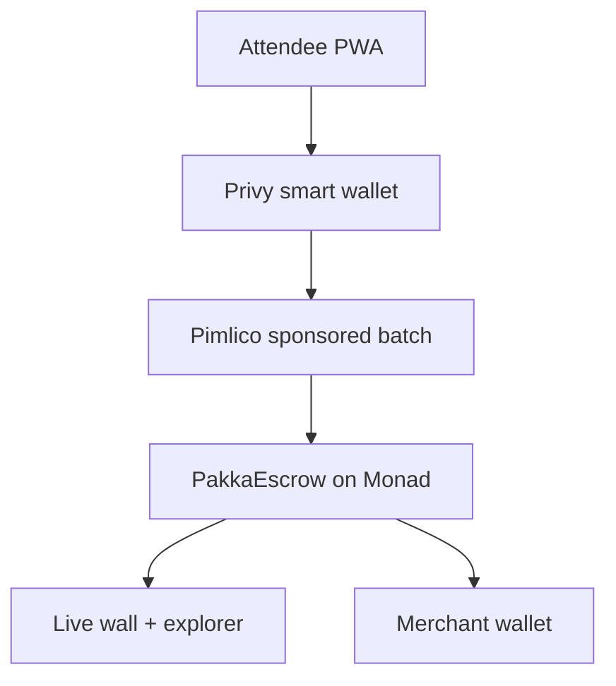
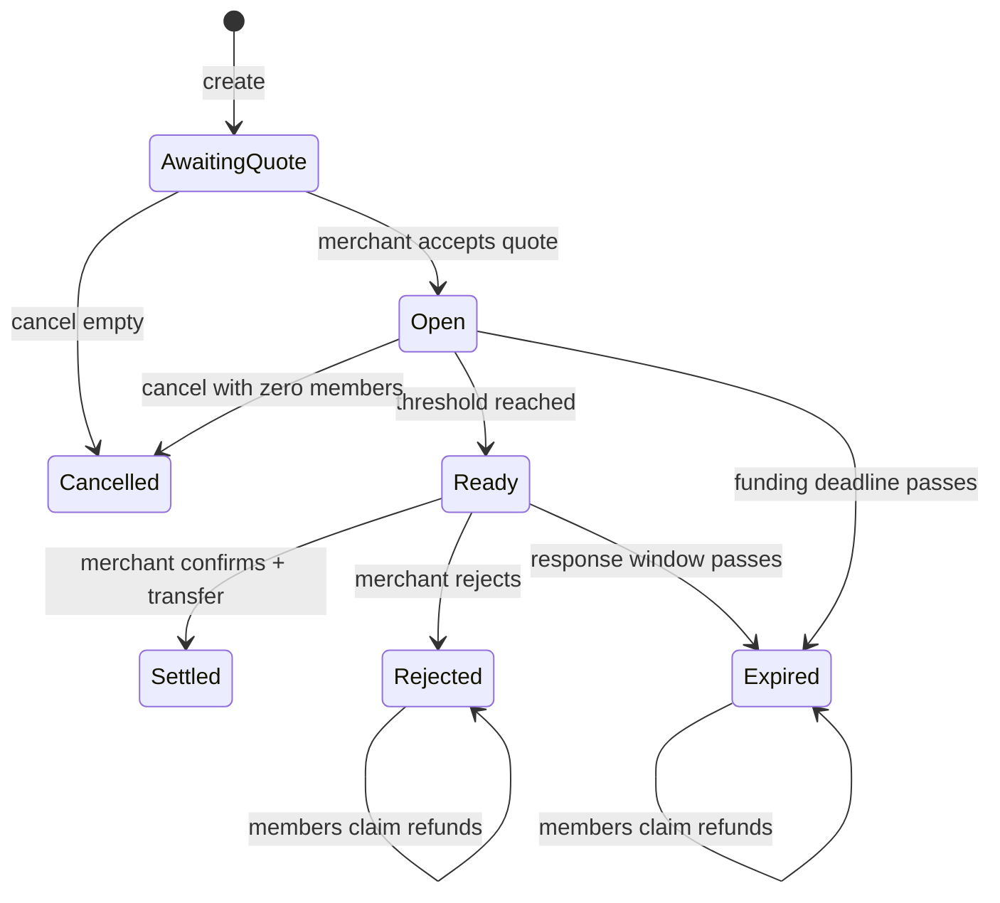

# PAKKA — Product Specification

> **Document role.** This is the *source brief* — the product intent, scope boundaries, and demo narrative.
> It answers **why** and **what**. It is deliberately preserved as written on 10 August 2026.
>
> Where this document and [`IMPLEMENTATION_PLAN.md`](./IMPLEMENTATION_PLAN.md) disagree, **the implementation
> plan wins** — it is the later document (14 August 2026) and exists to close the ambiguities left here.
> Known deliberate supersessions are listed in [`IMPLEMENTATION_PLAN.md` §0.3](./IMPLEMENTATION_PLAN.md#03-supersessions-over-the-product-spec).
>
> Executable work is driven from [`PAKKA_BLITZ_PROMPT_PACK.md`](./PAKKA_BLITZ_PROMPT_PACK.md), not from this file.
> Start at [`README.md`](./README.md).

**Original title:** PAKKA — Monad Blitz Implementation & Technical Plan
**Prepared:** 10 August 2026

**Event fit:** six-hour build sprint, team of three, consumer dApp on Monad
**Product sentence:** A group checkout that settles only when enough people have committed. Nobody fronts the full amount, nobody chases payments, and an incomplete group gets its money back.
**Demo sentence:** `PAKKA?` → people join → `GROUP READY` → the merchant confirms availability → `PAKKA!`

This version is deliberately optimized for a peer-voted, one-day room. It proves the on-chain conditional-payment primitive, creates a crowd moment, and produces verifiable live activity. It does **not** attempt Indian UPI, merchant KYC, fiat settlement, generic bill splitting, disputes, delivery confirmation, or AI.

---

## 1. Winning scope

### What must work

1. An organizer creates a fixed-price group plan for one pre-agreed merchant.
2. The merchant accepts the immutable quote—amount, minimum participant count, funding deadline, and response window—before the plan opens. This fixes terms; it is not a promise that the slot will still be available later.
3. Participants open one link, sign in without wallet jargon, and commit an equal amount.
4. The contract holds every contribution.
5. The last required commitment changes the plan to `Ready`; it does **not** transfer money.
6. The merchant freshly confirms availability after `Ready`, and that confirmation settles the whole pool atomically.
7. If the funding deadline passes, or the merchant rejects/does not respond after `Ready`, every participant can reclaim exactly their contribution.
8. A full-screen live wall shows confirmed commitments, the merchant decision, and the final `PAKKA!` moment.
9. Every confirmed state links to a Monad explorer transaction.

### What is intentionally excluded

- UPI, Cashfree, bank accounts, INR conversion, or off-ramping
- Variable contribution amounts
- Multiple merchants in one plan
- Arbitrary personal fundraising
- Delivery disputes or merchant arbitration
- Reputation, NFTs, governance, lending, yield, or cross-chain routing
- AI features
- A general merchant marketplace

### Demo modes

| Mode | Purpose | Money | Label |
| --- | --- | --- | --- |
| Crowd plan | Let 20–30 attendees participate with no funding friction | Monad testnet demo credits | `DEMO CREDITS — NO CASH VALUE` |
| Mainnet proof | Prove that the same contract can settle genuine value | Tiny real stablecoin amounts from 3–5 pre-funded wallets | `REAL MAINNET SETTLEMENT` |

Never merge the two totals. The crowd plan proves interaction and distribution; the mainnet plan proves economic settlement.

---

## 2. Technical architecture



Monad currently documents chain ID `10143` for testnet and `143` for mainnet. Its official PWA template combines Next.js, Privy embedded wallets, Pimlico sponsorship, and batched smart-account transactions. Use that template rather than designing account abstraction from scratch:

- [Monad network and deployment documentation](https://docs.monad.xyz/)
- [Official Next.js PWA sponsored-transactions template](https://docs.monad.xyz/templates/next-serwist-privy-smart-wallet)
- [Monad embedded-wallet providers](https://docs.monad.xyz/tooling-and-infra/wallet-infra/embedded-wallets)

The Next.js template URL above was verified on 9 August 2026. Before the event, clone its linked GitHub repository, record the exact commit SHA in the README, and prove the sponsored batch on the event device; do not depend on a moving template branch at kickoff.

### Stack

| Layer | Choice |
| --- | --- |
| Contracts | Solidity `^0.8.24`, Foundry, OpenZeppelin 5.x |
| Web app | Next.js App Router, TypeScript, Tailwind, PWA/Serwist |
| Wallet abstraction | Privy embedded EVM wallet |
| Sponsored transactions | Pimlico ERC-4337 paymaster, Kernel smart account |
| Contract client | viem; wagmi only where hooks materially help |
| Ephemeral live updates | Supabase Realtime or a tiny SSE endpoint |
| Confirmed reconstruction | Contract reads, receipts, and event-log replay |
| Hosting | Vercel for PWA; one serverless API for realtime fan-out |
| Contracts explorer | MonadVision/Monadscan link generated from chain config |

The contract is the financial source of truth. The realtime service may announce optimistic UI events, but it must never decide balances, counts, or settlement.

---

## 3. Contract specification

### 3.1 `PakkaEscrow.sol`

```solidity
enum PlanState {
    None,
    AwaitingQuote,
    Open,
    Ready,
    Settled,
    Expired,
    Rejected,
    Cancelled
}

enum ExpiryPhase {
    Funding,
    MerchantDecision
}

struct Plan {
    address creator;
    address merchant;
    address token;
    uint96 contribution;
    uint32 minimumParticipants;
    uint32 participantCount;
    uint64 fundingDeadline;
    uint64 readyAt;
    uint32 merchantResponseWindow;
    uint128 totalLocked;
    bytes32 metadataHash;
    PlanState state;
}
```

Required storage:

```solidity
uint256 public nextPlanId;
mapping(uint256 => Plan) public plans;
mapping(uint256 => mapping(address => bool)) public hasJoined;
mapping(uint256 => mapping(address => bool)) public refundClaimed;
```

Required functions:

```solidity
createPlan(
    address merchant,
    address token,
    uint96 contribution,
    uint32 minimumParticipants,
    uint64 fundingDeadline,
    uint32 merchantResponseWindow,
    bytes32 metadataHash
) returns (uint256 planId)

acceptQuote(uint256 planId)
join(uint256 planId)
leave(uint256 planId)
expire(uint256 planId)
confirmReadyAndSettle(uint256 planId)
rejectReadyPlan(uint256 planId)
claimRefund(uint256 planId)
cancelEmptyPlan(uint256 planId)
getPlan(uint256 planId) view returns (Plan memory)
```

Required events:

```solidity
PlanCreated(planId, creator, merchant, token, contribution, minimumParticipants, fundingDeadline, merchantResponseWindow, metadataHash)
MerchantQuoteAccepted(planId, merchant)
ParticipantJoined(planId, participant, participantCount, totalLocked)
ParticipantLeft(planId, participant, participantCount, totalLocked)
PlanReady(planId, readyAt, merchantDecisionDeadline)
MerchantConfirmed(planId, merchant, confirmedAt)
PlanSettled(planId, merchant, totalAmount, participantCount)
MerchantRejected(planId, merchant)
PlanExpired(planId, phase)
RefundClaimed(planId, participant, amount)
PlanCancelled(planId)
```

### 3.2 State-transition rules



Non-negotiable invariants:

- The merchant must accept the immutable quote before anyone can join; quote acceptance does not authorize later settlement by itself.
- `hasJoined[planId][participant]` means that address currently has one contribution locked; an address can never have two active contributions in the same plan.
- A participant may rejoin after a successful `leave` while the plan is still `Open`; the new join must lock a fresh contribution.
- Each contribution has one fixed amount.
- A participant can leave only while the plan remains `Open` and before the funding deadline.
- `leave` follows checks-effects-interactions: require `hasJoined == true`, then set it to `false`, decrement `participantCount`, subtract one contribution from `totalLocked`, and only then return the tokens. A participant who left cannot later claim a terminal refund unless they rejoined and locked a fresh contribution.
- The contribution that reaches the threshold only changes state to `Ready`, records `readyAt`, and starts the immutable merchant response window. It transfers nothing.
- Only the named merchant can call `confirmReadyAndSettle`, only while `Ready`, and only before `readyAt + merchantResponseWindow`.
- `confirmReadyAndSettle` records the merchant's fresh availability decision and transfers the complete pool in the same transaction.
- The merchant cannot confirm before the threshold. A rejection or response-window expiry makes every locked contribution refundable.
- Participants cannot leave while `Ready`; their maximum lock after threshold is bounded by the merchant response window.
- A settled plan cannot be reversed by the creator or admin.
- Expiry or rejection performs no unbounded refund loop. It changes state once; participants use pull-based `claimRefund`.
- `claimRefund` is allowed only in `Expired` or `Rejected`, requires `hasJoined == true` and `refundClaimed == false`, then sets `refundClaimed = true`, clears `hasJoined`, and subtracts one contribution from `totalLocked` before transferring tokens. `participantCount` remains the frozen terminal participation snapshot; refund progress comes from `totalLocked` and `RefundClaimed` events.
- `totalLocked` must equal `participantCount × contribution` while a plan is `Open` or `Ready`; settlement sets liability to zero before transfer.
- The contract must end with zero plan liability after all refunds or successful settlement.

Use `SafeERC20`, `ReentrancyGuard`, `Pausable`, custom errors, checks-effects-interactions, and an allowlist for the demo token/mainnet stablecoin. Do not use upgradeability for this hackathon.

### 3.3 Demo token

`DemoINR.sol` is a six-decimal ERC-20 used only on Monad testnet. It may expose an open `mint` to make the sponsored three-call batch possible, but its source and UI must clearly state `NO CASH VALUE — TESTNET ONLY`.

Testnet batch:

```ts
[
  DemoINR.mint(smartAccount, contribution),
  DemoINR.approve(pakkaEscrow, contribution),
  PakkaEscrow.join(planId)
]
```

Mainnet batch:

```ts
[
  Stablecoin.approve(pakkaEscrow, contribution),
  PakkaEscrow.join(planId)
]
```

Resolve the real stablecoin address from Monad's official token list immediately before deployment. Never paste an address from an old prompt or deploy the open-mint demo token to mainnet.

### 3.4 Foundry test gate

Do not begin advanced wall animation until these tests pass:

- creator creates valid plan
- invalid merchant, amount, threshold, or deadline reverts
- non-merchant cannot accept the quote, confirm readiness, or reject a ready plan
- join before quote acceptance reverts
- one join locks exactly one contribution
- duplicate join reverts
- leave clears `hasJoined`, returns the exact contribution, and decrements `participantCount` and `totalLocked`
- a participant who left cannot claim after later expiry/rejection unless they rejoined
- leave → rejoin locks exactly one fresh contribution and never creates two active contributions
- last join reaches `Ready` but transfers nothing
- merchant cannot confirm before `Ready`
- merchant confirmation after `Ready` settles the exact aggregate once
- merchant rejection transfers nothing and enables exact refunds
- merchant response timeout transfers nothing and enables exact refunds
- participant cannot leave while `Ready`
- contract balance/liability is correct after settlement
- join/leave at deadline boundary behaves deterministically
- expiry before deadline reverts
- expiry after deadline succeeds once
- refund requires an active contribution and `Expired` or `Rejected` state
- refund sets `refundClaimed` and clears `hasJoined` before the token transfer
- each eligible participant claims once and only once
- repeated refund, refund after leave, and refund after settlement revert
- `totalLocked` reaches zero after every eligible refund is claimed
- cancellation works only with zero participants
- paused contract blocks financial mutations
- reentrancy and malicious-token paths cannot duplicate settlement/refunds

Target: 100% branch coverage on settlement, leave, expiry, and refund paths; overall percentage matters less than covering every monetary transition.

---

## 4. Consumer experience

### 4.1 Routes

```text
/                    landing + current live plan
/p/[slug]            attendee plan page
/merchant/[planId]   merchant quote + post-ready confirmation screen
/wall                full-screen live visualization
/receipt/[planId]    verified plan outcome and transaction links
/ops                 team-only health and fallback controls
```

### 4.2 First-time participant flow

1. Scan the large room QR.
2. Immediately see the plan, merchant, amount, deadline, and progress—no login wall.
3. Tap `I'm PAKKA — join for 1 credit`.
4. Sign in with email or Google; an embedded wallet is created invisibly.
5. Submit one sponsored batch.
6. Show `Reserving your spot…` while pending.
7. After the receipt confirms, show `You're in` and the explorer link.
8. When the threshold transaction confirms, transition every connected screen to `GROUP READY — awaiting merchant`.
9. The merchant sees `Confirm availability & settle` or `Reject & release` with a visible response timer.
10. Only after the merchant's settlement receipt confirms does every screen transition to `PAKKA!`.

Forbidden consumer words: wallet, gas, approve, ERC-20, user operation, contract call, paymaster, testnet. Put technical details behind `Verified on Monad`.

Target performance:

- First-time participant: under 25 seconds
- Returning participant: under 7 seconds
- Chain-confirmed wall update: under 2 seconds in normal conditions

### 4.3 Visual language

The plan page should feel like a living group commitment, not a payment dashboard:

- A large circular ring with one segment per required participant
- Each confirmed participant lights one purple segment
- Pending participant pulses amber and does not increment the count
- Final segment closes the purple ring and shows `GROUP READY`; it does not stamp `PAKKA!`
- Merchant confirmation turns the closed ring gold and stamps `PAKKA!`
- Merchant quote and deadline remain visible at all times
- One clear action per screen

---

## 5. Live wall and Purple Box

### Confirmed-state rule

| Visual state | Trigger | Counted? | Explorer link? |
| --- | --- | --- | --- |
| Empty node | unfilled slot | No | No |
| Amber pulse | join submitted | No | No |
| Purple node | `ParticipantJoined` confirmed | Yes | Yes |
| Closed purple ring | `PlanReady` confirmed | Yes | Yes |
| Gold seal | `PlanSettled` confirmed | Yes | Yes |
| Grey release | `MerchantRejected` or `PlanExpired` confirmed | Removed from active total after refund | Yes |
| Red rewind | reverted transaction | No | No |

The wall may animate immediately from optimistic app state, but only a confirmed receipt can make a node solid or change a metric.

### Reconstruction

On refresh or RPC reconnect:

1. Read `getPlan(planId)`.
2. Replay `ParticipantJoined`, `ParticipantLeft`, `PlanReady`, `MerchantConfirmed`, `PlanSettled`, `MerchantRejected`, `PlanExpired`, and `RefundClaimed` logs.
3. Merge only still-pending local operations.
4. Poll transaction receipts when event subscriptions stall.
5. Switch to a configured backup RPC after repeated failures.

### Physical Purple Box

The box is demo theatre, not the product. Preassemble an ESP32 plus servo before the event. It polls a signed `/api/box/[planId]` endpoint. That endpoint returns `unlock=true` only after independently reading a confirmed `PlanSettled` state.

Fallbacks:

- Dedicated phone hotspot
- USB-powered ESP32
- Manual hidden release if hardware jams
- Full-screen digital box animation if hardware fails
- A clearly labelled `VERIFIED REPLAY` using a previously confirmed transaction if the network fails during judging

---

## 6. Minimal off-chain data

The database must not mirror balances as authority. Store only what improves the experience:

```text
plans_ui
  slug, chain_id, contract_plan_id, title, merchant_name, image_url

participant_profiles
  wallet_address, display_alias, avatar_seed

pending_operations
  client_operation_id, wallet_address, plan_id, status, tx_hash, created_at

verified_replays
  plan_id, join_tx_hashes[], settlement_tx_hash
```

All displayed counts are reconciled against the chain. Email addresses stay with the authentication provider and must not appear on the wall.

---

## 7. Repository layout

```text
pakka-blitz/
  apps/
    web/                    # attendee, merchant, receipt, wall, ops routes
  packages/
    contracts/              # Foundry project
    chain/                  # ABI, addresses, viem clients, event reducer
    ui/                     # shared visual components and tokens
    config/                 # chain-aware validated environment config
  scripts/
    deploy-testnet.ts
    seed-crowd-plan.ts
    create-mainnet-plan.ts
    verify-contracts.ts
    smoke-test.ts
  docs/
    DEMO_RUNBOOK.md
    INCIDENT_FALLBACKS.md
  .env.example
  README.md
```

Use one TypeScript package manager and one lockfile. Generate the ABI from Foundry artifacts; do not hand-maintain multiple ABI copies.

---

## 8. Three-person ownership

| Member | Primary responsibility | Event responsibility |
| --- | --- | --- |
| A — Chain/reliability | contract, Foundry tests, deployments, explorer verification, RPC fallback | watches contract health and mainnet proof |
| B — Consumer/UI | PWA, Privy/Pimlico, plan page, receipts | runs onboarding and device support |
| C — Live/demo | wall reducer, realtime fan-out, Purple Box, metrics, pitch | acquires users, operates wall, rehearses demo |

Each member owns one vertical end to end. Do not have all three people debug the same frontend issue.

---

## 9. Work allowed before Blitz

Because Monad Blitz explicitly permits preparation, complete roughly 75–80% beforehand:

- contract implementation and tests
- official Monad PWA template integration
- pinned commit SHA for the verified official Next.js template and a local smoke test of its sponsored batch
- Privy and Pimlico configuration
- attendee/merchant/receipt routes
- wall driven by simulated events
- ESP32/servo assembly and physical QR printing
- deployment, seeding, verification, and smoke-test scripts
- backup RPC, hotspot, demo phones, and recorded verified fallback

For peer-vote optics, preserve a clear boundary:

- tag pre-event work as `pre-blitz-ready`
- deploy the final contracts during the event
- create the actual room plan during the event
- collect all real room usage during the six-hour build window
- say plainly: `The infrastructure was prepared; this network of commitments was created live in this room today.`

---

## 10. Six-hour execution schedule

| Time | Member A | Member B | Member C | Gate |
| --- | --- | --- | --- | --- |
| 0:00–0:30 | confirm workshop/network changes; deploy testnet contracts | configure final addresses | set up wall, QR and hardware | verified deployment |
| 0:30–1:15 | run Foundry + scripted lifecycle | complete live sponsored join | connect event reducer | full join → ready → merchant confirm → settle → refund test |
| 1:15–2:00 | backup RPC and receipt checks | stranger onboarding tests | wall reconstruction and box trigger | 10 consecutive clean cycles |
| 2:00–2:45 | prepare mainnet tiny-value plan | polish only blocking UX | install signage and recruit first users | stranger joins under 25s |
| 2:45–4:45 | monitor and fix chain-only defects | onboard attendees | drive live room activation | 20+ confirmed participants |
| 4:45–5:20 | execute mainnet proof | freeze UI | capture metrics and verified links | real settlement confirmed |
| 5:20–6:00 | demo support | demo device | pitch and Q&A rehearsal | two clean rehearsals |

Cut order if behind:

1. Remove decorative animation.
2. Remove physical-box automation and use the digital box.
3. Remove multiple concurrent plans.
4. Keep the crowd testnet plan and one scripted mainnet proof.
5. Never cut the post-threshold merchant confirmation, settlement correctness, refunds, onboarding, or explorer verification.

---

## 11. Acceptance gates

Before inviting the room:

- all monetary Foundry tests pass
- ten consecutive scripted join/leave/ready/confirm/settle/reject/expire cycles pass
- three different phones complete onboarding
- one genuine stranger joins in under 25 seconds
- primary RPC can be disabled and backup recovery succeeds
- every confirmed wall node opens a valid explorer link
- refresh reconstructs the same confirmed participant count
- paymaster spend and per-user limits are configured
- box unlocks only after confirmed settlement

Before pitching:

- at least 20 verified room commitments
- one successfully settled crowd plan
- one verified expiry/refund path, live or previously recorded and labelled
- one tiny-value mainnet settlement if safe and ready
- two-minute demo works from a clean browser and a second phone hotspot

---

## 12. Demo choreography

1. Start with the incomplete live ring on the wall.
2. Say: `Every group plan dies the same way: one person pays first, everyone else says pakka.`
3. Ask one judge to scan and join.
4. Their node pulses amber, then becomes a verified purple node with a transaction link.
5. The last required participant joins; the ring closes but stops at `GROUP READY` and no money moves.
6. The merchant taps `Confirm availability & settle` in front of the room.
7. That confirmed transaction settles the pool; the ring turns gold; the box opens; every screen says `PAKKA!`.
8. Open both the `PlanReady` and merchant settlement transactions on the explorer.
9. Show a second rejected or expired plan and one exact refund transaction.
10. End with: `The group proved demand. The merchant confirmed supply. No organizer held the pool.`

### Honest Q&A boundaries

- **Testnet credits have no economic value.** The mainnet plan is the real-value proof.
- **Why does the merchant act twice?** The first action fixes the quote before anyone commits. The second is a fresh availability check after the group is actually ready. The last participant never causes an unattended payment.
- **What if the turf was double-booked meanwhile?** The merchant rejects or lets the short response window expire; no settlement occurs and participants claim exact refunds. This closes availability risk, not post-payment fulfillment disputes.
- **Merchant delivery remains a commerce risk.** A fresh post-threshold confirmation prevents stale availability from auto-charging the group, but production still needs regulated merchant onboarding, fulfillment policy, and dispute handling.
- **Why Monad?** The group becomes ready and then settles through two fast, low-cost, independently verifiable state changes. Monad's current documentation describes [300 ms block frequency and 600 ms finality](https://docs.monad.xyz/introduction/monad-for-users).
- **Why not UPI here?** UPI cannot be held by a Solidity contract. The Blitz build proves the crypto-native primitive; the production implementation uses a regulated fiat adapter.

---

## 13. Definition of done

PAKKA Blitz is done when a stranger can scan one QR, join without understanding crypto, visibly make a group ready, watch the merchant freshly confirm availability, and independently verify that the contract—not an organizer or the last participant—settled the aggregate. Anything that does not improve that moment is outside the build.

> Unaudited hackathon software. Use demo credits on testnet and only tiny mainnet amounts the team can afford to lose.
