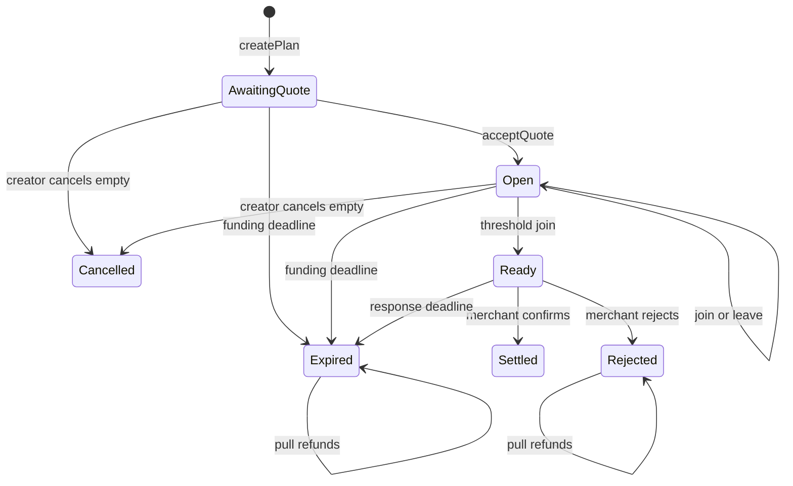
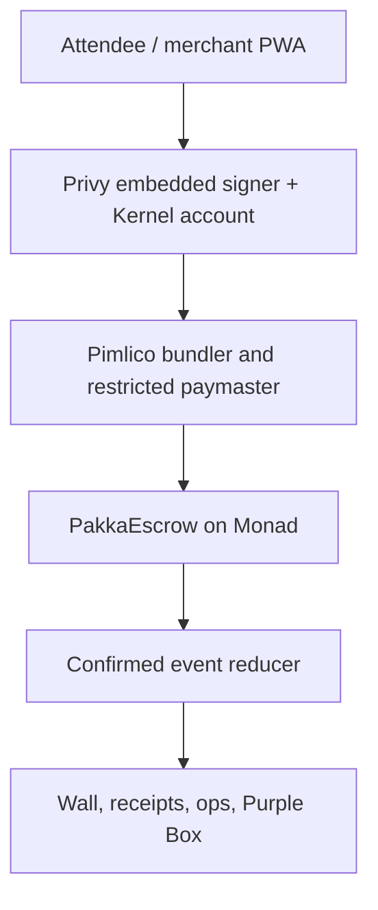

# ARCHIVED — PAKKA — Monad Blitz End-to-End Prompt Pack & Implementation Plan

> **SUPERSEDED — DO NOT EDIT, DO NOT CITE.**
>
> This is the original single-file combination of the technical plan and the prompt pack, kept only for
> provenance. On 14 August 2026 it was split, with no content dropped, into:
>
> | Live document | Absorbed from this file |
> | --- | --- |
> | [`../IMPLEMENTATION_PLAN.md`](../IMPLEMENTATION_PLAN.md) | §0, §2–§7, §9 (except §9.4), §11–§14 — the frozen technical decisions |
> | [`../PAKKA_BLITZ_PROMPT_PACK.md`](../PAKKA_BLITZ_PROMPT_PACK.md) | §1 and §8 — the executable prompts 00–18 |
> | [`../LIVE_LINKS.md`](../LIVE_LINKS.md) | §10 — extracted as a working file |
> | [`../MAINNET_APPROVAL.md`](../MAINNET_APPROVAL.md) | §9.4 — extracted as a working file |
>
> Section numbers inside *this* file are the old numbering and no longer match anything cited elsewhere.
>
> All section numbers referenced elsewhere in the repository refer to the **live** documents above.

**Prepared:** 14 August 2026  
**Blitz day:** 16 August 2026  
**Team:** 3 members  
**Source brief:** `PAKKA_MONAD_BLITZ_FINAL_V3_REFUND_FIXED_2026-08-10(1).md`  
**Use with:** Claude Opus 4.8, Fable 5, or an equivalent repository-aware coding agent with terminal access

> This is an execution system, not a mood board. Run the prompts in order. A prompt is complete only when its exit gate passes and its evidence is recorded. Never let visual polish outrun money safety, chain truth, or a clean stranger onboarding flow.

---

## 0. The outcome

PAKKA is a group checkout on Monad. An organizer creates a fixed-price plan for one merchant. The merchant accepts the immutable quote before funding opens. People then commit one equal contribution each. Reaching the threshold changes the plan to `Ready` but moves no money. The merchant must freshly confirm availability after that point; only this confirmation settles the whole pool atomically. If funding fails, the merchant rejects, or the response window expires, each active participant can claim exactly one refund.

The demo sentence is:

> `PAKKA?` → people join → `GROUP READY` → merchant confirms → `PAKKA!`

The finished demo must let a stranger scan one QR, join without crypto vocabulary, appear on a live wall only after chain confirmation, and open a valid explorer transaction. It must also show a settlement path and a refund path.

### Definition of done

- A stranger completes first-time onboarding and a sponsored testnet join in under 25 seconds.
- The last join makes the plan `Ready` and does **not** pay the merchant.
- Only the named merchant can settle, and only during the response window.
- Rejection and both expiry paths enable exact pull refunds.
- Every solid wall state is reconstructed from contract reads, receipts, and logs.
- The deployed source is verified and all live links are collected.
- Testnet credits and real mainnet value are never combined or visually confused.
- The experience remains usable with reduced motion, a slow phone, an RPC failover, or a failed physical box.

---

## 1. How to use this pack

1. Put the source brief at `docs/PRODUCT_SPEC.md` and this file at `docs/PAKKA_BLITZ_PROMPT_PACK.md` in the repository.
2. Start one long-lived coding-agent session per owner lane when possible:
   - Member A: contracts, deployment, chain reliability.
   - Member B: attendee and merchant web experience.
   - Member C: event reducer, live wall, demo hardware, pitch evidence.
3. Paste **Prompt 00** into every session. Then run only the prompts assigned to that lane.
4. Use small branches and merge at the stated integration gates. Do not let three agents edit the same files concurrently.
5. Each prompt must end by writing a short gate report under `artifacts/gates/`. The report contains commands run, pass/fail, changed files, known risks, and the commit SHA. Never include secrets.
6. If a gate fails, stop that lane, fix the failure, rerun the gate, and only then continue.
7. Human reviewers—not the coding model—approve deployments, secret changes, mainnet transactions, sponsor limits, visual baselines, and any ignored security finding.

### Prompt execution contract

Every prompt in this pack assumes the coding agent can inspect and edit the repository and run commands. If it cannot, use the prompt to produce a patch plan only; do not accept invented command output.

Use these exact meanings:

| Word | Meaning |
| --- | --- |
| `MUST` | Required for the demo; do not waive silently. |
| `SHOULD` | Implement unless a recorded blocker exists. |
| `MAY` | Optional and first to cut. |
| `Gate` | A binary condition with evidence. |
| `Confirmed` | Receipt succeeded and the configured finality threshold was reached. |
| `Source of truth` | Contract state and confirmed logs, never Supabase or local UI state. |

### Global stop conditions

Stop and ask a human before:

- broadcasting any mainnet transaction;
- changing a deployed contract address in production configuration;
- selecting or allowlisting a mainnet token;
- raising a paymaster budget or loosening a sponsor policy;
- rotating or exposing credentials;
- suppressing a failing monetary test, static-analysis finding, type error, or chain mismatch;
- changing a contract invariant or the post-threshold merchant confirmation rule;
- deleting or rewriting user work unrelated to the current prompt.

---

## 2. Canonical product and money rules

### 2.1 In scope

- One organizer, one named merchant, one allowlisted ERC-20, one equal contribution per address.
- Merchant quote acceptance before joins.
- Funding deadline and immutable post-ready merchant response window.
- Sponsored testnet join batch using open-mint `DemoINR` credits.
- Tiny, optional, pre-funded mainnet USDC proof.
- Attendee, merchant, wall, receipt, and restricted ops surfaces.
- Explorer links, verified source, deterministic state reconstruction, refund evidence.

### 2.2 Explicitly out of scope

- UPI, INR settlement, bank accounts, on/off-ramping, Cashfree, merchant KYC.
- Variable contributions, arbitrary fundraising, a marketplace, multiple merchants per plan.
- Delivery disputes, arbitration, lending, yield, NFTs, governance, cross-chain routing, AI features.
- Upgradeable contracts, protocol fees, admin withdrawal of escrowed funds.

### 2.3 Demo modes

| Mode | Purpose | Asset | Required label |
| --- | --- | --- | --- |
| Crowd | Room-scale interaction | Open-mint six-decimal testnet `DemoINR` | `DEMO CREDITS — NO CASH VALUE` |
| Mainnet proof | Economic settlement proof | Tiny native Monad USDC amount from 3–5 pre-funded accounts | `REAL MAINNET SETTLEMENT` |

Never add the two totals. Never describe testnet credits as money, INR, stablecoins, or payments.

### 2.4 State machine



### 2.5 Deterministic deadline semantics

Use one rule everywhere—in Solidity, TypeScript, tests, copy, and timers:

- `join`, `leave`, and `acceptQuote` are allowed only when `block.timestamp < fundingDeadline`.
- funding expiry is allowed when `block.timestamp >= fundingDeadline`.
- merchant confirmation is allowed only when `block.timestamp < decisionDeadline`.
- merchant-decision expiry is allowed when `block.timestamp >= decisionDeadline`.
- merchant rejection may occur at any time while state is `Ready`; after the deadline, either rejection or expiry produces the same refund rights.
- the UI timer is informative; the contract timestamp is authoritative.

### 2.6 Transition table

| Function | Caller | Required state | Money effect | Result |
| --- | --- | --- | --- | --- |
| `createPlan` | anyone | n/a | none | `AwaitingQuote` |
| `acceptQuote` | named merchant | `AwaitingQuote` | none | `Open` |
| `join` | participant | `Open` | exact contribution enters escrow | `Open` or `Ready` |
| `leave` | active participant | `Open` | exact contribution exits escrow | `Open` |
| `confirmReadyAndSettle` | named merchant | `Ready` | complete pool to merchant | `Settled` |
| `rejectReadyPlan` | named merchant | `Ready` | no transfer | `Rejected` |
| `expire` | anyone | applicable timed state | no transfer | `Expired` |
| `claimRefund` | active participant | `Expired` or `Rejected` | one exact contribution exits escrow | terminal state unchanged |
| `cancelEmptyPlan` | creator | `AwaitingQuote` or `Open`, zero active members | none | `Cancelled` |

---

## 3. Architecture and authority boundaries



### 3.1 Authority rules

- `PakkaEscrow` is the only authority for lifecycle, membership, liabilities, settlement, and refunds.
- Confirmed logs are the history; `getPlan` is the current summary.
- Realtime infrastructure may fan out transaction hashes and “refresh now” hints. It must not invent counts, balances, state, or settlement.
- Pending client state may animate amber. It may never increment the confirmed participant count.
- The box endpoint independently checks the configured chain, contract, plan, receipt success, and confirmed `Settled` state. A client message alone cannot unlock it.
- Chain ID, contract bytecode, token address, and deployment start block are validated at startup. Mismatch means fail closed with an ops error, not a best guess.

### 3.2 Current Monad integration facts to verify again on D-day

As of 14 August 2026, official documentation lists Monad testnet chain ID `10143`, mainnet chain ID `143`, Pimlico support for both, and `viem >= 2.40.0`. Monad documents 300 ms blocks and finality after two blocks. Receipts can appear earlier, so PAKKA uses a two-stage presentation:

- receipt seen: pending/amber feedback;
- configured finalized threshold reached: solid purple/gold confirmed state.

For a physical action or mainnet proof, prefer the conservative finalized threshold. The official deployment summary explains proposed, finalized, and verified stages: [Monad deployment summary](https://docs.monad.xyz/developer-essentials/summary).

Primary references:

- [Monad mainnet network information](https://docs.monad.xyz/developer-essentials/network-information)
- [Monad testnet network information and faucet](https://docs.monad.xyz/developer-essentials/testnet)
- [Official Next.js PWA sponsored-transactions template](https://docs.monad.xyz/templates/next-serwist-privy-smart-wallet)
- [Template repository](https://github.com/monad-developers/next-serwist-privy-smart-wallet)
- [Pimlico supported chains](https://docs.pimlico.io/guides/supported-chains)
- [Privy smart-wallet overview](https://docs.privy.io/wallets/using-wallets/evm-smart-wallets/overview)

Explorer bases observed on 14 August 2026; generate links from validated chain config and re-check them before the event:

| Chain | MonadVision | Monadscan |
| --- | --- | --- |
| Testnet `10143` | [testnet.monadvision.com](https://testnet.monadvision.com/) | [testnet.monadscan.com](https://testnet.monadscan.com/) |
| Mainnet `143` | [monadvision.com](https://monadvision.com/) | [monadscan.com](https://monadscan.com/) |

See the [official explorer directory](https://docs.monad.xyz/tooling-and-infra/block-explorers) for current status and verifier endpoints.

### 3.3 Finality and retry policy

- Persist the submitted transaction or user-operation identifier locally immediately.
- Poll for a receipt with bounded exponential backoff and a visible retry state.
- After a successful receipt, wait for `FINALITY_CONFIRMATIONS` from validated chain config before marking solid.
- Treat reverted receipts as red rewind; never count them.
- On timeout, keep the hash, switch read RPC, and continue receipt lookup. Do not blindly resubmit a join because a duplicate could race.
- Before a retry, read `hasJoined(planId, account)` and current plan state. Retry only if the intended effect is absent and the state still permits it.
- Order replayed logs by `(blockNumber, transactionIndex, logIndex)` and deduplicate by `(chainId, transactionHash, logIndex)`.

---

## 4. Contract implementation decisions

These decisions close ambiguity in the source brief. Any later change requires a human review note.

### 4.1 Contracts

Implement:

- `PakkaEscrow.sol`: non-upgradeable escrow and lifecycle.
- `DemoINR.sol`: six-decimal open-mint testnet token with permanent `NO CASH VALUE — TESTNET ONLY` source comments and metadata.
- malicious/mock tokens only under tests.

Use Solidity `^0.8.24`, OpenZeppelin Contracts 5.x, `SafeERC20`, `ReentrancyGuard`, `Pausable`, and `Ownable2Step`. Pin exact dependency revisions in git.

### 4.2 Required storage

```solidity
enum PlanState {
    None,
    AwaitingQuote,
    Open,
    Ready,
    Settled,
    Expired,
    Rejected,
    Cancelled
}

enum ExpiryPhase {
    Funding,
    MerchantDecision
}

struct Plan {
    address creator;
    address merchant;
    address token;
    uint96 contribution;
    uint32 minimumParticipants;
    uint32 participantCount;
    uint64 fundingDeadline;
    uint64 readyAt;
    uint32 merchantResponseWindow;
    uint128 totalLocked;
    bytes32 metadataHash;
    PlanState state;
}

uint256 public nextPlanId;
mapping(uint256 => Plan) public plans;
mapping(uint256 => mapping(address => bool)) public hasJoined;
mapping(uint256 => mapping(address => bool)) public refundClaimed;
mapping(address => bool) public allowedToken;
mapping(address => uint256) public liabilityByToken;
```

`liabilityByToken` is mandatory. It makes cross-plan solvency testable and prevents one plan’s funds from masking another plan’s accounting error.

### 4.3 Required external functions

```solidity
createPlan(address merchant, address token, uint96 contribution,
  uint32 minimumParticipants, uint64 fundingDeadline,
  uint32 merchantResponseWindow, bytes32 metadataHash)
  returns (uint256 planId)

acceptQuote(uint256 planId)
join(uint256 planId)
leave(uint256 planId)
expire(uint256 planId)
confirmReadyAndSettle(uint256 planId)
rejectReadyPlan(uint256 planId)
claimRefund(uint256 planId)
cancelEmptyPlan(uint256 planId)
getPlan(uint256 planId) view returns (Plan memory)
setTokenAllowed(address token, bool allowed)
pause()
unpause()
```

### 4.4 Required events

Use the final indexed parameter layout frozen in Prompt 02, while preserving these payloads:

```solidity
PlanCreated(
    uint256 planId,
    address creator,
    address merchant,
    address token,
    uint256 contribution,
    uint256 minimumParticipants,
    uint256 fundingDeadline,
    uint256 merchantResponseWindow,
    bytes32 metadataHash
)
MerchantQuoteAccepted(uint256 planId, address merchant)
ParticipantJoined(uint256 planId, address participant, uint256 participantCount, uint256 totalLocked)
ParticipantLeft(uint256 planId, address participant, uint256 participantCount, uint256 totalLocked)
PlanReady(uint256 planId, uint256 readyAt, uint256 merchantDecisionDeadline)
MerchantConfirmed(uint256 planId, address merchant, uint256 confirmedAt)
PlanSettled(uint256 planId, address merchant, uint256 totalAmount, uint256 participantCount)
MerchantRejected(uint256 planId, address merchant)
PlanExpired(uint256 planId, ExpiryPhase phase)
RefundClaimed(uint256 planId, address participant, uint256 amount)
PlanCancelled(uint256 planId)
TokenAllowlistUpdated(address indexed token, bool allowed)
```

Index `planId` and the actor address where useful. Do not over-index numeric values merely for appearance.

### 4.5 Input bounds

Choose named constants and test them:

- merchant and token cannot be zero;
- creator cannot be the zero address by construction;
- contribution must be positive and below a documented demo-safe upper bound;
- minimum participants must be at least 2 and at most a documented UI-safe maximum, recommended `100`;
- funding deadline must be in the future and within a documented maximum horizon;
- merchant response window must be within documented minimum and maximum bounds;
- `uint256(contribution) * minimumParticipants` must fit `uint128`;
- token must already be allowlisted;
- `metadataHash` may be zero only if the team explicitly supports a metadata-free plan.

### 4.6 Accounting rules

- On `join`, mark effects under `nonReentrant`, pull exactly one contribution, and verify the contract balance delta equals the requested amount. A fee-on-transfer or rebasing token is unsupported and must revert or never be allowlisted.
- Increment both `plan.totalLocked` and `liabilityByToken[token]` exactly once.
- The threshold join sets `Ready` and `readyAt`; it never transfers to the merchant.
- On `leave`, `claimRefund`, or settlement, reduce plan and global liability before the external token transfer. A later revert rolls back all effects.
- `participantCount` is the current active count in `Open`, then a frozen terminal participation snapshot after `Ready`.
- Refund progress is represented by `totalLocked`, `liabilityByToken`, membership flags, and events—not by decrementing the frozen terminal count.
- There is no participant array and no unbounded settlement or refund loop.
- There is no owner/admin method that can withdraw or rescue allowlisted tokens while `liabilityByToken[token] > 0`.

### 4.7 Pause policy

An emergency pause must stop new risk without creating a hostage switch:

- paused: block `createPlan`, `acceptQuote`, `join`, and settlement;
- still available when logically valid: `leave`, `expire`, merchant rejection, and `claimRefund`;
- record and test this exact policy.

If the team instead pauses every mutation, document that refunds can be temporarily frozen and obtain explicit human sign-off. The recommended policy is exit-preserving.

### 4.8 Mainnet token policy

Use native USDC only if the D-day verification procedure succeeds. As of this document’s preparation, Circle and Monad’s token list agree on a six-decimal Monad mainnet USDC address, but **do not paste that snapshot into deploy code as eternal truth**. Resolve and verify it immediately before deployment using both:

- [Circle’s USDC contract-address reference](https://developers.circle.com/stablecoins/usdc-contract-addresses)
- [Monad’s canonical token-list repository](https://github.com/monad-crypto/token-list)

Then verify on chain:

- chain ID is `143`;
- address has bytecode;
- `symbol()`, `name()`, and `decimals()` match expectations;
- explorer labels/source match Circle;
- the selected address is written once to the chain deployment manifest;
- the human approver signs the manifest before `setTokenAllowed` or plan creation.

If any check differs, skip the mainnet proof. Testnet remains the primary demo.

---

## 5. Experience and visual system

### 5.1 Creative direction: “the promise reactor”

The product should feel like a room charging one shared commitment—not like a banking dashboard.

- Base: near-black plum canvas with a subtle grain and coordinate grid.
- Primary: electric violet for verified commitments.
- Pending: warm amber pulse.
- Settlement: restrained metallic gold bloom.
- Failure/refund: cool grey release; red only for true reverts/errors.
- Typography: oversized condensed or grotesk display face paired with a highly legible UI sans. Self-host or use `next/font` with deterministic fallbacks.
- Geometry: one radial reactor with one segment per required person; thin orbital labels; crisp cards; no generic crypto gradients, coin icons, glassmorphism soup, or token-price widgets.

Borrow principles, not assets or layouts:

- [Rig](https://rig.ai/): sharp hierarchy, terminal precision, deliberate sequencing.
- [Anime.js](https://animejs.com/): timeline orchestration, SVG drawing, stagger, responsive scopes.
- [Claude Clan](https://claude-clan.vercel.app/): playful world-building and characterful transitions.
- [Tinkerers](https://tinkerers.space/): candid technical copy, numbered process, tactile utility.
- [Awwwards](https://www.awwwards.com/): high craft, but never at the expense of task completion.

### 5.2 Page map

| Route | Job | Primary action |
| --- | --- | --- |
| `/` | One-sentence story and current plan | `Join the live plan` |
| `/p/[slug]` | Attendee plan and status | `I'm PAKKA — join` |
| `/merchant/[planId]` | Quote acceptance or ready decision | one state-appropriate merchant action |
| `/wall` | Full-screen confirmed room visualization | none |
| `/receipt/[planId]` | Verifiable outcome | explorer links |
| `/ops` | Restricted health/fallback view | operator-only controls |

### 5.3 State-to-motion contract

| State | Motion | Copy | Authority |
| --- | --- | --- | --- |
| Empty | slow, low-amplitude orbit | `N spots to make it pakka` | plan read |
| Signing/submitted | one amber segment breathes | `Reserving your spot…` | local pending op |
| Confirmed join | amber compresses into solid violet | `You're in` | finalized receipt/log |
| Ready | final gap closes; purple ring locks | `GROUP READY — awaiting merchant` | confirmed `PlanReady` |
| Settled | one gold wave, seal stamp, optional confetti particles | `PAKKA!` | confirmed `PlanSettled` |
| Rejected/expired | segments release outward and desaturate | `Released — claim your credit` | confirmed terminal log |
| Reverted | pending segment rewinds once | human error/retry copy | failed receipt |

Never loop celebratory animation. Never show `PAKKA!` on threshold alone.

### 5.4 Motion implementation rules

- Use Anime.js v4 modules only where timelines, SVG drawing, stagger, or responsive scopes add meaning. Prefer CSS for simple hover/focus transitions.
- Animate only `transform`, `opacity`, SVG stroke properties, and custom properties that do not trigger layout.
- Provide `prefers-reduced-motion` behavior: remove parallax, particles, shakes, long staggers, and route sweeps; keep instant state clarity.
- Pause ambient work when the tab is hidden or the element is offscreen.
- Lazy-load celebration and wall-only motion.
- No WebGL or heavy 3D in the critical path. It is optional only after every release gate passes.
- One animation timeline owns each lifecycle transition; React re-renders must not replay confirmed celebrations.

### 5.5 Responsive and accessibility requirements

- Design at `360×640`, `390×844`, `768×1024`, `1440×900`, and `1920×1080`.
- Minimum interactive target: 44×44 CSS pixels.
- Preserve plan amount, merchant, deadline, state, and primary action above the fold on attendee phones.
- Wall text must be readable from the back of a room; no critical text below 24 px at 1080p.
- Use semantic buttons, visible focus, keyboard navigation, labelled timers, and polite/assertive live regions appropriately.
- Do not encode state with color alone. Include shape, icon, and text.
- Maintain WCAG AA contrast and test with axe plus manual keyboard and reduced-motion passes.
- Do not show email addresses or raw wallet addresses on the wall. Use generated aliases and optional identicons.

### 5.6 Performance budgets

- Plan page LCP under 2.5 seconds on the event phone and hotspot.
- Returning participant from page open to submitted intent under 7 seconds in a rehearsed normal path.
- Confirmed wall transition within 2 seconds of the configured finalized threshold under normal venue conditions.
- No long animation task over 50 ms during the join flow.
- Zero horizontal scroll at target viewports.
- Zero avoidable layout shift around wallet/login modals and the reactor.
- Lighthouse targets on the production build: Performance ≥ 85, Accessibility ≥ 95, Best Practices ≥ 90. Record exceptions; do not game the audit.

---

## 6. Repository and configuration contract

```text
pakka-blitz/
  apps/
    web/
      app/
      components/
      e2e/
      public/
  packages/
    contracts/
      src/
      script/
      test/
    chain/
      src/abi/
      src/config/
      src/events/
    ui/
      src/components/
      src/motion/
      src/tokens/
    config/
  scripts/
    deploy-testnet.ts
    deploy-mainnet.ts
    verify-contracts.ts
    seed-crowd-plan.ts
    create-mainnet-plan.ts
    smoke-test.ts
    verify-live-links.ts
  docs/
    PRODUCT_SPEC.md
    PAKKA_BLITZ_PROMPT_PACK.md
    THREAT_MODEL.md
    LIVE_LINKS.md
    DEMO_RUNBOOK.md
    INCIDENT_FALLBACKS.md
    MAINNET_APPROVAL.md
  artifacts/gates/
  .env.example
  package-lock.json
  README.md
```

Use npm workspaces and one root `package-lock.json` because the official PWA template ships with npm. Do not churn package managers two days before the event. Generate the ABI from Foundry build artifacts; do not hand-maintain copies.

### 6.1 Environment contract

Classify every variable. Validate all of them at process startup with a schema.

| Variable | Exposure | Purpose |
| --- | --- | --- |
| `NEXT_PUBLIC_CHAIN_MODE` | client | explicit `testnet` or `mainnet` mode |
| `NEXT_PUBLIC_MONAD_CHAIN_ID` | client | expected chain |
| `NEXT_PUBLIC_ESCROW_ADDRESS` | client | generated deployment address |
| `NEXT_PUBLIC_DEMO_TOKEN_ADDRESS` | client/testnet | generated demo token address |
| `NEXT_PUBLIC_DEPLOYMENT_BLOCK` | client | bounded log replay start |
| `NEXT_PUBLIC_PRIVY_APP_ID` | client | Privy app identity |
| `NEXT_PUBLIC_PIMLICO_BUNDLER_URL` | client | restricted event key/URL if template requires it |
| `NEXT_PUBLIC_SITE_URL` | client | canonical share URL |
| `MONAD_RPC_URL` | server/CLI | primary deployment/read RPC |
| `MONAD_BACKUP_RPC_URL` | server/CLI | independent backup provider |
| `DEPLOYER_PRIVATE_KEY` | secret/CLI only | deployer; never exposed to Next.js |
| `ETHERSCAN_API_KEY` | secret/CLI only | Monadscan verification |
| `BOX_HMAC_SECRET` | secret/server only | signed hardware polling response |
| optional realtime variables | scoped by provider | hints only, never authority |

Rules:

- No private key, server secret, or unrestricted provider key may begin with `NEXT_PUBLIC_`.
- Commit `.env.example` with safe placeholders, never `.env*` values.
- Restrict Pimlico credentials by origin and feature; use a sponsorship policy limited to the intended chain, target contracts, selectors, gas, per-user rate, and total budget. Pimlico recommends restrictions, sponsorship policies, or a proxy: [Protect API keys](https://docs.pimlico.io/guides/how-to/security/protect-api-keys).
- Separate testnet and mainnet Privy/Pimlico policies if the provider supports it.
- Production config is generated from `deployments/<chainId>.json`; it is not manually copied among components.

### 6.2 Metadata and minimal off-chain data

The contract stores `metadataHash`, not presentation strings. Define a versioned, canonical JSON shape such as:

```json
{
  "schemaVersion": 1,
  "chainId": 10143,
  "escrow": "GENERATED_DEPLOYMENT_ADDRESS",
  "slug": "room-plan",
  "title": "Five-a-side under the purple lights",
  "merchantName": "Demo merchant",
  "imageUrl": "/plans/room-plan.webp",
  "displayUnit": "demo credit",
  "disclosure": "DEMO CREDITS — NO CASH VALUE"
}
```

Use one canonical serializer in scripts and the web app. Hash the exact UTF-8 canonical bytes with `keccak256`, save the JSON next to the generated plan record, and make the merchant screen verify that the fetched bytes match the on-chain hash before quote acceptance. Do not silently display unverified metadata.

The hashed document must contain only values known before `createPlan`; do not insert `planId` afterward and invalidate the hash. Store the returned plan ID in the separate `plans_ui` record that points to the immutable canonical document.

If a database/realtime provider is used, its schema is limited to experience data:

```text
plans_ui
  slug, chain_id, escrow_address, contract_plan_id, canonical_metadata_json

participant_profiles
  wallet_address, display_alias, avatar_seed

pending_operations
  client_operation_id, wallet_address, plan_id, status, tx_hash, created_at

verified_replays
  chain_id, escrow_address, plan_id, join_tx_hashes[], settlement_tx_hash
```

Rules:

- no mirrored balance, participant count, lifecycle state, or settlement flag is authoritative;
- email/social-login identifiers remain with Privy and never appear in this store or on the wall;
- pending-operation records expire and are reconciled against chain state;
- verified replay records contain public chain references and always render with the replay watermark;
- the app must still reconstruct correct financial state if this database is empty or unavailable.

---

## 7. D−2 prerequisite plan

### 7.1 Human accounts and physical prerequisites

Complete before coding polish:

- [ ] Git repository created; all three members have access; default branch protected from force pushes.
- [ ] Privy app created; email and Google configured; embedded EVM wallet auto-creation enabled; allowed origins include localhost and the preview/production domains.
- [ ] Pimlico account and Monad testnet endpoint created; sponsor policy and budget cap configured.
- [ ] Vercel project created and domains known.
- [ ] Two independent Monad RPC providers tested from the venue region.
- [ ] Monad testnet deployer funded from the [official faucet](https://faucet.monad.xyz).
- [ ] The current Monad Foundry build/fork recommended by official docs is installed and its version recorded.
- [ ] Monadscan/Etherscan verification key available if using that verifier; Sourcify path also rehearsed.
- [ ] Three test phones: at least one iPhone/Safari and one Android/Chrome; chargers and power bank.
- [ ] Merchant phone/account and 3–5 mainnet proof accounts created and clearly labelled.
- [ ] Mainnet accounts pre-warmed and funded only with the tiny approved amount; no valuable personal wallet is used.
- [ ] ESP32, servo, box, USB cable, spare power, hotspot, printed QR, tape, and manual release tested.
- [ ] Screen recording of a fully verified fallback lifecycle captured and labelled `VERIFIED REPLAY`.

### 7.2 Go/no-go decisions

| Feature | Go only if | Otherwise |
| --- | --- | --- |
| Physical box | 10 consecutive confirmed unlock cycles | digital box animation |
| Realtime relay | reconnect and replay never alter chain-derived count | direct chain polling with cache |
| Mainnet proof | full tiny-value lifecycle rehearsed twice; token and sponsor reverified | omit mainnet and state why |
| Push notifications | complete backend and permission UX already works | remove from build |
| Heavy 3D/WebGL | all functional/reliability gates pass with performance budget | do not add |

### 7.3 Team ownership and file boundaries

| Member | Branch prefix | Owns | Must not casually edit |
| --- | --- | --- | --- |
| A — Chain/reliability | `chain/` | `packages/contracts`, deployment scripts, chain manifests, verification, RPC failover | page styling and wall animation |
| B — Consumer/UI | `web/` | auth UX, attendee, merchant, receipt, shared app shell | Solidity and deployment manifests |
| C — Live/demo | `live/` | reducer, wall, ops health, box endpoint/firmware, demo docs | contract invariants and auth internals |

Shared `packages/chain` changes require one reviewer from A and the consumer owner using the change.

### 7.4 14 August — foundation day

| Window | Member A | Member B | Member C | Integration gate |
| --- | --- | --- | --- | --- |
| 0–2 h | Prompt 00–02; threat model | Prompt 00–01; template smoke | Prompt 00; wall state storyboard | repo builds from clean clone |
| 2–6 h | Prompt 03–04; contract/tests | Prompt 08 setup spike, no polish | Prompt 07 reducer fixtures | contract gate green; event schema frozen |
| 6–9 h | Prompt 05–06 testnet deploy rehearsal | Prompt 09–10 core flow | Prompt 12 wall shell | one real sponsored join reaches reducer |
| End of day | publish contract interface + manifest schema | publish join UX | publish wall replay | integration branch green |

### 7.5 15 August — reliability and freeze day

| Window | Member A | Member B | Member C | Integration gate |
| --- | --- | --- | --- | --- |
| 0–3 h | verification + lifecycle scripts | merchant/receipt/ops views | wall + box endpoint | full create→settle and create→refund |
| 3–6 h | fuzz/static review | motion/accessibility | reconnect/reconstruction | 10 clean scripted cycles |
| 6–9 h | mainnet dry-run, no broadcast | Playwright/device fixes | hardware and QR rehearsal | three phones, one stranger under 25 s |
| Final 2 h | freeze addresses/scripts | freeze critical UX | freeze demo scene | tag `pre-blitz-ready` |

No late-night architectural rewrite. Back up the repo, deployment evidence, QR asset, slide/pitch notes, and verified replay.

### 7.6 D-day six-hour plan

| Time | Member A | Member B | Member C | Gate |
| --- | --- | --- | --- | --- |
| 0:00–0:30 | re-check official network info; deploy/verify testnet | bind generated manifest and production env | wall, projector, QR, hardware setup | explorer-verified deployment |
| 0:30–1:15 | scripted settle + refund lifecycles | live sponsored join | reducer and box confirmation | both monetary paths pass |
| 1:15–2:00 | disable primary RPC and prove recovery | three-device/clean-browser checks | refresh/reconnect/box checks | 10 consecutive cycles |
| 2:00–2:45 | optional mainnet approval preflight | only blocker polish | recruit first users and signage | stranger join <25 s |
| 2:45–4:45 | chain monitor, no speculative changes | attendee support | live activation and evidence | 20+ confirmed joins |
| 4:45–5:20 | optional tiny mainnet proof | UI freeze | capture all links and metrics | settlement confirmed or safely skipped |
| 5:20–6:00 | demo support | clean demo phone | pitch, wall, box, Q&A | two clean rehearsals |

---

## 8. Sequential prompt pack

Paste Prompt 00 at the beginning of every coding-agent session. Then run the numbered prompts in sequence for the relevant lane. The prompts deliberately instruct the agent to inspect the repo before editing, execute tests, and report evidence. Do not remove those constraints to make the model “go faster.”

### Prompt 00 — operating contract and repo orientation

**Owner:** all members  
**Exit artifact:** `artifacts/gates/G00-orientation.md`

```text
You are a senior product engineer and security-minded coding agent working on PAKKA, a Monad group-checkout hackathon project. You have repository and terminal access. Read these files completely before editing:

1. docs/PRODUCT_SPEC.md
2. docs/PAKKA_BLITZ_PROMPT_PACK.md
3. README.md, package manifests, Foundry config, environment examples, and any AGENTS.md/CLAUDE.md files

Then inspect git status, the repository tree, existing scripts, tests, generated artifacts, and current branch. Preserve unrelated human work. Never expose or print secrets. Never invent command output, deployments, transaction hashes, addresses, or links.

Non-negotiable product rules:
- quote acceptance occurs before joins;
- threshold makes Ready and transfers nothing;
- only the named merchant may freshly confirm and atomically settle;
- timeout or rejection produces pull refunds;
- the chain is the money and state authority;
- pending UI never becomes confirmed UI without a successful receipt plus configured finality;
- testnet demo credits are visibly no-cash-value and never mixed with mainnet value;
- no upgradeability or admin withdrawal of liabilities.

Working protocol:
- First report: current state, relevant files, assumptions, risks, and a minimal edit plan.
- Make the smallest coherent change for the current prompt.
- Run the prompt’s required checks and any nearby tests affected by your work.
- Fix failures caused by your change. Do not suppress them.
- End with changed files, commands and results, risks/TODOs, and the exact gate status.
- Write the same evidence to the requested artifacts/gates/Gxx-*.md file without secrets.
- Do not begin the next prompt.

For this orientation step only, make no product-code edits. Create G00-orientation.md with the repo map, detected tool versions, dirty-worktree notes, missing prerequisites, and whether it is safe to continue.
```

**Gate G00:** repo and constraints are understood; dirty or missing state is explicitly recorded.

---

### Prompt 01 — scaffold, pin, and reproducible baseline

**Owner:** B, reviewed by A  
**Branch:** `web/scaffold`  
**Exit artifact:** `artifacts/gates/G01-baseline.md`

```text
Create a reproducible PAKKA monorepo baseline without implementing product features yet.

Requirements:
1. Use npm workspaces and exactly one root package-lock.json.
2. Start from the official monad-developers/next-serwist-privy-smart-wallet template or, if the repo already contains it, audit the imported files. Record the exact upstream URL and commit SHA in README.md. Do not track a moving branch as provenance.
3. Preserve the template’s verified smart-wallet path before upgrading dependencies. Run its original clean install/build and a local wallet smoke if credentials exist. If the upstream is too old or incompatible, document the smallest compatibility patch; do not perform a broad framework upgrade.
4. Create the repository structure in section 6, shared TypeScript configs, root scripts, .nvmrc or equivalent pinned Node version, .env.example, and a strict environment schema.
5. Pin direct dependency versions. Ensure viem meets Monad’s documented minimum and record the installed Monad Foundry version. Add Renovate/Dependabot only if it does not delay the build.
6. Add scripts for lint, typecheck, unit test, build, e2e, contract build/test, ABI generation, and a single `npm run gate` aggregator.
7. Add CI that uses npm ci, Foundry, lint, typecheck, unit tests, contract tests, and production build. Do not require deployment secrets on pull requests.
8. Add secret-safe .gitignore entries and a check that fails if private-key-shaped values or committed .env files are detected.

Run a clean install and production build. Record exact versions, upstream commit, commands, results, and unresolved blockers in G01-baseline.md. Do not implement PAKKA screens or contracts in this step.
```

**Gate G01:** a clean clone can install and build; template provenance is pinned; no secrets are tracked.

---

### Prompt 02 — executable threat model and contract interface freeze

**Owner:** A  
**Branch:** `chain/spec`  
**Exit artifact:** `docs/THREAT_MODEL.md`, `artifacts/gates/G02-contract-spec.md`

```text
Before writing Solidity, convert the product specification into an executable contract design and threat model.

Produce docs/THREAT_MODEL.md with:
- actors, trust boundaries, protected assets, authority boundaries, and explicit non-goals;
- the full state transition table, caller permissions, deadline semantics, and terminal-state behavior;
- invariants for per-plan liability, liabilityByToken, membership, frozen participantCount, single settlement, single refund, and zero liability after completion;
- threats: reentrancy, fee-on-transfer/rebasing/malicious tokens, duplicate join, stale quote, deadline races, pause abuse, owner abuse, wrong token/chain, overflow/cast errors, event inconsistency, griefing, denial of refund, and smart-account batch partial assumptions;
- mitigation and a test ID for every threat;
- a list of residual hackathon risks and production work not claimed.

Freeze the Solidity interface, structs, enums, custom errors, events, constants, ownership model, allowlist policy, and exit-preserving pause policy. Resolve every ambiguous boundary with the rules in the prompt pack. Design liabilityByToken and exact balance-delta checks. Ensure there is no participant array or refund loop.

Create interface/fixture files needed by tests, but do not implement function bodies beyond compile-safe stubs if necessary. Add a state-machine diagram and a traceability table mapping each source requirement to a function, event, and test ID.

Run formatting and compilation. End by calling out any spec conflict rather than silently choosing. Write G02-contract-spec.md and stop.
```

**Gate G02:** every monetary requirement maps to a state transition and planned test; human A approves the interface freeze.

---

### Prompt 03 — implement PakkaEscrow and DemoINR

**Owner:** A  
**Branch:** `chain/contracts`  
**Exit artifact:** `artifacts/gates/G03-contracts.md`

```text
Implement the frozen PAKKA contracts exactly. Do not add product features.

PakkaEscrow requirements:
- Solidity ^0.8.24 and pinned OpenZeppelin 5.x imports;
- SafeERC20, ReentrancyGuard, Pausable, Ownable2Step, custom errors;
- storage, functions, events, constants, and deadline semantics in the prompt pack;
- exact balance-delta validation on joins;
- checks/effects before transfers, protected by nonReentrant;
- per-plan totalLocked and global liabilityByToken updated together;
- threshold join emits ParticipantJoined and PlanReady, records readyAt, transfers nothing;
- atomic merchant confirmation sets terminal state and zeroes liability before one aggregate transfer;
- reject/expire do no refund loop; claimRefund is exact and one-time;
- leave clears active membership before returning funds and allows a later fresh rejoin;
- cancellation only by creator with zero active participants in the specified states;
- allowlist changes and pause controls only by owner;
- pause blocks new exposure and settlement but preserves valid exits/refunds;
- no rescue path for escrow liabilities, no upgradeability, no hidden fees.

DemoINR requirements:
- six decimals;
- open mint only for testnet demonstration;
- unmistakable NO CASH VALUE / TESTNET ONLY source comments, name/symbol metadata, and README warning;
- never referenced by the mainnet deployment script.

Use NatSpec on all external functions and security-sensitive state. Keep functions small and readable. Run forge fmt --check, forge build --sizes, and the existing tests. Write G03-contracts.md with bytecode sizes, compiler settings, and results. Stop if the implementation deviates from the frozen interface.
```

**Gate G03:** contracts compile, bytecode is within limits, and a line-by-line review finds no unplanned authority or transfer path.

---

### Prompt 04 — unit, fuzz, invariant, and malicious-token tests

**Owner:** A  
**Branch:** `chain/tests`  
**Exit artifact:** `artifacts/gates/G04-contract-tests.md`

```text
Build a comprehensive Foundry test suite for PakkaEscrow. Tests must verify behavior, state, events, balances, and global liability—not merely that calls do not revert.

Required deterministic tests:
- every valid and invalid create input;
- only merchant quote acceptance, before the funding deadline;
- join before acceptance, duplicate join, wrong state, deadline boundary, paused state;
- exact single contribution accounting and emitted counts;
- leave, leave→rejoin, refund-after-leave rejection;
- threshold join reaches Ready without changing merchant balance;
- only merchant can confirm/reject; confirm before Ready and at/after deadline revert;
- exact aggregate settlement once; state and liabilities zero before transfer;
- funding expiry from AwaitingQuote/Open and response expiry from Ready;
- rejection and both expiries enable only eligible one-time refunds;
- refund clears hasJoined and liability; terminal participantCount remains frozen;
- cancellation permissions and zero-member requirement;
- token allowlist and ownership transfer;
- exit-preserving pause behavior;
- multiple plans sharing a token and multiple tokens cannot cross-subsidize liabilities;
- events contain reconstructable data.

Adversarial tests:
- reentrant transferFrom/transfer callback token;
- fee-on-transfer token;
- token returning false or reverting;
- oversized values/casts and timestamp edges;
- repeated settle/refund/expire/reject calls;
- randomized interleavings across plans.

Add stateful invariant tests with a handler. At minimum assert:
1. sum of plan liabilities for each token equals liabilityByToken;
2. contract balance is never below liabilityByToken for supported standard tokens;
3. a participant has at most one active contribution per plan;
4. Settled/Cancelled plans cannot regain liability;
5. each contribution exits at most once;
6. merchant cannot receive before confirmed Ready settlement;
7. no terminal transition is reversible.

Run forge test -vvv, fuzz/invariants with a meaningful run count, forge coverage, and forge test --gas-report. Target 100% branch coverage for join, leave, readiness, settlement, expiry, rejection, and refund. If a line is intentionally unreachable, document why; do not add meaningless tests to inflate numbers. Write G04-contract-tests.md with test count, seed/run settings, coverage summary, gas summary, and any residual gaps.
```

**Gate G04:** all deterministic, fuzz, invariant, and malicious-token tests pass; monetary branch coverage target is met.

---

### Prompt 05 — independent contract red-team review

**Owner:** A requests; another human approves  
**Branch:** review first, then `chain/security-fixes`  
**Exit artifact:** `artifacts/gates/G05-security-review.md`

```text
Act as an adversarial smart-contract reviewer. Do not edit code during the first pass.

Read the product spec, threat model, contract, tests, deployment scripts, and git diff. Build an attack table with severity, likelihood, exact code location, exploit sequence, affected invariant, proof/test, and remediation. Review at least:
- state-machine completeness and deadline equality;
- access control and ownership transfer;
- quote freshness and merchant authority;
- CEI and every external token call;
- exact accounting, global solvency, shared-token multi-plan isolation;
- non-standard ERC-20 behavior;
- pause/refund liveness and admin censorship;
- replay/double-action possibilities;
- event correctness and off-chain reconstruction;
- denial-of-service and gas bounds;
- unsafe casts, storage packing assumptions, and timestamp math;
- deployment/allowlist misconfiguration;
- test blind spots.

Run available static analysis (Slither if installed), forge fmt --check, build, full tests, coverage, and gas report. Classify tool false positives with evidence; never silence them without a note.

After presenting the first-pass report, fix Critical/High findings and clear Medium findings that affect hackathon funds or liveness. Add regression tests first where practical. Rerun all checks. Do not broaden scope. Write G05-security-review.md containing first-pass findings, fixes, regression tests, accepted residual findings with owner, and final gate status.
```

**Gate G05:** zero open Critical/High findings; no unowned Medium fund-safety/liveness finding; human reviewer signs off.

---

### Prompt 06 — deterministic deployment, verification, seeding, and smoke scripts

**Owner:** A  
**Branch:** `chain/deploy`  
**Exit artifact:** `artifacts/gates/G06-deployment.md`

```text
Implement deterministic, idempotent deployment and lifecycle tooling for Monad testnet and guarded mainnet use.

Create scripts that:
- validate environment and eth_chainId before any write;
- deploy DemoINR only on chain 10143;
- deploy PakkaEscrow with the intended owner;
- allowlist DemoINR on testnet;
- write deployments/<chainId>.json atomically with chain ID, RPC label (not secret URL), contract addresses, deployment block, deploy tx hashes, compiler settings, git SHA, timestamp, and explorer URL builders;
- generate/copy the ABI from Foundry artifacts into packages/chain;
- verify source through the official Monad Foundry verification path and then confirm verification by opening/reading the explorer result;
- canonicalize and hash versioned plan metadata, save the exact JSON bytes, verify the hash before merchant acceptance, seed a plan, and output share/merchant/wall URLs;
- run settle and reject/expire/refund smoke lifecycles and assert balances/state after every transaction;
- rerun safely without silently deploying duplicates.

Mainnet guardrails:
- require explicit `--network mainnet --confirm-chain-id 143` and an interactive human confirmation or signed approval file;
- never deploy DemoINR;
- resolve USDC from current Circle and Monad sources, then verify bytecode/name/symbol/decimals and require docs/MAINNET_APPROVAL.md;
- use tiny configurable amounts and print a human-readable maximum exposure before broadcasting;
- stop on any mismatch; no fallback token.

Use the official Foundry verification guide: https://docs.monad.xyz/guides/verify-smart-contract/foundry

Add npm wrappers and README commands. Dry-run locally/anvil first, then rehearse testnet only if credentials are present. Capture actual links only when a transaction truly exists. Write G06-deployment.md with commands, manifest schema, testnet rehearsal evidence, and mainnet-not-broadcast status.
```

**Gate G06:** one command deploys and records testnet contracts; verification and both lifecycle smoke paths succeed; mainnet remains guarded.

---

### Prompt 07 — typed chain package and deterministic event reducer

**Owner:** C, reviewed by A  
**Branch:** `live/chain-reducer`  
**Exit artifact:** `artifacts/gates/G07-chain-reducer.md`

```text
Implement packages/chain as the only web-facing integration layer for PAKKA contracts.

Requirements:
- generated ABI import; typed addresses and explorer URL builders from deployments/<chainId>.json;
- validated Monad chain definitions and primary/backup public clients using viem >= the official minimum;
- startup checks for chain ID, nonzero bytecode, and expected contract/token addresses;
- typed read/write helpers and transaction intent types;
- a pure event reducer that consumes ordered decoded logs and returns current participants, per-address active status, plan milestones, refund progress, and canonical explorer links;
- deterministic deduplication by chainId/txHash/logIndex;
- replay starts at deployment block and handles chunked getLogs provider limits;
- snapshots reconcile reducer output with getPlan; disagreement becomes a visible health error and triggers a bounded full replay;
- pending operations are a separate overlay and never mutate confirmed counts;
- receipt tracking distinguishes submitted, receipt-seen, finalized, reverted, timed-out, and superseded states;
- retry intent checks current on-chain state before resubmission;
- primary RPC failover preserves the same chain and verifies returned chain ID.

Create unit fixtures for join, leave, rejoin, ready, settle, reject, both expiries, partial refunds, duplicate delivery, out-of-order input, refresh, provider chunking, and reorg-like pending replacement. Add property tests if practical: replaying the same canonical log set in chunks must yield the same state.

Do not add Supabase authority or UI components. Run typecheck and reducer tests. Write G07-chain-reducer.md with fixture coverage, failover behavior, and any provider assumptions.
```

**Gate G07:** reducer replay is deterministic and reconciles exactly with contract state across all lifecycle fixtures.

---

### Prompt 08 — Privy, Kernel, Pimlico, and sponsored batches

**Owner:** B, reviewed by A  
**Branch:** `web/wallet-flow`  
**Exit artifact:** `artifacts/gates/G08-sponsored-flow.md`

```text
Integrate the pinned official Monad PWA template’s Privy embedded-wallet and Pimlico Kernel smart-account flow into PAKKA. Preserve the known-working account-abstraction path; do not rewrite it from memory.

Requirements:
- email and Google login; embedded EVM signer automatically created;
- distinguish the Privy signer address from the smart-account address everywhere in code and diagnostics;
- wait for wallet/account readiness before enabling join;
- chain must be the configured Monad network; fail closed on mismatch;
- encode calls with viem and generated ABI;
- testnet join batch: DemoINR.mint(smartAccount, contribution), approve exact escrow amount, PakkaEscrow.join(planId);
- mainnet join batch: read balance and allowance; include approve only when needed, then join; no mint path can compile into mainnet mode;
- estimate/simulate where supported before sending;
- create one idempotency/client-operation ID and persist tx/user-op identifiers;
- show human copy for login, preparing, submitted, confirmed, already joined, plan closed, rejected, sponsor denied, and reverted states;
- never automatically submit twice after a timeout; reconcile on chain first;
- restrict the sponsor policy to expected chain, targets/selectors, gas, origin, per-user rate, and total event budget;
- include an ops-only diagnostic that shows account addresses, chain, sponsor status, and hashes without exposing secrets;
- no consumer-facing words: wallet, gas, approve, ERC-20, user operation, contract call, paymaster, testnet (except the explicit no-cash-value demo label).

Write integration tests with provider clients mocked at boundaries, then perform a real testnet sponsored batch if configured. Confirm token balance delta, hasJoined, participantCount, totalLocked, liabilityByToken, receipt, and explorer link. Record timing from tap to confirmed state. Write G08-sponsored-flow.md.
```

**Gate G08:** a fresh test account completes a real three-call sponsored testnet join and the chain reads prove exact accounting.

---

### Prompt 09 — design tokens, reactor, and motion primitives

**Owner:** B  
**Branch:** `web/design-system`  
**Exit artifact:** `artifacts/gates/G09-design-system.md`

```text
Build the PAKKA visual system and reusable motion primitives before composing full pages.

Translate section 5 into code:
- semantic color, type, spacing, radius, elevation, z-index, and motion tokens;
- near-black plum base, verified violet, pending amber, settlement gold, release grey, true-error red;
- responsive display typography and legible UI typography with deterministic loading;
- accessible Button, ActionCard, StatusPill, Countdown, ExplorerLink, PlanFacts, Toast/LiveRegion, Skeleton, and NetworkHealth components;
- an SVG CommitmentReactor that supports 2–100 segments and explicit empty/pending/confirmed/ready/settled/released/reverted states;
- Anime.js timelines isolated in hooks/utilities with cleanup, one-shot transition IDs, reduced-motion variants, and responsive scopes;
- a development-only state gallery showing every component and lifecycle state without requiring chain access.

The reactor must not infer state from a numeric percentage alone. It receives typed confirmed state plus a separate pending overlay. It must never label Ready as PAKKA/Settled.

Add unit tests for state mapping and reduced-motion behavior. Add Playwright visual baselines at 360x640, 390x844, 768x1024, 1440x900, and 1920x1080. Use stable fixture data and disable nondeterministic ambient effects for screenshots. Run lint, typecheck, tests, build, axe on the gallery, and visual comparison. Write G09-design-system.md with screenshots reviewed by a human.
```

**Gate G09:** all lifecycle states are visually distinct, accessible, responsive, and deterministic under screenshots.

---

### Prompt 10 — attendee landing and plan experience

**Owner:** B  
**Branch:** `web/attendee`  
**Exit artifact:** `artifacts/gates/G10-attendee.md`

```text
Implement the landing page and /p/[slug] attendee journey using the typed chain layer, sponsored-flow service, and design system.

Requirements:
- plan facts visible before login: title, merchant, equal amount, confirmed count/threshold, funding deadline, quote status, demo/mainnet label;
- one dominant state-appropriate action;
- first tap begins clear login only when needed, then resumes the same intent after account readiness;
- pending is amber and not counted; finalized join becomes solid violet with explorer link;
- refresh/reopen detects already joined and never offers a duplicate join;
- Ready removes join/leave actions and says awaiting merchant;
- Settled says PAKKA only after confirmed settlement;
- Expired/Rejected offers claim refund only to an eligible active participant and tracks it through confirmation;
- Open active members may leave before deadline with explicit consequence copy and confirmation;
- countdown equality matches contract rules;
- no hidden login wall, crypto vocabulary, fake testimonials, fake metrics, or fabricated transaction links;
- SEO/share metadata and QR target use the canonical production URL;
- offline shell may load, but financial actions clearly require connectivity and fresh chain state.

Add component/unit tests for every state and Playwright flows using a deterministic chain adapter: new visitor, login resume, pending, confirmed, duplicate prevention, leave/rejoin, Ready, Settled, rejection refund, expiry refund, revert, RPC timeout, and reduced motion. Record a production-build mobile trace and fix layout shift or unusable modal behavior. Write G10-attendee.md.
```

**Gate G10:** a human unfamiliar with crypto can explain the plan and complete the mocked flow without assistance; real testnet path still passes.

---

### Prompt 11 — merchant, receipt, and restricted ops surfaces

**Owner:** B, ops diagnostics reviewed by A/C  
**Branch:** `web/merchant-receipt-ops`  
**Exit artifact:** `artifacts/gates/G11-operator-surfaces.md`

```text
Implement /merchant/[planId], /receipt/[planId], and /ops.

Merchant route:
- verify connected smart account/address matches plan.merchant before enabling writes;
- AwaitingQuote shows immutable amount, threshold, funding deadline, response window, metadata hash verification, then Accept quote;
- Ready shows decision deadline and exactly two explicit actions: Confirm availability & settle, or Reject & release;
- require a deliberate confirmation step for settlement and rejection;
- show pending, finalized, reverted, expired-race, and already-completed states;
- never enable confirmation before Ready or after decision deadline.

Receipt route:
- show chain, contract, plan ID, state, merchant, token symbol/address, contribution, count, aggregate, important timestamps, and explorer links;
- list PlanCreated, quote, Ready, settlement/rejection/expiry, and refund evidence from confirmed logs;
- visibly label testnet demo credits versus mainnet USDC;
- include verified-source and contract links.

Ops route:
- protect with a simple event-team access mechanism appropriate for a hackathon; it is not a substitute for on-chain authorization;
- show build SHA, config checksum, chain ID, latest block/age, primary/backup RPC status, Privy readiness, Pimlico health/budget indicator if safely available, contract bytecode check, reducer-vs-plan reconciliation, wall clients, and box heartbeat;
- provide safe refresh/failover/replay controls only. No UI control may override on-chain state, fabricate settlement, or reveal secrets;
- verified replay mode must be visually watermarked and use an existing confirmed transaction set.

Test caller mismatch, deadline races, double click, refreshed completion, explorer URLs, ops access, and secret redaction. Run the full web gate and write G11-operator-surfaces.md.
```

**Gate G11:** merchant authority is reflected correctly, receipts are independently verifiable, and ops cannot mutate financial truth.

---

### Prompt 12 — live wall, realtime hints, and Purple Box

**Owner:** C  
**Branch:** `live/wall-box`  
**Exit artifact:** `artifacts/gates/G12-live-wall.md`

```text
Implement the /wall experience and the Purple Box integration on top of the confirmed event reducer.

Wall requirements:
- full-screen 16:9 composition plus graceful laptop/tablet layouts;
- confirmed participant count and reactor are produced only by the reducer;
- pending operations may appear as anonymous amber sparks outside the confirmed ring;
- each confirmed node can open its explorer transaction without exposing email or full wallet address;
- Ready closes violet; Settled alone triggers the one-shot gold seal;
- rejection/expiry and refund progress are accurate and do not erase the terminal participation snapshot;
- refresh, reconnect, duplicate realtime delivery, missed messages, and primary-RPC failure reconstruct the same state;
- latest confirmed block and health indicator are discreet but visible to operators;
- no celebration replay on every render.

Realtime layer:
- send only invalidation hints, operation IDs, and public transaction hashes;
- on every hint, fetch receipt/log/state from chain before changing confirmed UI;
- app must remain correct if realtime is disabled.

Purple Box:
- implement a signed /api/box/[planId] response with short expiry and replay-resistant nonce/counter;
- server validates chain, deployment, plan, confirmed settlement receipt/log, and getPlan.state == Settled before unlock=true;
- never accept a browser-provided settled boolean;
- document ESP32 verification/poll cadence and fail-closed behavior;
- provide a hidden manual mechanical release and a separate digital fallback, not a fake on-chain trigger.

Add reducer-driven tests, reconnect tests, signature/replay tests, and a 10-cycle hardware or simulator soak. Write G12-live-wall.md with each cycle, latency, and failures.
```

**Gate G12:** 10 consecutive lifecycle/reconnect cycles preserve the same confirmed state; box unlocks only after finalized settlement.

---

### Prompt 13 — PWA, offline shell, resilience, and performance polish

**Owner:** B with C  
**Branch:** `web/resilience`  
**Exit artifact:** `artifacts/gates/G13-resilience.md`

```text
Harden PAKKA as a production-built PWA without introducing stale financial state.

Requirements:
- correct manifest, icons, theme/background colors, install behavior, and offline route;
- service worker caches static shell/assets but never serves stale mutation responses, receipt status, plan state, or box unlock responses as fresh;
- versioned caches are cleaned on activation; production build shows the current build SHA;
- online/offline and stale-data banners are explicit;
- read RPC uses bounded retry, timeout, backup failover, and chain-ID revalidation;
- transaction tracking survives refresh in local storage but reconciles before any retry;
- abort obsolete requests on route/state changes;
- lazy-load wallet, wall celebration, and noncritical visuals where safe;
- reduce or stop animation on low-power/reduced-motion contexts;
- add security headers appropriate for Privy/Pimlico/Vercel integrations and document any CSP exception;
- remove dead template demos, push TODOs, sample secrets, and irrelevant routes.

Run production build, Lighthouse on attendee and wall routes, bundle analysis, offline/online transition tests, service-worker update test, primary RPC outage test, reduced-motion test, and three target phones if available. Fix regressions rather than lowering budgets silently. Write G13-resilience.md with measurements and accepted exceptions.
```

**Gate G13:** offline shell is honest, no financial response is dangerously cached, failover works, and performance/accessibility budgets are met or explicitly approved.

---

### Prompt 14 — end-to-end lifecycle and visual regression suite

**Owner:** B/C, contract fixtures supplied by A  
**Branch:** `test/e2e`  
**Exit artifact:** `artifacts/gates/G14-e2e.md`

```text
Create a release-grade automated test matrix across contracts, chain adapter, UI, and production build.

Use Playwright for user-visible behavior and a deterministic local chain or controlled test adapter. Do not automate third-party login internals; mock at the provider boundary for CI and keep a separate manual real-provider checklist.

Required E2E scenarios:
1. create → merchant quote accept → joins below threshold;
2. final join → Ready, assert merchant balance unchanged;
3. merchant confirm → exact aggregate settled → PAKKA;
4. open participant leaves → may rejoin fresh;
5. funding expiry → two participants each claim once;
6. merchant rejection → refunds;
7. merchant response expiry → refunds;
8. unauthorized merchant actions fail;
9. submitted then reverted join never increments wall;
10. refresh/reconnect/duplicate hints preserve state;
11. primary RPC failure switches to validated backup;
12. reduced motion and keyboard-only critical paths;
13. mobile Safari/Chrome layout fixtures;
14. testnet and mainnet labels cannot be confused;
15. all explorer links match chain and hash format.

Add axe scans and visual snapshots for every lifecycle state at the target viewports. Stabilize timestamps, aliases, and animation for screenshots. Store traces/screenshots on failure in CI. Run the entire root gate from a clean install, then the real testnet manual checklist once. Write G14-e2e.md with scenario matrix, runtime, flaky retries (target zero), and manual provider evidence.
```

**Gate G14:** all 15 scenarios pass; no critical visual/a11y regression; real testnet lifecycle matches the deterministic suite.

---

### Prompt 15 — deployment, live links, monitoring, and rollback

**Owner:** A with B/C  
**Branch:** `release/deploy`  
**Exit artifact:** `artifacts/gates/G15-release-candidate.md`

```text
Prepare and deploy a release candidate without broadcasting mainnet.

Tasks:
- deploy and verify fresh testnet contracts using the deterministic script;
- generate and validate deployment manifest, ABI, client config, and explorer URL builders;
- deploy the production PWA to Vercel with validated environment values;
- set Privy allowed origins/redirects and restricted Pimlico sponsor policy for the exact production domain and contracts;
- create a test room plan and complete settlement plus a separate refund lifecycle;
- populate docs/LIVE_LINKS.md only with observed URLs/hashes;
- add a lightweight health endpoint that reports no secrets and checks chain ID, latest block age, contract bytecode, and build SHA;
- document Vercel rollback to the last known-good deployment and contract/config immutability implications;
- produce a QR asset for the final attendee URL and verify it from three physical phones;
- record paymaster budget, alert threshold, and who may change it without writing the credential itself;
- back up manifests, ABIs, verified source links, and demo evidence.

Then run npm ci, the full gate, production smoke tests against the deployed URL, primary RPC failover, clean-browser join, wall reconstruction, and box simulator. Write G15-release-candidate.md with the release SHA and every pass/fail. Mainnet must remain unbroadcast and marked pending human approval.
```

**Gate G15:** public release candidate, verified testnet contract, settlement/refund evidence, QR, and rollback path all work.

---

### Prompt 16 — full release review: security, UX, and truthfulness

**Owner:** all three; each signs one perspective  
**Branch:** review, then minimal fixes  
**Exit artifact:** `artifacts/gates/G16-release-review.md`

```text
Perform a three-perspective release review. Begin read-only and do not rationalize failures because this is a hackathon.

Perspective A — funds and chain:
- rerun contract tests/invariants/static analysis;
- inspect deployed bytecode/source verification, owner, pause state, allowlist, chain ID, token, liabilities, and both lifecycle receipts;
- verify no admin withdrawal or threshold auto-settlement;
- simulate RPC failure and deadline races.

Perspective B — stranger journey:
- start from a clean mobile browser and scan the physical QR;
- verify plan comprehension before login, login resume, one-action clarity, pending/confirmed distinction, explorer link, refund eligibility, error recovery, and under-25-second target;
- keyboard, screen-reader labels, contrast, reduced motion, rotation, and small-screen checks;
- confirm forbidden crypto vocabulary is absent from consumer surfaces.

Perspective C — room/demo truth:
- compare wall count to getPlan and replayed logs;
- refresh/reconnect and duplicate hint tests;
- verify every solid node and milestone link;
- box finality/signature/replay behavior and manual fallback;
- verify `VERIFIED REPLAY` watermark and that testnet/mainnet metrics never mix;
- inspect pitch claims against actual implementation.

Create a severity-ranked issue list. Fix all Critical/High and all demo-blocking Medium issues with regression tests. Any accepted issue needs owner, rationale, user impact, workaround, and expiry date. Rerun the complete gate once after fixes. Write G16-release-review.md and include human sign-off lines for A, B, and C.
```

**Gate G16:** zero Critical/High issues, all three human sign-offs, and one clean full-gate rerun after the last code change.

---

### Prompt 17 — demo freeze, runbooks, and evidence pack

**Owner:** C with A/B review  
**Branch:** `release/demo-freeze`  
**Exit artifact:** `docs/DEMO_RUNBOOK.md`, `docs/INCIDENT_FALLBACKS.md`, `artifacts/gates/G17-freeze.md`

```text
Freeze the pre-Blitz release and create operator-grade demo documentation.

Create docs/DEMO_RUNBOOK.md with:
- device/account assignment, charger/hotspot/projector setup;
- exact commands for testnet deploy, verify, seed, smoke, and production configuration;
- exact URLs and where they are displayed;
- two-minute demo choreography and speaker lines;
- merchant actions, judge QR timing, wall operator cues, box/manual fallback;
- explorer transactions to open for Ready, settlement, and refund;
- metrics collection that uses confirmed logs only;
- clean-browser rehearsal checklist and reset procedure;
- honest Q&A boundaries and unaudited/tiny-value warning.

Create docs/INCIDENT_FALLBACKS.md for:
- primary RPC outage;
- bundler/paymaster denial or budget exhaustion;
- Privy login outage;
- pending/dropped/reverted operation;
- wall count disagreement;
- stale service worker;
- Vercel outage/rollback;
- box/network/servo failure;
- mainnet token or funding mismatch;
- discovered contract issue.

For each incident give detection, first 60-second action, owner, safe fallback, prohibited action, and audience wording. Include the feature cut ladder. Generate a SHA256/checksum list for manifests and key docs, tag the repository `pre-blitz-ready`, and record the commit. Do not change product behavior in this prompt unless a runbook validation exposes a blocker; if so, fix minimally and rerun the full gate.
```

**Gate G17:** two clean rehearsals from the written runbook; tag exists; fallback language and artifacts are ready offline.

---

### Prompt 18 — D-day deploy, seed, prove, and capture

**Owner:** A runs writes; B/C observe  
**Branch:** event release branch  
**Exit artifact:** `artifacts/gates/G18-live.md`, completed `docs/LIVE_LINKS.md`

```text
This is the D-day controlled execution prompt. Do not refactor or add features.

1. Read current official Monad network/testnet docs and compare chain IDs, RPCs, explorer status, template/provider notices, and faucet status with the preflight record. Stop on material change.
2. Confirm git status, release SHA, full gate, testnet deployer balance, sponsor budget/policy, Privy origins, primary/backup RPC, Vercel health, wall, and box simulator.
3. Deploy fresh testnet DemoINR and PakkaEscrow, allowlist, verify source, and write the immutable deployment manifest.
4. Deploy/bind the production app to that manifest; confirm chain and bytecode checks.
5. Create the actual room plan and have the named merchant accept the quote live.
6. Run one internal join, leave, rejoin; then a separate reject/expire/refund smoke if time permits. Verify exact balances and links.
7. Freeze writes to code unless a severity-1 blocker exists. Acquire room participants; monitor only from /ops and chain reads.
8. Populate LIVE_LINKS.md with actual web, repository/commit, contracts, deploy, plan, quote, representative joins, Ready, settlement, rejection/expiry, and refund links.
9. Mainnet is optional. Before it, re-run the MAINNET_APPROVAL checklist, current Circle + Monad USDC resolution, exact exposure printout, pre-funded account balances, sponsor support/policy, and two human approvals. Broadcast only the tiny rehearsed flow. Otherwise record SKIPPED SAFELY.
10. Capture final confirmed counts, timestamps, transaction hashes, screenshots/video, and the last successful health snapshot. Never manufacture a missing milestone.

Write G18-live.md with live evidence and any deviations. End with a go/no-go recommendation for the judging demo. Do not start post-event changes.
```

**Gate G18:** real room plan is verified and healthy; all presented claims have a working URL or explicitly labelled fallback.

---

## 9. Review and release gates

### 9.1 Mandatory command gate

Adapt script names to the final package manifests, but keep one root command that covers all of this:

```bash
npm ci
npm run lint
npm run typecheck
npm run test
npm run contracts:fmt-check
npm run contracts:build
npm run contracts:test
npm run contracts:coverage
npm run build
npm run test:e2e
npm run verify:no-secrets
```

Additional contract review:

```bash
cd packages/contracts
forge fmt --check
forge build --sizes
forge test -vvv
forge test --gas-report
forge coverage
slither .
```

Do not install a security tool during the final hour. Install and rehearse it on D−2; pin or record the version.

### 9.2 Traceability matrix

| Requirement | Contract evidence | Web evidence | Live evidence |
| --- | --- | --- | --- |
| quote before funding | unauthorized/state tests | merchant route state | quote explorer tx |
| threshold transfers nothing | merchant balance assertion | Ready copy/state | Ready tx + balance |
| merchant-only settlement | access tests | address-gated action | settlement tx caller |
| exact refunds | refund/invariant tests | eligible claim UX | refund tx + balances |
| no duplicate join/refund | duplicate/replay tests | disabled/reconciled action | current membership read |
| confirmed-only wall | reducer tests | pending/confirmed visuals | node explorer links |
| RPC recovery | failover tests | health banner | live failover rehearsal |
| testnet/mainnet separation | deploy guards | labels/theme copy | separate totals/links |

### 9.3 Human review scorecard

Each category is Pass/Fail, not a 1–10 vibe score.

| Category | Pass condition |
| --- | --- |
| Funds safety | no open Critical/High; liabilities and balances proven; no hidden withdrawal |
| Liveness | every eligible participant can leave/refund under specified conditions |
| Authorization | merchant/owner/user capabilities match the table |
| Chain correctness | chain/token/address/bytecode validated; explorer builders correct |
| Sponsor safety | target/selectors/origin/rate/budget restricted |
| State truth | reducer and getPlan reconcile; pending never counted |
| UX | stranger understands and joins under target time |
| Accessibility | axe clean for critical routes plus manual keyboard/reduced-motion pass |
| Performance | production budgets recorded and accepted |
| Resilience | backup RPC, refresh, stale SW, and box fallback rehearsed |
| Truthfulness | every demo claim maps to evidence; testnet/mainnet labels unambiguous |

### 9.4 Mainnet approval checklist

Two humans initial every item in `docs/MAINNET_APPROVAL.md`:

- [ ] chain ID read from RPC is exactly `143`;
- [ ] current Circle and Monad sources agree on native USDC address and decimals;
- [ ] bytecode, explorer verification/label, `name`, `symbol`, `decimals` checked;
- [ ] escrow source verified and owner/pause/allowlist inspected;
- [ ] exact maximum total exposure printed and affordable to lose;
- [ ] participant smart-account addresses, balances, and merchant address verified twice;
- [ ] sponsor/bundler supports chain 143 and policy is narrowly scoped;
- [ ] full exact flow succeeded twice on testnet and once in a tiny mainnet rehearsal if available;
- [ ] refund plan and emergency stop wording ready;
- [ ] no personal treasury or valuable wallet is connected;
- [ ] both approvers understand unaudited-contract risk.

Any unchecked item means no mainnet proof.

---

## 10. Live links file template

The agent must never prefill hashes. Populate only after observing successful receipts.

```md
# PAKKA Live Links

- Release commit: PENDING
- Production PWA: PENDING
- Attendee plan: PENDING
- Merchant route: PENDING
- Wall: PENDING
- Ops: PENDING

## Testnet — chain 10143

- PakkaEscrow contract: PENDING
- Verified source: PENDING
- DemoINR contract: PENDING
- Deploy transaction(s): PENDING
- PlanCreated: PENDING
- MerchantQuoteAccepted: PENDING
- Representative ParticipantJoined: PENDING
- PlanReady: PENDING
- PlanSettled: PENDING
- Rejected or expired plan: PENDING
- RefundClaimed: PENDING

## Mainnet — chain 143

- Status: NOT ATTEMPTED / SKIPPED SAFELY / COMPLETED
- USDC source references checked at: PENDING
- PakkaEscrow contract: PENDING
- Verified source: PENDING
- PlanCreated: PENDING
- PlanReady: PENDING
- PlanSettled: PENDING
```

---

## 11. Incident playbook and cut ladder

### 11.1 Fast incident table

| Incident | Detect | First action | Safe fallback | Never do |
| --- | --- | --- | --- | --- |
| Primary RPC fails | health age/error | switch to validated backup | slower polling | use unknown RPC/chain |
| Sponsor denied | policy/error code | inspect budget and selector | operator-assisted pre-funded test account if rehearsed | expose/loosen key publicly |
| Privy unavailable | login readiness | pause new onboarding | use verified replay for story, disclose outage | collect private keys |
| Join pending | no finalized receipt | preserve hash and poll backup | explain pending; use another participant only after reconciliation | blindly resubmit |
| Wall drifts | reducer ≠ getPlan | freeze celebration and full replay | show plan read + explorer | edit count manually |
| Box fails | no heartbeat/servo | use manual release after confirmed settlement | digital box animation | unlock before settlement |
| Service worker stale | SHA mismatch | hard refresh/update worker | clean browser/device | present wrong address |
| Vercel fails | health outage | rollback known-good deployment | local production build on hotspot if rehearsed | deploy untested branch |
| Mainnet preflight differs | address/chain/policy mismatch | abort mainnet | testnet proof only | “try anyway” |
| Contract defect suspected | invariant/state anomaly | pause new exposure; preserve exits; stop demo writes | verified prior replay with disclosure | conceal or patch deployed bytecode claim |

### 11.2 Feature cut order

If behind, cut in this order:

1. ambient/decorative motion;
2. physical-box automation—keep digital fallback;
3. realtime relay—keep direct confirmed polling;
4. extra plans and profile/avatar customization;
5. push notifications/PWA install prompts;
6. mainnet proof;
7. landing-page flourish—route QR directly to the plan.

Never cut merchant post-threshold confirmation, correct settlement/refunds, confirmed-only counting, stranger onboarding, explorer verification, or testnet/mainnet honesty.

---

## 12. Demo choreography and judge-proof evidence

### Two-minute flow

1. Begin on the incomplete live ring.
2. Say: **“Every group plan dies the same way: one person pays first, everyone else says pakka.”**
3. A judge scans and sees merchant, amount, deadline, and group progress before login.
4. They tap `I'm PAKKA`. Their spot pulses amber while submitted, then locks violet only after confirmation. Open their explorer link.
5. The final participant joins. The ring closes violet and stops at `GROUP READY — awaiting merchant`. Show that merchant balance did not change.
6. The merchant taps `Confirm availability & settle` in front of the room.
7. After confirmation, the ring turns gold, the box opens, and screens say `PAKKA!`.
8. Open the Ready and settlement transactions separately.
9. Show a second rejected/expired plan and one exact refund transaction.
10. End: **“The group proved demand. The merchant confirmed supply. No organizer held the pool.”**

If asked about prework, say plainly: **“The infrastructure was prepared; this network of commitments was created live in this room today.”**

### Honest Q&A

- **Are the crowd credits money?** No. They are open-mint testnet demo credits with no cash value. Any mainnet USDC proof is separate, tiny, and clearly labelled.
- **Why does the merchant act twice?** First to accept fixed terms before people commit; second to confirm current availability after the group is actually ready. The last participant cannot accidentally pay the merchant.
- **What if the merchant is unavailable?** They reject or the short window expires. Funds do not settle; participants pull exact refunds.
- **Can the contract force delivery?** No. This closes group-funding and stale-availability risk, not real-world fulfillment or dispute risk.
- **Why Monad?** Fast, low-cost, independently verifiable lifecycle changes make the room-scale interaction legible; cite only current official performance claims.
- **Is it production ready?** No. It is unaudited hackathon software. Production needs audits, regulated merchant/fiat integration, operational controls, dispute policy, privacy review, and monitoring.

---

## 13. Source and implementation links

### Monad

- [Developer essentials](https://docs.monad.xyz/developer-essentials)
- [Mainnet network information](https://docs.monad.xyz/developer-essentials/network-information)
- [Testnet network information](https://docs.monad.xyz/developer-essentials/testnet)
- [Deployment summary and finality notes](https://docs.monad.xyz/developer-essentials/summary)
- [High-performance app best practices](https://docs.monad.xyz/developer-essentials/best-practices)
- [Official block explorer directory](https://docs.monad.xyz/tooling-and-infra/block-explorers)
- [Foundry contract verification](https://docs.monad.xyz/guides/verify-smart-contract/foundry)
- [Official sponsored PWA template guide](https://docs.monad.xyz/templates/next-serwist-privy-smart-wallet)
- [Official sponsored PWA template repository](https://github.com/monad-developers/next-serwist-privy-smart-wallet)
- [Monad token list](https://github.com/monad-crypto/token-list)
- [Monad testnet faucet](https://faucet.monad.xyz)

### Wallet and sponsorship

- [Privy smart wallets](https://docs.privy.io/wallets/using-wallets/evm-smart-wallets/overview)
- [Privy smart-wallet usage](https://docs.privy.io/wallets/using-wallets/evm-smart-wallets/usage)
- [Privy batch transactions](https://docs.privy.io/recipes/batch-transactions)
- [Pimlico supported chains](https://docs.pimlico.io/guides/supported-chains)
- [Pimlico API-key protection](https://docs.pimlico.io/guides/how-to/security/protect-api-keys)

### Contracts, testing, and web QA

- [OpenZeppelin Contracts 5.x](https://docs.openzeppelin.com/contracts/5.x/)
- [Foundry documentation](https://getfoundry.sh/)
- [Playwright best practices](https://playwright.dev/docs/best-practices)
- [Playwright visual comparisons](https://playwright.dev/docs/test-snapshots)
- [Playwright accessibility testing](https://playwright.dev/docs/accessibility-testing)
- [Anime.js documentation](https://animejs.com/documentation/)
- [Vercel documentation](https://vercel.com/docs)
- [Serwist documentation](https://serwist.pages.dev/docs/)

### Mainnet USDC

- [Circle USDC contract addresses](https://developers.circle.com/stablecoins/usdc-contract-addresses)
- [Circle: USDC on Monad](https://www.circle.com/multi-chain-usdc/monad)

---

## 14. Final pre-flight card

Print this section or keep it on the ops phone.

### Before opening the QR

- [ ] full root gate green on release SHA;
- [ ] correct chain/address/build SHA visible in ops;
- [ ] contract source verified;
- [ ] merchant quote accepted;
- [ ] sponsor budget and policy healthy;
- [ ] primary and backup RPC green;
- [ ] test join, settle, reject/expire, and refund evidence captured;
- [ ] wall refresh reconstructs the same count;
- [ ] three phones and one clean browser pass;
- [ ] QR opens the correct production plan;
- [ ] box simulator/physical box and manual release pass;
- [ ] `DEMO CREDITS — NO CASH VALUE` visible;
- [ ] presenter has Ready, settlement, and refund links queued.

### Before the pitch

- [ ] confirmed room participant target met or stated honestly;
- [ ] one settled crowd plan;
- [ ] one verified refund path;
- [ ] mainnet proof completed or explicitly skipped safely;
- [ ] all displayed totals come from chain-derived confirmed state;
- [ ] two clean two-minute rehearsals;
- [ ] no code/config change after the last rehearsal;
- [ ] hotspot, chargers, backup device, and verified replay ready.

> Final safety line: unaudited hackathon software. Use testnet credits for the crowd and only a tiny mainnet amount the team can afford to lose.
